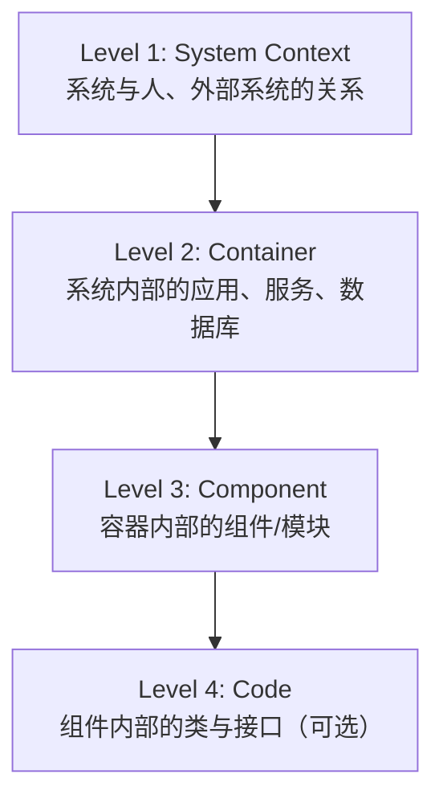
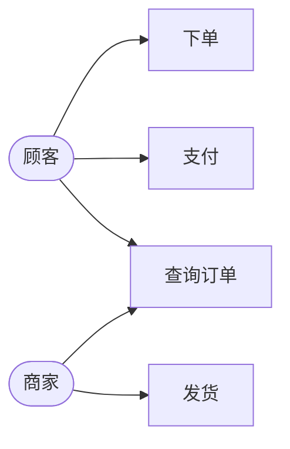
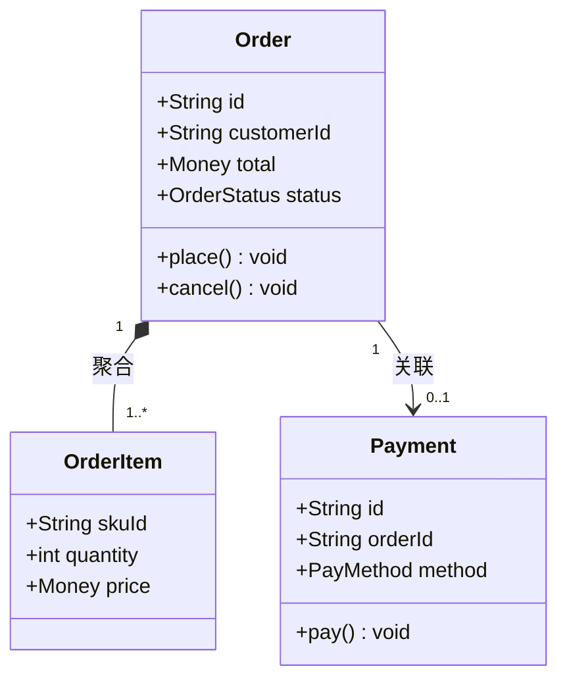
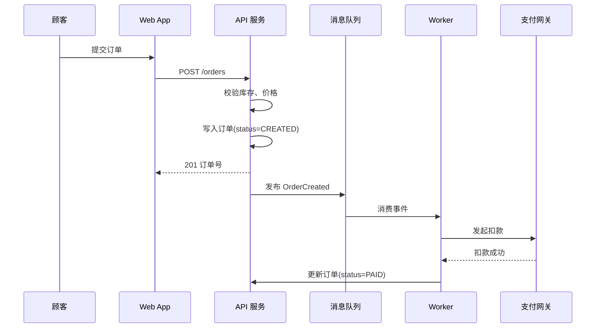
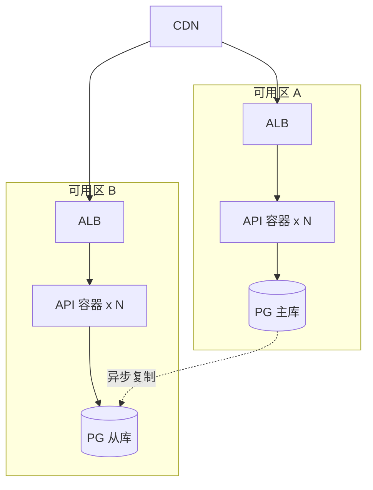
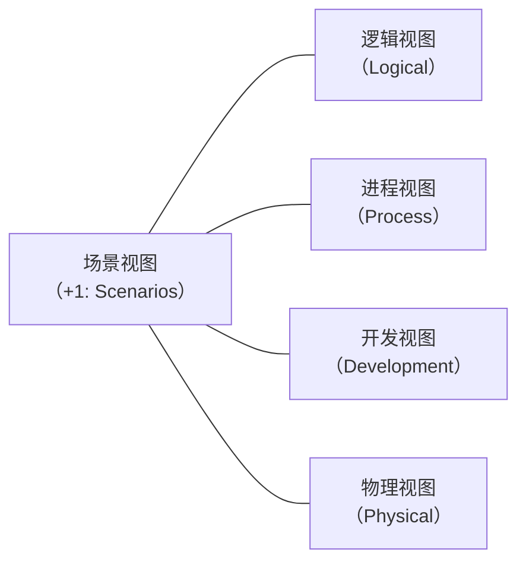
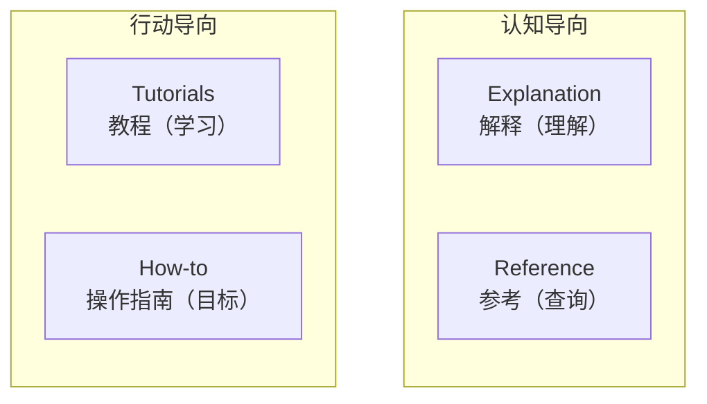

# 架构文档

> **版本**：v1.2
> **最后更新**：2026-04-28

## 📖 概述

架构文档是团队共识的载体，是架构师最重要的输出物之一。一份好的架构文档既要让新成员快速上手，又要在系统演进时作为决策依据。本文讲解四类最常用的架构文档产出方式：**C4 模型**（分层描述系统结构）、**UML 建模**（精确表达静态结构与动态行为）、**架构决策记录（ADR）**（沉淀关键决策）、**技术方案设计文档**（指导实施落地）。

## 🎯 学习目标

- 掌握 C4 模型（Context、Container、Component、Code）的四层视图
- 理解 UML 常用图的绘制方法（用例图、类图、序列图、部署图）
- 能够编写规范的架构决策记录（ADR）
- 掌握技术方案设计文档的编写规范与模板

## 🎯 C4 模型

C4 模型由 Simon Brown 提出，用**从粗到细**的四层视图描述软件架构，核心思想是"放大镜（Zoom-in）"——每往下一层就聚焦到上一层的某个元素内部。

### 四层视图



| 层次 | 描述 | 关键元素 | 受众 |
| --- | --- | --- | --- |
| **Context** | 系统的"1 张图" | 人（Person）、软件系统（System） | 所有人，含非技术 |
| **Container** | 系统内可独立部署/运行的单元 | Web App、API、DB、队列 | 架构师、运维、开发 |
| **Component** | 容器内逻辑分组 | 模块、服务类、Repository | 开发者 |
| **Code** | 实现细节（可选） | UML 类图 | 实现者 |

### C4 文本化（Structurizr DSL）

架构图建议以**代码化（Diagrams-as-Code）**的方式维护，便于版本管理和评审。以下是 [Structurizr DSL](https://docs.structurizr.com/dsl) 描述一个"订单系统"的示例：

```js
// workspace.dsl —— 可在 https://structurizr.com/dsl 在线渲染
const workspaceDsl = `
workspace "订单系统" "电商订单履约系统架构" {

  model {
    customer = person "顾客" "下单用户"
    merchant = person "商家" "管理商品与订单的商家"

    orderSystem = softwareSystem "订单系统" "负责订单创建、支付、履约" {
      webApp   = container "Web 应用"   "React 单页应用"      "React, TypeScript"
      apiApp   = container "API 服务"   "订单领域 API"        "Node.js, Express"
      worker   = container "异步 Worker" "处理支付/履约事件"    "Node.js"
      db       = container "订单数据库"  "存储订单与履约状态"   "PostgreSQL" "Database"
      mq       = container "消息队列"    "订单事件总线"        "Kafka" "Queue"
    }

    payment = softwareSystem "支付网关" "外部支付服务" "External"
    logistics = softwareSystem "物流系统" "外部履约服务" "External"

    customer  -> webApp   "下单、查询订单"
    merchant  -> webApp   "管理订单"
    webApp    -> apiApp   "HTTPS/JSON"
    apiApp    -> db       "读写" "SQL"
    apiApp    -> mq       "发布订单事件"
    worker    -> mq       "消费事件"
    worker    -> payment  "发起扣款" "HTTPS"
    worker    -> logistics "下发物流单" "HTTPS"
  }

  views {
    systemContext orderSystem { include * autolayout lr }
    container     orderSystem { include * autolayout lr }
    theme default
  }
}
`

console.log(workspaceDsl)
```

运行上面的代码片段即可在控制台看到完整 DSL 文本，将其粘贴到 Structurizr Lite 或 [structurizr-dsl 渲染器](https://structurizr.com/dsl) 即可生成 Context 与 Container 两张图。

## 🎯 UML 建模

UML（Unified Modeling Language）提供 13 种图，架构师**高频使用**的只有 4 种。推荐使用 [Mermaid](https://mermaid.js.org/) 或 [PlantUML](https://plantuml.com/) 以文本方式维护。

### 1. 用例图（Use Case Diagram）

表达**谁可以对系统做什么**，用于需求阶段对齐。



### 2. 类图（Class Diagram）

表达**领域模型的静态结构**与关系（继承、聚合、依赖）。



### 3. 序列图（Sequence Diagram）

表达**关键业务流程的时序交互**，是方案评审中最有效的图。



### 4. 部署图（Deployment Diagram）

表达**软件构件与硬件节点的映射**。



## 🎯 架构决策记录（ADR）

ADR（Architecture Decision Record）用于**沉淀"为什么这么做"**。一个团队的技术脉络，就是一串 ADR。

### ADR 模板（Michael Nygard 版）

```js
const adrTemplate = `
# ADR-0007: 使用 Kafka 替代 RabbitMQ 作为订单事件总线

- 状态: Accepted
- 日期: 2026-04-28
- 决策者: 架构组（@zhangsan, @lisi）
- 相关 ADR: ADR-0003（消息驱动架构）

## 背景
当前订单事件峰值 50k QPS，RabbitMQ 出现 broker 单点瓶颈，
且下游数据团队需要消费订单日志做实时数仓，要求消息可回溯 7 天。

## 决策
采用 Kafka 3.x 作为订单事件总线，Topic 按业务域划分，默认保留 7 天。

## 可选方案对比
| 方案        | 吞吐  | 回溯 | 生态  | 运维成本 |
| ----------- | ----- | ---- | ----- | -------- |
| RabbitMQ    | 20k   | 弱   | 成熟  | 低       |
| Kafka       | 100k+ | 强   | 丰富  | 中       |
| Pulsar      | 100k+ | 强   | 较新  | 高       |

## 影响
- 正面: 吞吐提升 5 倍，数据可回溯，利于实时数仓
- 负面: 团队需要学习 Kafka，新增 ZooKeeper/KRaft 运维
- 迁移: 分两阶段，双写 -> 灰度切换 -> 下线 RabbitMQ
`

// 新建 ADR 时只需复制模板并填写
function createAdr(number, title) {
  const id = String(number).padStart(4, '0')
  const fileName = `ADR-${id}-${title.replace(/\s+/g, '-').toLowerCase()}.md`
  return { fileName, content: adrTemplate }
}

const { fileName } = createAdr(7, 'use kafka for order events')
console.log(fileName) // ADR-0007-use-kafka-for-order-events.md
```

### ADR 写作原则

- **一决策一文件**：禁止在一个 ADR 中塞多个决策
- **不可变**：已 Accepted 的 ADR 不修改，若推翻则新建 ADR 并在旧的写 `Superseded by ADR-xxxx`
- **与代码同仓**：放 `docs/adr/` 目录，随 PR 评审
- **简短可读**：一页 A4 以内，10 分钟能读完

## 🎯 技术方案设计文档

技术方案设计文档（Technical Design Doc，简称 TDD 或 RFC）是**项目落地前**的核心产出，目的是在写代码前发现风险、对齐方案。

### 推荐模板

```js
const techDesignTemplate = `
# [项目名] 技术方案设计

> 作者: @xxx | 评审日期: 2026-04-28 | 状态: Draft / Reviewing / Approved

## 1. 背景与目标
- 业务背景: 为什么要做（业务痛点、数据支撑）
- 目标: 本期交付什么（功能 + 非功能指标，如 P99 < 200ms）
- 非目标: 明确不做什么（防止范围蔓延）

## 2. 现状分析
- 现有系统架构与问题
- 关键数据（QPS、存储量、增长率）

## 3. 方案设计
### 3.1 整体架构
（贴 C4 Container 图）
### 3.2 关键流程
（贴序列图，覆盖主流程 + 异常流程）
### 3.3 数据模型
（表结构、索引、容量估算）
### 3.4 接口设计
（API 列表、协议、幂等性、鉴权）
### 3.5 关键技术点
（难点算法、性能优化、并发控制）

## 4. 方案对比
| 维度       | 方案 A | 方案 B | 方案 C |
| ---------- | ------ | ------ | ------ |
| 复杂度     | 低     | 中     | 高     |
| 性能       | 一般   | 好     | 极好   |
| 成本       | 低     | 中     | 高     |
| **推荐**   |        | ✅     |        |

## 5. 风险与应对
| 风险           | 可能性 | 影响 | 应对策略                 |
| -------------- | ------ | ---- | ------------------------ |
| DB 成为瓶颈     | 中     | 高   | 分库分表预案，读写分离   |
| 第三方服务抖动  | 高     | 中   | 熔断 + 本地缓存降级      |

## 6. 实施计划
- 里程碑: M1 基础框架（4w） / M2 核心功能（4w） / M3 压测上线（2w）
- 依赖方: 数据团队 / 安全团队 / 基础平台
- 资源需求: 2 后端 + 1 前端 + 1 测试

## 7. 监控与回滚
- 核心指标: 订单创建成功率、支付延迟 P99、队列堆积
- 告警阈值: 成功率 < 99.5% / P99 > 500ms
- 回滚方案: 开关控制（配置中心）、灰度回退脚本

## 8. 附录
- 相关 ADR 链接
- 参考资料
`

console.log(techDesignTemplate.length)
```

### 评审流程

1. **预读（异步）**：评审前 2 天发文档，评审人在文档中留批注
2. **评审会（1 小时）**：作者讲 20 分钟 → 针对批注讨论 → 决议
3. **修订与归档**：会后 3 天内更新文档，状态改为 `Approved`，与代码仓同步

## 🧠 理论基础

本节介绍架构文档背后的经典理论与源流，帮助理解"为什么要这么写"。

### 1. 4+1 视图模型（Philippe Kruchten, 1995）

1995 年 Philippe Kruchten 在 IEEE Software 上发表 [*Architectural Blueprints—The "4+1" View Model of Software Architecture*](https://www.cs.ubc.ca/~gregor/teaching/papers/4+1view-architecture.pdf)，首次系统化提出用**多视图**描述架构，因为"没有一张图能讲清所有事"。



| 视图 | 关注点 | 受众 | 现代对应 |
| --- | --- | --- | --- |
| **Logical** | 功能需求、领域模型 | 最终用户、分析师 | C4 Component、DDD 聚合 |
| **Process** | 并发、性能、分布式 | 运维、性能工程师 | 序列图、部署图 |
| **Development** | 模块划分、代码组织 | 开发者 | 包图、Monorepo 结构 |
| **Physical** | 节点、网络、部署 | 系统工程师 | C4 Deployment |
| **Scenarios** | 用例、关键场景 | 所有人 | 用例图、用户旅程 |

```js
// 用 4+1 评估一份架构文档的完备性
function evaluate4Plus1(doc) {
  const required = ['logical', 'process', 'development', 'physical', 'scenarios']
  const covered = required.filter((v) => doc.views?.[v]?.present)
  const missing = required.filter((v) => !covered.includes(v))
  return {
    completeness: covered.length / required.length,
    missing,
    suggestion: missing.length ? `建议补充：${missing.join('、')}` : '视图完整',
  }
}

console.log(
  evaluate4Plus1({
    views: {
      logical: { present: true },
      process: { present: true },
      development: { present: true },
      physical: { present: false },
      scenarios: { present: true },
    },
  }),
)
// { completeness: 0.8, missing: ['physical'], suggestion: '建议补充：physical' }
```

### 2. ADR 的起源（Michael Nygard, 2011）

ADR 最初由 Michael Nygard 于 2011 年 11 月在博客 [*Documenting Architecture Decisions*](https://www.cognitect.com/blog/2011/11/15/documenting-architecture-decisions) 提出，解决"入职新同事无法理解历史决策"的痛点。核心洞察：

- **决策是稀缺资源**：每一个重要决策都应留下可追溯的书面记录
- **不可变性**：决策一旦接受就不再修改，若推翻则新增 ADR 并标注 `Superseded`
- **轻量优先**：一页 A4 以内，避免决策文档自身成为负担

[Joel Parker Henderson 的 ADR 仓库](https://github.com/joelparkerhenderson/architecture-decision-record) 整理了业界 10+ 种模板（Nygard、MADR、Y-Statement 等）。

```js
// 判断一份 ADR 是否符合 Nygard 最小模板
function validateAdr(adr) {
  const requiredSections = ['status', 'context', 'decision', 'consequences']
  const missing = requiredSections.filter((s) => !adr[s] || adr[s].trim() === '')
  const validStatuses = ['Proposed', 'Accepted', 'Deprecated', 'Superseded']
  const statusOk = validStatuses.includes(adr.status)
  return {
    valid: missing.length === 0 && statusOk,
    missingSections: missing,
    statusOk,
  }
}

console.log(
  validateAdr({
    status: 'Accepted',
    context: '当前 RabbitMQ 无法支撑 50k QPS...',
    decision: '采用 Kafka 3.x',
    consequences: '吞吐提升 5 倍，新增运维成本...',
  }),
)
```

### 3. 敏捷建模（Scott Ambler, 2002）

Scott Ambler 的 [Agile Modeling](http://agilemodeling.com/) 给出了**为什么不应过度文档化**的方法论，核心原则被 C4 和现代 DDD 广泛继承：

- **多个模型（Multiple Models）**：没有一个模型能讲清一切，用最合适的图
- **内容重于形式**：不追求 UML 的"完全规范"，表达清楚才是目的
- **与代码同步**：文档化在需要时（Just Barely Good Enough），过时的文档比没文档更糟
- **旅行轻装（Travel Light）**：只维护有人真的在读的文档

```js
// 文档健康度评分（基于敏捷建模原则）
function scoreDocHealth(doc) {
  const checks = {
    hasMultipleViews: doc.views?.length >= 2, // 多个模型
    updatedWithin90Days: daysSince(doc.lastUpdated) <= 90, // 时效性
    readersInLast30Days: (doc.readers30d ?? 0) > 0, // 有人在读
    sizeWithinPage: (doc.wordCount ?? 0) <= 3000, // 轻量
    linkedToCode: Boolean(doc.codeRef), // 与代码关联
  }
  const score = Object.values(checks).filter(Boolean).length / 5
  return { score, checks }
}

function daysSince(isoDate) {
  return Math.floor((Date.now() - new Date(isoDate).getTime()) / 86400000)
}

console.log(
  scoreDocHealth({
    views: ['context', 'container'],
    lastUpdated: '2026-03-01',
    readers30d: 25,
    wordCount: 2400,
    codeRef: 'https://git.example.com/order/README.md',
  }),
)
```

### 4. Diátaxis 文档框架（Daniele Procida）

[Diátaxis](https://diataxis.fr/) 是 Divio 在 2017 年提出、Daniele Procida 系统化的**文档四象限**框架。它按读者意图把文档分为四类，避免"一篇文档既教新手又给老手查 API"的混乱：



| 类型 | 意图 | 例子（架构文档） |
| --- | --- | --- |
| **Tutorials** | 新人学习 | "第一次画 C4 图"教程 |
| **How-to** | 解决具体问题 | "如何为一次选型写 ADR" |
| **Explanation** | 理解背景与原理 | "为什么选择事件驱动架构" |
| **Reference** | 查询事实 | "API 列表"、"字段定义" |

```js
function classifyDoc(doc) {
  const { intent, audience } = doc
  if (intent === 'learn' && audience === 'newcomer') return 'Tutorials'
  if (intent === 'solve-problem') return 'How-to'
  if (intent === 'understand') return 'Explanation'
  if (intent === 'lookup') return 'Reference'
  return 'unknown'
}

console.log(classifyDoc({ intent: 'solve-problem', audience: 'dev' })) // How-to
```

### 理论到实践的映射

| 实践 | 对应理论 | 解决的问题 |
| --- | --- | --- |
| C4 四层视图 | 4+1 视图模型（精简版） | 同一系统多视角表达 |
| ADR | Nygard ADR + 敏捷建模 | 沉淀决策，避免失忆 |
| 技术方案文档 | Diátaxis 的 Explanation | 统一团队对方案的理解 |
| 与代码同仓 | 敏捷建模"Travel Light" | 保持文档时效性 |

## 📝 实际应用示例：订单系统文档套件

一个中等复杂度系统（如订单系统）的完整文档套件应包含：

```js
const docSuite = {
  c4: {
    context: 'diagrams/c4/context.dsl',
    container: 'diagrams/c4/container.dsl',
  },
  uml: {
    domainModel: 'diagrams/uml/order-class.mmd',
    placeOrderFlow: 'diagrams/uml/place-order-sequence.mmd',
    deployment: 'diagrams/uml/deployment.mmd',
  },
  adr: [
    'docs/adr/ADR-0001-monorepo-layout.md',
    'docs/adr/ADR-0003-event-driven.md',
    'docs/adr/ADR-0007-kafka-for-events.md',
  ],
  techDesign: 'docs/rfc/2026-q2-order-system.md',
}

function auditDocCompleteness(suite) {
  const required = ['c4.container', 'uml.placeOrderFlow', 'techDesign']
  const missing = required.filter((path) => {
    const keys = path.split('.')
    let cursor = suite
    for (const key of keys) cursor = cursor?.[key]
    return !cursor
  })
  return { pass: missing.length === 0, missing }
}

console.log(auditDocCompleteness(docSuite))
// { pass: true, missing: [] }
```

## 🔗 相关概念

- **DDD 战术设计**：类图与序列图可直接表达聚合、实体、领域事件
- **架构可视化**：下一节将深入讲解系统架构图与数据流图的画法
- **技术沟通**：文档是沟通的载体，评审与汇报是文档的延伸

## 📝 学习检查点

- [ ] 能用 C4 的 Context + Container 两张图描述一个你熟悉的系统
- [ ] 能区分用例图、类图、序列图、部署图各自的使用场景
- [ ] 能按模板为一次技术决策写一份 ADR
- [ ] 能独立产出一份可评审的技术方案设计文档
- [ ] 理解文档的"代码化（Diagrams-as-Code）"维护方式

## 🚀 下一步

→ [架构可视化](./03-architecture-visualization.mdx)

