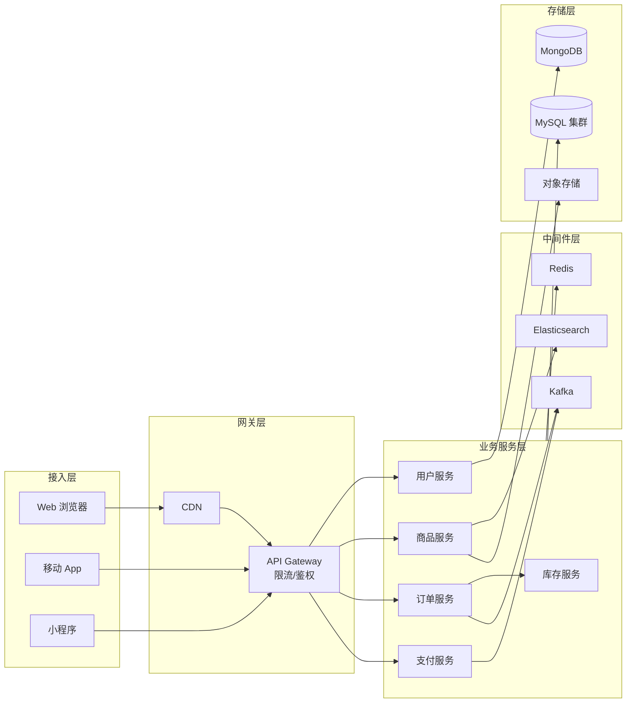
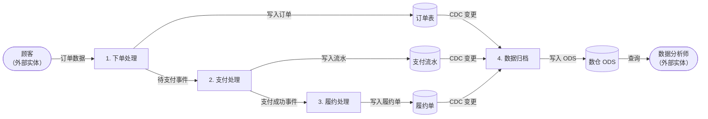
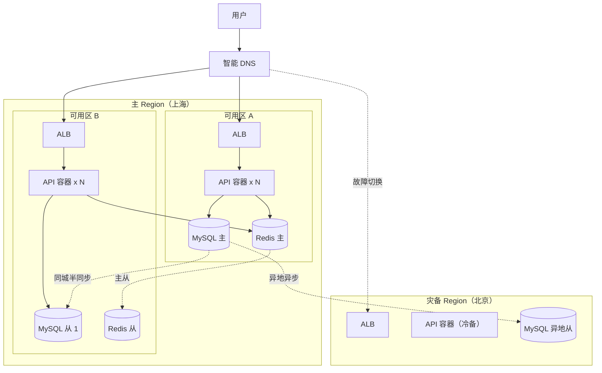
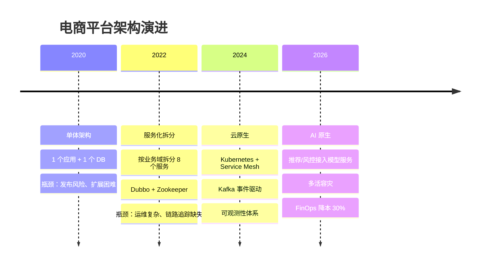
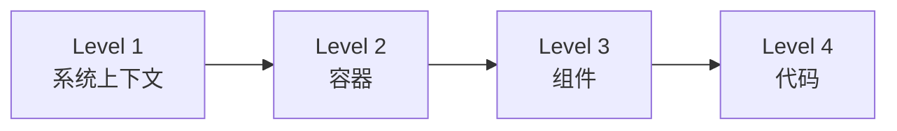

# 架构可视化

> **版本**：v1.2
> **最后更新**：2026-04-28

## 📖 概述

一张好图胜过千言万语。架构可视化的核心不是"画得漂亮"，而是**让读者在 30 秒内抓住系统的要点**。本文讲解架构师最常画的 4 类图：**系统架构图**（整体拓扑）、**数据流图**（数据如何流转）、**部署架构图**（物理部署与高可用）、**架构演进图**（系统随时间的变化）。所有示例都以 Mermaid 代码形式给出，可复制即用。

## 🎯 学习目标

- 掌握系统架构图的分层与元素表达规范
- 能够用数据流图（DFD）描述数据全链路
- 掌握部署架构图中可用区、负载均衡、容灾的表达
- 了解用架构演进图展示系统演化历程的方法
- 熟练使用 Mermaid / draw.io / Excalidraw 三类工具

## 🎯 可视化的通用原则

### 一图一主题（Single Responsibility Diagram）

每张图只回答一个问题。试图用一张图说明"架构 + 部署 + 数据流 + 安全"会让所有人都看不懂。

```js
// 判断一张图是否健康
function diagramHealthCheck(diagram) {
  const checks = {
    hasTitle: Boolean(diagram.title),
    hasLegend: Boolean(diagram.legend),
    elementCount: diagram.elements.length,
    singlePurpose: diagram.purposes.length === 1,
    hasDirection: Boolean(diagram.layout), // LR / TB
  }
  const warnings = []
  if (checks.elementCount > 20) warnings.push('元素过多，考虑拆分或分层')
  if (!checks.singlePurpose) warnings.push('混合多个主题，拆分为多张')
  if (!checks.hasLegend && checks.elementCount > 8) warnings.push('缺少图例')
  return { pass: warnings.length === 0, warnings }
}

const diagram = {
  title: '订单系统 Container 视图',
  legend: ['蓝色=服务', '橙色=存储', '虚线=异步'],
  elements: Array.from({ length: 12 }),
  purposes: ['container'],
  layout: 'LR',
}
console.log(diagramHealthCheck(diagram))
// { pass: true, warnings: [] }
```

### 分层与留白

- **分层**：用 `subgraph` 将相关元素聚合，例如"接入层 / 应用层 / 数据层"
- **方向一致**：同一张图从左到右或从上到下保持一致
- **图例必备**：一旦使用颜色、线型编码，必须附图例
- **避免交叉线**：线条交叉超过 3 次就应调整布局

## 🎯 系统架构图

表达系统**在某一时刻的静态结构**，是最常用的一张图。以"电商平台"为例：



### 绘制清单

| 要素 | 建议 |
| --- | --- |
| **方向** | 请求方在左/上，存储在右/下 |
| **颜色** | 同类用同色，≤ 5 种颜色 |
| **形状** | 圆柱=DB、矩形=服务、菱形=判断、云=外部系统 |
| **连线** | 实线=同步、虚线=异步、带箭头=有向 |
| **标签** | 关键链路标注协议（HTTP/gRPC/Kafka） |

## 🎯 数据流图（DFD）

数据流图（Data Flow Diagram）关注**数据在系统中的流转路径**，而非服务调用。它有 4 个核心符号：外部实体、处理过程、数据存储、数据流。

以"订单创建后的数据流"为例：



### DFD 分层

复杂系统使用**分层 DFD**（Level 0 / Level 1 / Level 2）：

```js
const dfdLevels = {
  level0: {
    name: '上下文图',
    purpose: '系统与外部实体的总体数据交换',
    detail: '把整个系统看作一个处理过程',
  },
  level1: {
    name: '顶层 DFD',
    purpose: '分解为 3~9 个主要子处理',
    detail: '展示子处理之间的数据流',
  },
  level2: {
    name: '子处理 DFD',
    purpose: '对 Level 1 中某个子处理继续分解',
    detail: '可继续往下分，但一般到 Level 2/3 足够',
  },
}

function pickLevel(audience) {
  if (audience === 'executive') return dfdLevels.level0
  if (audience === 'architect') return dfdLevels.level1
  return dfdLevels.level2
}

console.log(pickLevel('architect').name) // 顶层 DFD
```

## 🎯 部署架构图

部署架构图（Deployment Diagram）描述**软件构件在物理/虚拟节点上的分布**，重点表达**高可用、容灾、网络边界**。

### 同城双机房 + 异地灾备



### 容量估算表

部署图应配一张容量估算表，便于运维和成本评估：

```js
const capacityPlan = [
  { tier: '接入层', component: 'ALB', spec: '每实例 50k QPS', count: 2, redundancy: 'N+1' },
  { tier: '应用层', component: 'API 容器', spec: '4C8G, 每实例 1k QPS', count: 20, redundancy: '跨 AZ' },
  { tier: '缓存层', component: 'Redis', spec: '32G 主从', count: 3, redundancy: '1 主 2 从' },
  { tier: '存储层', component: 'MySQL', spec: '16C64G, 2TB', count: 3, redundancy: '1 主 2 从 + 异地' },
]

function estimatePeak(plan, peakMultiplier = 3) {
  return plan.map((row) => ({
    ...row,
    peakCount: Math.ceil(row.count * peakMultiplier),
  }))
}

console.table(estimatePeak(capacityPlan))
```

## 🎯 架构演进图

架构演进图展示**系统在不同阶段的形态**，用于技术汇报与规划对齐。推荐用**左右对比**或**时间轴**形式。

### 单体 → 微服务 → 云原生



### 演进对比表

```js
const evolutionStages = [
  {
    stage: '单体',
    pros: ['开发简单', '部署容易'],
    cons: ['耦合高', '扩展差'],
    fitWhen: '业务早期，团队 < 10 人',
  },
  {
    stage: '微服务',
    pros: ['独立部署', '技术多样'],
    cons: ['运维复杂', '分布式一致性难'],
    fitWhen: '多业务线，团队 > 30 人',
  },
  {
    stage: '云原生',
    pros: ['弹性', '可观测', '多云'],
    cons: ['学习成本高', '基础设施投入大'],
    fitWhen: '业务快速增长，需弹性与多活',
  },
]

function recommendStage({ teamSize, businessLines }) {
  if (teamSize < 10) return evolutionStages[0]
  if (businessLines >= 3 || teamSize >= 30) return evolutionStages[2]
  return evolutionStages[1]
}

console.log(recommendStage({ teamSize: 40, businessLines: 3 }).stage) // 云原生
```

## 🎯 工具选型

| 工具 | 适合场景 | 特点 |
| --- | --- | --- |
| **Mermaid** | 仓库内维护、轻量图 | 文本化、GitHub 原生渲染 |
| **PlantUML** | UML 图、规范化 | 文本化、企业常用 |
| **draw.io / diagrams.net** | 复杂手绘图 | 所见即所得、免费 |
| **Excalidraw** | 讨论/白板风 | 手绘感、协作快 |
| **Structurizr** | C4 模型 | DSL 一次描述多视图 |

### 选型建议

```js
function pickDiagramTool({ needVersionControl, complexity, audience }) {
  if (needVersionControl && complexity <= 3) return 'Mermaid'
  if (needVersionControl && complexity > 3) return 'PlantUML / Structurizr'
  if (audience === 'business') return 'Excalidraw'
  return 'draw.io'
}

console.log(pickDiagramTool({ needVersionControl: true, complexity: 2, audience: 'tech' }))
// Mermaid
```

## 🧠 理论基础

架构可视化看似是"画图"，背后却有严谨的认知科学与软件工程理论支撑。

### 1. C4 抽象阶梯（Simon Brown, 2006 起）

Simon Brown 在 [c4model.com](https://c4model.com/) 中提出核心隐喻 —— **地图放大镜（Zoom-in Map）**：地图有洲、国家、城市、街道的不同缩放级别，架构图也应有层级。



该理论解决了 UML 失败的核心原因：**UML 没有层级约束，结果要么过于抽象，要么过于细节**。C4 通过严格分层让每张图都有单一目的。

```js
// 检查一张图是否混层（C4 反模式）
function checkC4LayerConsistency(diagram) {
  const levels = { context: 1, container: 2, component: 3, code: 4 }
  const elementLevels = diagram.elements.map((e) => levels[e.type] ?? 0)
  const uniqueLevels = new Set(elementLevels)
  return {
    consistent: uniqueLevels.size === 1,
    detectedLevels: Array.from(uniqueLevels),
    warning: uniqueLevels.size > 1 ? '混层：同一张图包含多个抽象层级' : null,
  }
}

console.log(
  checkC4LayerConsistency({
    elements: [
      { name: 'OrderService', type: 'container' },
      { name: 'PaymentGateway', type: 'container' },
      { name: 'OrderRepository', type: 'component' }, // 混层
    ],
  }),
)
```

### 2. Tufte 数据-墨水比（Edward Tufte, 1983）

Edward Tufte 在 [*The Visual Display of Quantitative Information*](https://www.edwardtufte.com/tufte/books_vdqi) 中提出**数据-墨水比（Data-Ink Ratio）**：

> **Data-Ink Ratio = 表达数据的墨水 / 图中总墨水**

理想情况下应最大化此比率，即**删除一切不传达信息的元素**（装饰边框、3D 阴影、多余网格线）。

```js
// 简化版数据-墨水比评估
function estimateDataInkRatio(diagram) {
  const dataInk = diagram.elements.length + diagram.connections.length
  const nonDataInk =
    (diagram.decorations ?? 0) +
    (diagram.unnecessaryBorders ?? 0) +
    (diagram.shadows3D ?? 0) * 2 // 3D 阴影权重高
  const totalInk = dataInk + nonDataInk
  const ratio = dataInk / totalInk
  return {
    ratio: Number(ratio.toFixed(2)),
    verdict: ratio > 0.7 ? '高效' : ratio > 0.4 ? '一般' : '存在噪声',
  }
}

console.log(
  estimateDataInkRatio({
    elements: Array(10),
    connections: Array(12),
    decorations: 3,
    unnecessaryBorders: 2,
    shadows3D: 0,
  }),
)
```

Tufte 的三条原则对架构图同样适用：

1. **Above all else show the data**：信息优先于装饰
2. **Remove non-data ink**：删掉装饰性边框、阴影、3D
3. **Small multiples**：多张小图 > 一张巨图

### 3. 认知负荷理论（John Sweller, 1988）

认知心理学家 John Sweller 提出 [Cognitive Load Theory](https://en.wikipedia.org/wiki/Cognitive_load)，指出工作记忆一次只能处理 **4±1 个信息块**（Miller 1956 的 7±2 经现代研究修正）。架构图的实操准则：

- **一张图元素 ≤ 12 个**（两倍 Miller 数极限）
- **超过就分层或分页**
- **关键路径 ≤ 7 步**（对应 7±2）

```js
function cognitiveLoadCheck(diagram) {
  const elementCount = diagram.elements.length
  const criticalPathLength = diagram.criticalPath?.length ?? 0
  const warnings = []
  if (elementCount > 12) warnings.push(`元素 ${elementCount} > 12，建议分层`)
  if (criticalPathLength > 7) warnings.push(`关键路径 ${criticalPathLength} > 7，建议折叠`)
  if (diagram.crossingLines > 3) warnings.push(`交叉线 ${diagram.crossingLines} > 3，调整布局`)
  return { ok: warnings.length === 0, warnings }
}

console.log(
  cognitiveLoadCheck({
    elements: Array(15),
    criticalPath: Array(5),
    crossingLines: 2,
  }),
)
```

### 4. Diagrams-as-Code 运动

文本化架构图运动的思想源自 DevOps 领域的"**X-as-Code**"哲学 —— 一切可版本化的产物都应能被 Diff、Review、CI 检查。代表工具：

- [PlantUML](https://plantuml.com/)（2009）—— 最早的 UML as code
- [Mermaid](https://mermaid.js.org/)（2014）—— GitHub/GitLab 原生支持
- [Structurizr DSL](https://docs.structurizr.com/dsl)（Simon Brown 2016）—— C4 专用
- [D2](https://d2lang.com/)（Terrastruct 2022）—— 现代布局引擎

核心收益（对比 draw.io / PPT）：

| 维度 | 图形工具 | Diagrams-as-Code |
| --- | --- | --- |
| 版本控制 | 二进制，不可 diff | 文本，完美 diff |
| 评审 | 只能看图 | 可评论每一行 |
| 自动化 | 人工导出 | CI 自动生成/校验 |
| 一致性 | 靠自觉 | 模板约束 |

```js
// 判断一个架构图产物是否符合 Diagrams-as-Code 标准
function isDac(artifact) {
  const checks = {
    textBased: ['.mmd', '.puml', '.dsl', '.d2'].some((ext) => artifact.path.endsWith(ext)),
    underVersionControl: Boolean(artifact.gitTracked),
    renderedInCi: Boolean(artifact.ciGenerated),
    reviewable: Boolean(artifact.inPrReview),
  }
  const passed = Object.values(checks).filter(Boolean).length
  return { score: passed, total: 4, checks, isDac: passed >= 3 }
}

console.log(
  isDac({
    path: 'docs/diagrams/container.mmd',
    gitTracked: true,
    ciGenerated: true,
    inPrReview: true,
  }),
)
// { score: 4, total: 4, checks: {...}, isDac: true }
```

### 理论到实践的映射

| 实践 | 对应理论 | 核心收益 |
| --- | --- | --- |
| 系统架构图分层 | C4 抽象阶梯 | 避免"一图讲所有" |
| 删掉装饰性边框 | Tufte 数据-墨水比 | 信息密度更高 |
| 一图 ≤ 12 元素 | 认知负荷理论 | 读者能一眼抓住 |
| `.mmd` 与代码同仓 | Diagrams-as-Code | 版本化、可评审 |

## 📝 实际应用示例：为新项目准备"图集"

启动一个新项目时，建议在 `docs/diagrams/` 下预留以下图：

```js
const newProjectDiagramSet = {
  'diagrams/system-overview.mmd': '系统架构图（Container 级别）',
  'diagrams/data-flow-main.mmd': '主业务链路数据流图',
  'diagrams/deployment-prod.mmd': '生产部署图（含可用区）',
  'diagrams/deployment-dr.mmd': '容灾部署图',
  'diagrams/evolution-roadmap.mmd': '架构演进路线图',
}

function scaffold(projectRoot) {
  return Object.entries(newProjectDiagramSet).map(([path, desc]) => ({
    path: `${projectRoot}/${path}`,
    content: `%% ${desc}\nflowchart LR\n    TODO_REPLACE["待补充"]\n`,
  }))
}

const files = scaffold('order-system')
console.log(files.length) // 5
```

> 注：上面的 `TODO_REPLACE` 仅是脚手架占位的 **变量名**，真实项目创建图时应立即替换为具体内容。

## 🔗 相关概念

- **C4 模型**：系统架构图通常对应 C4 的 Container/Component 层
- **UML 部署图**：部署架构图的正式表达形式
- **ADR**：架构演进图上的每一次重大变化都应有对应 ADR

## 📝 学习检查点

- [ ] 能画出一个服务的 Container 级系统架构图
- [ ] 能区分系统架构图与数据流图的关注点
- [ ] 能在部署图中正确表达跨可用区/跨 Region
- [ ] 能用架构演进图讲清一个系统过去 2 年的变化
- [ ] 能根据场景选择合适的绘图工具

## 🚀 下一步

→ [技术沟通](./04-technical-communication.mdx)

