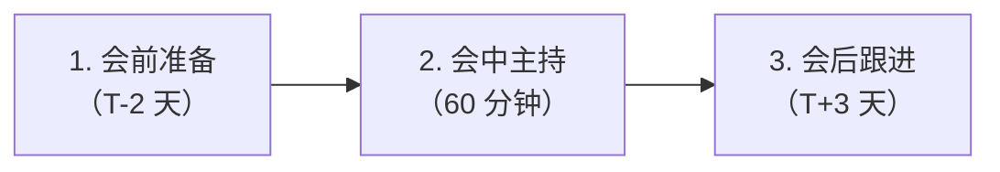
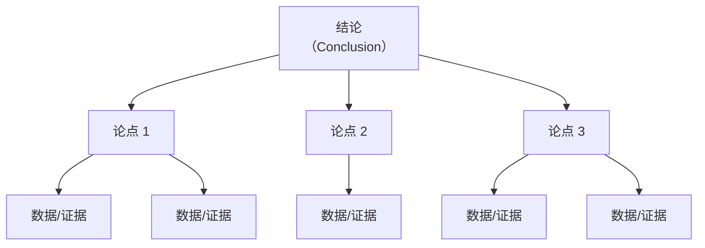

# 技术沟通

> **版本**：v1.2
> **最后更新**：2026-04-28

## 📖 概述

架构师 70% 的工作不是写代码，而是**沟通与对齐**。再好的方案，如果没有人理解和接受，就不会落地。本文讲解架构师最重要的 3 类沟通场景：**技术方案评审**（与同级、专家的方案对齐）、**向上汇报与向下传达**（与 leader、团队的信息同步）、**跨团队协作与对齐**（与平行团队的边界与接口达成一致）。

## 🎯 学习目标

- 掌握技术方案评审的组织、主持与收尾方法
- 能够用结构化方式向上级汇报进展、风险与决策
- 能够把架构决策清晰地传达给一线工程师
- 掌握跨团队协作中定义边界、推动对齐、解决冲突的技巧
- 理解"金字塔原理"与"SCQA"等沟通框架

## 🎯 技术方案评审

技术方案评审是**架构师最高频的协作会议**。目的不是"秀方案"，而是**借助集体智慧发现风险、形成共识**。

### 评审的三个阶段



### 会前准备（T-2 天）

```js
const reviewPrepChecklist = {
  document: {
    ready: true,
    version: 'v1.0',
    sections: ['背景', '方案', '对比', '风险', '计划'],
  },
  reviewers: [
    { name: '张三', role: '领域专家', required: true },
    { name: '李四', role: '基础平台', required: true },
    { name: '王五', role: '安全', required: false },
  ],
  preReadWindow: 48, // 评审前 48 小时发文档
  asyncComments: true, // 鼓励异步评论
}

function isReadyForReview(prep) {
  const issues = []
  if (!prep.document.ready) issues.push('文档未完成')
  if (prep.reviewers.filter((r) => r.required).length < 2) {
    issues.push('必要评审人 < 2')
  }
  if (prep.preReadWindow < 24) issues.push('预读时间不足 24h')
  return { canStart: issues.length === 0, issues }
}

console.log(isReadyForReview(reviewPrepChecklist))
// { canStart: true, issues: [] }
```

**关键动作**：

1. 文档冻结版本，发送给评审人，明确"异步先评论、会上再讨论"
2. 识别关键质疑点，提前准备备选方案
3. 预约有决策权的人，避免会后返工

### 会中主持（60 分钟标准结构）

| 时段 | 内容 | 主持技巧 |
| --- | --- | --- |
| 0-5 min | 目标与议程 | 说清楚"今天要决策什么" |
| 5-25 min | 方案讲解 | **不念文档**，只讲关键决策与权衡 |
| 25-50 min | 针对性讨论 | 按批注顺序逐条解决，跑题即拉回 |
| 50-55 min | 决议与行动项 | 明确"通过/有条件通过/不通过" |
| 55-60 min | 下一步 | 指定负责人、截止时间 |

### 会后跟进（T+3 天）

- 会后 24 小时内发**会议纪要**（决议 + 行动项 + 负责人 + 截止时间）
- 行动项进入 Jira/工作台，跟到关闭
- 更新 ADR 与设计文档，状态置为 `Approved`

### 评审决策结果分类

```js
const reviewOutcomes = {
  approved: {
    label: '通过',
    condition: '方案完整、风险可控',
    next: '进入实施阶段',
  },
  conditionalApproval: {
    label: '有条件通过',
    condition: '存在可闭环的遗留项',
    next: '按 checklist 闭环后自动生效',
  },
  rejected: {
    label: '不通过',
    condition: '关键方向有异议',
    next: '重新设计或立项讨论',
  },
  pending: {
    label: '待补充',
    condition: '信息不足无法决策',
    next: '补充调研后重评',
  },
}

function closeReview(outcome, actionItems) {
  return {
    outcome: reviewOutcomes[outcome].label,
    nextStep: reviewOutcomes[outcome].next,
    actionItems,
  }
}

console.log(
  closeReview('conditionalApproval', [
    { item: '压测报告', owner: '@lisi', due: '2026-05-10' },
    { item: 'DB 容量评估', owner: '@wangwu', due: '2026-05-05' },
  ]),
)
```

## 🎯 向上汇报

向上汇报的核心是**让领导在最短时间内获得决策所需的信息**。最好用的框架是**金字塔原理**：**结论先行，论据支撑**。

### 三段式结构

```js
const upwardReportTemplate = {
  conclusion: '一句话结论（结论先行）',
  keyPoints: [
    { point: '论据 1', data: '关键数据支撑' },
    { point: '论据 2', data: '关键数据支撑' },
    { point: '论据 3', data: '关键数据支撑' },
  ],
  askForHelp: '需要的支持（资源/决策/拉通）',
}

// 示例: 双 11 保障进展汇报
const example = {
  conclusion: '双 11 技术保障已完成 80%，预计按期达成，有一项风险需要协调资源',
  keyPoints: [
    { point: '压测', data: 'QPS 已压到目标的 120%，无明显瓶颈' },
    { point: '扩容', data: '已扩容 30%，成本增加 180 万' },
    { point: '风险', data: '支付通道容量仅达目标 90%，需协调金融云扩容' },
  ],
  askForHelp: '请帮助协调金融云团队本周完成支付通道扩容',
}

function formatReport(report) {
  return [
    `**结论**：${report.conclusion}`,
    `**要点**：`,
    ...report.keyPoints.map((p, i) => `  ${i + 1}. ${p.point} —— ${p.data}`),
    `**需要支持**：${report.askForHelp}`,
  ].join('\n')
}

console.log(formatReport(example))
```

### 不同场景的汇报侧重

| 场景 | 重点 | 时长 |
| --- | --- | --- |
| **日报/周报** | 进展、阻塞、下一步 | 5 分钟 |
| **月度汇报** | 关键产出、数据指标、问题 | 15 分钟 |
| **季度/年度** | 战略对齐、资源复盘、规划 | 30-60 分钟 |
| **风险升级** | 风险等级、影响面、建议 | 越短越好 |

### 风险升级的 3T 法则

- **Timely**：风险识别后 24 小时内上报
- **Transparent**：不隐瞒、不粉饰
- **Take responsibility**：提出建议方案，不做"甩手掌柜"

```js
function escalateRisk(risk) {
  return {
    summary: risk.summary,
    level: risk.impact * risk.probability, // 1-25
    impact: risk.impact,
    probability: risk.probability,
    proposedAction: risk.proposal,
    needDecisionFrom: risk.decisionMaker,
    deadline: risk.deadline,
  }
}

console.log(
  escalateRisk({
    summary: '主库磁盘预计 7 天内写满',
    impact: 5,
    probability: 4,
    proposal: '立即扩容 + 异步归档历史数据',
    decisionMaker: 'CTO',
    deadline: '2026-04-30',
  }),
)
```

## 🎯 向下传达

向下传达的目标是**让一线工程师理解"为什么这么做"**，而非"你必须这么做"。

### SCQA 框架

- **S**ituation（情境）：业务/技术背景
- **C**omplication（冲突）：当前遇到的问题
- **Q**uestion（疑问）：需要回答的关键问题
- **A**nswer（回答）：方案 + 执行计划

```js
const scqa = {
  situation: '订单系统支撑了每天 500 万单，核心是单体 Java 应用',
  complication: '发布频率从每周 1 次升到每天 5 次，发布失败率上升到 8%',
  question: '如何在不中断业务的前提下，将发布失败率降到 1% 以下？',
  answer: '第一步：服务化拆分出订单核心域；第二步：引入蓝绿发布；第三步：接入自动化回滚',
}

function toAnnouncement(scqa) {
  return `
【架构升级说明】
背景：${scqa.situation}
现状：${scqa.complication}
目标：${scqa.question}
方案：${scqa.answer}
欢迎大家在 #architecture 频道提问。
  `.trim()
}

console.log(toAnnouncement(scqa))
```

### 反模式：只下结论不讲理由

```js
// ❌ 反模式
const badAnnouncement = '从下周起所有服务接入 Service Mesh，不接入的服务将不能上线。'

// ✅ 正确做法
const goodAnnouncement = `
从下周起所有服务接入 Service Mesh。
  - 为什么：统一治理，替代各语言 SDK（Java/Go/Node 三套）
  - 收益：跨语言链路追踪、统一限流熔断、降低框架升级成本
  - 影响：业务代码无感，Sidecar 自动注入
  - 支持：基础平台团队提供接入文档 + 答疑群 + 试点样板间
`
```

## 🎯 跨团队协作

跨团队协作的核心是**边界清晰、接口契约、冲突机制**。

### 边界协议（Team API）

> "团队也是有 API 的。" —— Team Topologies

```js
const teamAPI = {
  team: '订单团队',
  ownership: ['订单创建', '订单状态机', '履约工作流'],
  nonOwnership: ['支付（支付团队）', '商品（商品团队）', '风控（风控团队）'],
  contract: {
    sla: { availability: '99.95%', p99: '300ms' },
    channels: ['Kafka: order.events', 'HTTP: /api/orders/*'],
    oncall: '@order-oncall',
  },
  changePolicy: '破坏性变更需提前 2 周通知下游',
}

function validateTeamBoundary(api) {
  const overlap = api.ownership.filter((o) =>
    api.nonOwnership.some((n) => n.includes(o)),
  )
  return { hasOverlap: overlap.length > 0, overlap }
}

console.log(validateTeamBoundary(teamAPI))
// { hasOverlap: false, overlap: [] }
```

### 推动对齐的 5 步法

1. **明确目标**：先对齐"我们在解决什么问题"
2. **列出事实**：用数据说话，不用情绪
3. **穷举方案**：至少准备 3 个方案（非二选一）
4. **权衡取舍**：用评分表或对比表
5. **写入文档**：决议必须沉淀为 ADR 或协议文档

### 冲突解决

```js
const conflictResolution = {
  dataFirst: {
    situation: '双方对性能/成本判断不一致',
    action: '共同设计 PoC 或压测用数据说话',
  },
  upgrade: {
    situation: '双方对战略方向不一致',
    action: '升级到双方共同 leader 做决策',
  },
  timebox: {
    situation: '讨论长期无进展',
    action: '定 1 周 timebox，到期强制决策',
  },
  disagreeAndCommit: {
    situation: '已充分讨论但无法说服对方',
    action: '保留意见但执行决定（Disagree and Commit）',
  },
}

function pickStrategy(conflictType) {
  return conflictResolution[conflictType]?.action ?? '寻求中立第三方主持'
}

console.log(pickStrategy('dataFirst'))
// 共同设计 PoC 或压测用数据说话
```

## 🧠 理论基础

架构师的沟通能力并非玄学，背后是一系列经过验证的理论模型。

### 1. 康威定律（Melvin Conway, 1968）

1968 年 Melvin Conway 在论文 [*How Do Committees Invent?*](http://www.melconway.com/Home/Committees_Paper.html) 中提出：

> Any organization that designs a system will produce a design whose structure is a copy of the organization's communication structure.
> 任何设计系统的组织，最终产出的系统结构都会复制该组织的沟通结构。

换言之：**系统架构 ≈ 组织架构**。沟通路径决定软件边界，沟通不畅的两个团队永远做不出整洁的接口。

```js
// 检测系统架构与组织架构是否对齐（Conway 对齐度）
function conwayAlignment(systemBoundaries, teamBoundaries) {
  const overlap = systemBoundaries.filter((sb) =>
    teamBoundaries.some((tb) => tb.owns.includes(sb.name)),
  )
  const ratio = overlap.length / systemBoundaries.length
  return {
    alignmentRatio: ratio,
    misaligned: systemBoundaries.filter(
      (sb) => !teamBoundaries.some((tb) => tb.owns.includes(sb.name)),
    ),
    verdict: ratio >= 0.8 ? '对齐良好' : ratio >= 0.5 ? '部分对齐' : '严重错位',
  }
}

console.log(
  conwayAlignment(
    [{ name: '订单域' }, { name: '支付域' }, { name: '履约域' }],
    [
      { team: 'A', owns: ['订单域'] },
      { team: 'B', owns: ['支付域'] },
      { team: 'C', owns: ['履约域'] },
    ],
  ),
)
```

### 2. 反向康威演习（Inverse Conway Maneuver）

由 ThoughtWorks 在 2015 年提出的推论：**如果组织结构决定架构，那么为了得到理想架构，就主动重塑组织**。

```js
const inverseConway = {
  step1: '先画理想的系统边界图',
  step2: '按系统边界反推团队边界（不是按现有团队妥协）',
  step3: '调整汇报线、会议节奏、接口契约匹配目标边界',
  step4: '演进过程中持续测量 Conway 对齐度',
}

console.log(inverseConway)
```

### 3. 金字塔原理（Barbara Minto, 1973）

Barbara Minto 在麦肯锡时期提出 [*The Minto Pyramid Principle*](https://www.barbaraminto.com/)，核心是**结论先行、自上而下、归类分组、逻辑递进**。



四大原则（SCQA 的理论根基）：

1. **结论先行**：先说答案，再给论据
2. **以上统下**：每一层结论都能被下一层证据支撑
3. **归类分组**：同组论点属于同一维度
4. **逻辑递进**：时间/空间/重要性顺序

```js
// 检查汇报材料是否符合金字塔结构
function checkPyramid(slides) {
  const hasConclusionFirst = slides[0]?.type === 'conclusion'
  const groupsAreMECE = slides
    .filter((s) => s.type === 'argument')
    .every((s) => s.group && s.dimension) // 分组且有明确维度
  const everyArgHasEvidence = slides
    .filter((s) => s.type === 'argument')
    .every((s) => s.evidence?.length > 0)
  return { hasConclusionFirst, groupsAreMECE, everyArgHasEvidence }
}

console.log(
  checkPyramid([
    { type: 'conclusion', text: '技术保障按期达成，有 1 项风险' },
    { type: 'argument', group: 'progress', dimension: '时间', evidence: ['压测完成', '扩容完成'] },
    { type: 'argument', group: 'risk', dimension: '风险', evidence: ['支付通道容量不足'] },
  ]),
)
```

### 4. 丰田 5 Whys（Sakichi Toyoda）

由丰田创始人丰田佐吉提出、Taiichi Ohno 在丰田生产系统中推广的**根因分析法**：**遇到问题连问 5 次 Why，直到追到根因**。

```js
function fiveWhys(problem) {
  const chain = []
  let current = problem
  for (let i = 0; i < 5; i++) {
    const why = current.because
    if (!why) break
    chain.push({ level: i + 1, question: `Why: ${current.statement}?`, answer: why.statement })
    current = why
  }
  return {
    rootCause: chain[chain.length - 1]?.answer ?? '未追到根因',
    chain,
    deepEnough: chain.length >= 5,
  }
}

const incident = {
  statement: '订单创建超时',
  because: {
    statement: 'DB 连接池耗尽',
    because: {
      statement: '慢查询堆积',
      because: {
        statement: '某接口未走索引',
        because: {
          statement: '新增字段查询未评审',
          because: {
            statement: 'PR 模板没有"索引影响"检查项',
          },
        },
      },
    },
  },
}

console.log(fiveWhys(incident).rootCause) // PR 模板没有"索引影响"检查项
```

5 Whys 的价值在于**避免停留在表象修复**（加机器、重启），让组织通过修复"模板"级根因消除整类问题。

### 5. 关键对话模型（Patterson et al., 2002）

[*Crucial Conversations*](https://cruciallearning.com/crucial-conversations-book/) 研究了"高风险、情绪化、意见分歧"的对话场景，提出 **STATE** 框架：

- **S**hare your facts：先说事实，不说评价
- **T**ell your story：说出你的解读（声明是"我认为"）
- **A**sk for others' paths：询问他人视角
- **T**alk tentatively：表达为"可能"而非"确定"
- **E**ncourage testing：鼓励反驳

```js
function stateFramework(statement) {
  return {
    facts: statement.facts ?? [],
    myStory: `我的解读：${statement.interpretation ?? '（缺失）'}`,
    askOthers: statement.question ?? '你看到的是什么？',
    tentative: `这可能是个人角度：${statement.hedge ?? '（缺失）'}`,
    encourageTest: '你有不同观点吗？',
  }
}

console.log(
  stateFramework({
    facts: ['上周部署失败率 15%，本周 20%'],
    interpretation: '发布流程可能存在问题',
    question: '你那边观察到的情况如何？',
    hedge: '我看到的数据有限',
  }),
)
```

在**技术方案评审**和**跨团队对齐**中，STATE 能把"对抗性讨论"转成"合作性求证"。

### 6. Disagree and Commit（Intel / Amazon）

由 Andrew Grove 在 Intel 推广、Jeff Bezos 在 Amazon 1997 年致股东信中明确提倡：**充分讨论后即使不同意也要承诺执行**。

> Even though we're a team, we need to act like a team. I'd like you to commit to this decision even though you disagree with it.

这是**高效决策的组织肌肉**。没有这条原则，组织要么议而不决，要么决而不行。

```js
function decisionStage(discussion) {
  if (discussion.rounds < 2 || !discussion.allHeard) return 'continue-discussion'
  if (discussion.consensusReached) return 'proceed'
  if (discussion.decisionMakerAligned) return 'disagree-and-commit'
  return 'escalate'
}

console.log(
  decisionStage({
    rounds: 3,
    allHeard: true,
    consensusReached: false,
    decisionMakerAligned: true,
  }),
) // disagree-and-commit
```

### 理论到实践的映射

| 实践 | 对应理论 | 解决的问题 |
| --- | --- | --- |
| 跨团队 Team API | 康威定律 + 逆康威 | 让架构与组织同向 |
| SCQA 汇报 | 金字塔原理 | 结论先行，提升效率 |
| 事故复盘 | 5 Whys | 追到根因而非症状 |
| 评审中的质疑 | 关键对话 STATE | 对事不对人 |
| 评审收尾 | Disagree and Commit | 决而必行 |

## 📝 实际应用示例：一次跨团队架构升级

场景：订单团队主导把全公司 8 个业务域从 RabbitMQ 迁移到 Kafka。

```js
const migrationPlaybook = {
  phase1_alignment: {
    action: '组织跨团队 Kick-off（8 个团队 + 基础平台 + 运维）',
    artifact: 'RFC 文档（SCQA 结构）+ 迁移路线图',
    outcome: '各团队指定 owner，承诺 Q2 完成',
  },
  phase2_design: {
    action: '按团队组织 3 次评审（订单/支付/商品先行）',
    artifact: 'ADR-0007 + 每团队的接入方案',
    outcome: '确定双写 + 灰度切换策略',
  },
  phase3_rollout: {
    action: '按"试点 → 扩大 → 全量"三阶段推进',
    artifact: '周度进展看板（向上汇报）',
    outcome: '10 周完成全量迁移，0 故障',
  },
  phase4_closure: {
    action: '复盘会（向下传达 + 沉淀经验）',
    artifact: '复盘文档 + 新团队接入 SOP',
    outcome: '形成可复制方法论',
  },
}

function summarize(playbook) {
  return Object.entries(playbook).map(([phase, info]) => ({
    phase,
    action: info.action,
    outcome: info.outcome,
  }))
}

console.table(summarize(migrationPlaybook))
```

## 🔗 相关概念

- **ADR**：沟通结论的最终沉淀形式
- **技术方案设计文档**：评审与传达的主要载体
- **技术管理**：沟通能力是技术管理的基本功

## 📝 学习检查点

- [ ] 能独立主持一次 60 分钟的技术方案评审
- [ ] 能用金字塔原理向上级做 5 分钟汇报
- [ ] 能用 SCQA 框架向团队讲清楚一次架构变更
- [ ] 能在跨团队场景下定义清晰的 Team API
- [ ] 能识别冲突类型并选择合适的解决策略

## 🚀 下一步

→ [8.2 技术管理](../02-technical-management/01-technical-management-overview.mdx)

