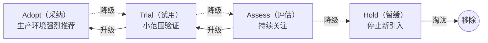
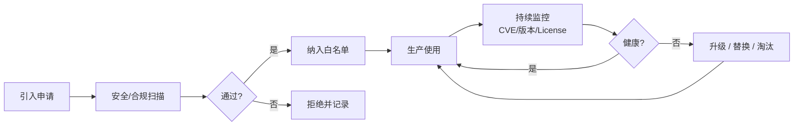

# 技术选型

> **版本**：v1.2
> **最后更新**：2026-04-28

## 📖 概述

技术选型是架构师最高杠杆的决策之一：一个好的选型能让团队走得又快又稳，一个错误的选型则会让团队在未来数年背负沉重的偿还成本。本文讲解一套系统化的技术选型方法：**技术雷达**（组织级技术资产可视化）、**PoC 方法论**（用最小代价验证方案）、**技术债务管理**（量化与偿还）、**开源组件选型与治理**（安全合规的引入与淘汰）。

## 🎯 学习目标

- 理解 ThoughtWorks 技术雷达的四象限与四阶段
- 能够在组织内建立并维护自己的技术雷达
- 掌握 PoC 的目标设定、执行与结论输出
- 能够量化技术债务并制定偿还计划
- 建立开源组件的引入、审计、升级、淘汰的闭环流程

## 🎯 技术雷达

[ThoughtWorks 技术雷达](https://www.thoughtworks.com/radar) 是目前业界最有影响力的技术趋势工具。其核心是**两个维度**：**象限**（技术类型）× **阶段**（建议采用度）。

### 四象限

| 象限 | 含义 | 示例 |
| --- | --- | --- |
| **Techniques** | 技术实践与方法 | TDD、ADR、事件风暴 |
| **Tools** | 工具 | Git、Prometheus、Terraform |
| **Platforms** | 平台与基础设施 | Kubernetes、Kafka、AWS |
| **Languages & Frameworks** | 语言与框架 | TypeScript、React、Spring Boot |

### 四阶段



### 组织级技术雷达的建立

```js
// 一条技术雷达条目
const radarItem = {
  name: 'Kubernetes',
  quadrant: 'platforms',
  ring: 'adopt', // adopt | trial | assess | hold
  isNew: false,
  description: '容器编排事实标准，公司主集群已稳定运行 3 年',
  owner: '@infra-team',
  lastReviewed: '2026-04-01',
  evidence: [
    '生产集群 5 个，节点 2000+',
    '故障率 < 0.05%',
  ],
}

// 维护雷达的流程
function radarLifecycle(item, newEvidence) {
  const moveRules = {
    assess: (e) => e.poc?.passed ? 'trial' : 'assess',
    trial: (e) => e.productionCases >= 3 && e.monthsStable >= 6 ? 'adopt' : 'trial',
    adopt: (e) => e.criticalIssues > 0 ? 'hold' : 'adopt',
    hold: (e) => e.replacement ? 'remove' : 'hold',
  }
  const next = moveRules[item.ring](newEvidence)
  return { ...item, ring: next, lastReviewed: new Date().toISOString().slice(0, 10) }
}

console.log(radarLifecycle(radarItem, { criticalIssues: 0 }))
```

### 评审机制

- **频率**：季度评审一次，重大事件可临时触发
- **参与者**：架构委员会 + 各领域专家
- **产出**：更新后的雷达图 + 本期变更 changelog
- **公开度**：公司内部全员可见

## 🎯 PoC 方法论

PoC（Proof of Concept，概念验证）是**用最小代价验证关键假设**。PoC 失败很正常，关键是能快速得出"能不能用"的结论。

### 好 PoC 的 5 个特征

1. **目标单一**：只验证一个核心假设
2. **时间盒**：通常 1-2 周，最多 1 个月
3. **可测量**：有明确的成功/失败标准
4. **代表性**：用接近真实的数据和场景
5. **可复盘**：产出结论文档，而非只是代码

### PoC 模板

```js
const pocTemplate = {
  title: 'Kafka 能否替代 RabbitMQ 支撑 100k QPS 订单事件',
  hypothesis: '在 3 节点集群下，Kafka 可稳定承载 100k QPS 且 P99 < 50ms',
  successCriteria: [
    { metric: 'QPS', target: '>= 100000', priority: 'must' },
    { metric: 'P99 延迟', target: '<= 50ms', priority: 'must' },
    { metric: '消息丢失率', target: '= 0', priority: 'must' },
    { metric: '集群故障恢复', target: '<= 30s', priority: 'should' },
  ],
  scope: {
    included: ['生产', '消费', '故障恢复', '监控接入'],
    excluded: ['跨集群复制', '事务消息'],
  },
  timeline: {
    week1: '搭建集群 + 基础压测',
    week2: '真实数据回放 + 故障演练 + 产出报告',
  },
  resources: { engineers: 2, machines: 3, budget: 20000 },
  risks: ['压测机性能成为瓶颈', '真实业务数据脱敏耗时'],
}

function evaluatePoc(template, actualResults) {
  const mustItems = template.successCriteria.filter((c) => c.priority === 'must')
  const passed = mustItems.every((item) => actualResults[item.metric]?.meet)
  return {
    conclusion: passed ? 'adopt' : 'rework',
    details: mustItems.map((item) => ({
      metric: item.metric,
      target: item.target,
      actual: actualResults[item.metric]?.actual,
      meet: actualResults[item.metric]?.meet ?? false,
    })),
  }
}

console.log(
  evaluatePoc(pocTemplate, {
    QPS: { actual: 120000, meet: true },
    'P99 延迟': { actual: '35ms', meet: true },
    消息丢失率: { actual: 0, meet: true },
    集群故障恢复: { actual: '18s', meet: true },
  }),
)
```

### PoC 的三种结论

- **Adopt（采纳）**：所有 must 指标达标，进入 Trial 阶段
- **Rework（重做）**：核心指标未达标但有改进空间
- **Abandon（放弃）**：假设根本不成立，沉淀失败原因

## 🎯 技术债务管理

技术债务（Technical Debt）由 Ward Cunningham 提出，类比金融债务：**借债可以快速交付，但必须偿还利息**。架构师的职责不是"消灭债务"（不现实），而是**让债务可见、可控、可偿还**。

### 技术债务四象限（Martin Fowler）

| | **鲁莽（Reckless）** | **谨慎（Prudent）** |
| --- | --- | --- |
| **故意（Deliberate）** | "没时间做设计" | "先发布，后重构" |
| **无意（Inadvertent）** | "分层是什么？" | "现在才知道该怎么做" |

### 债务量化

```js
// 把债务量化成"修复工时" + "风险等级"
const techDebtItems = [
  {
    id: 'DEBT-001',
    title: '订单表缺少分库分表',
    category: 'architecture',
    fixEffort: 40, // 人日
    riskLevel: 4, // 1-5
    interestRate: 'high', // 债务增长速度
    impact: 'QPS > 5k 后数据库成为瓶颈',
  },
  {
    id: 'DEBT-002',
    title: '核心业务缺少单元测试',
    category: 'quality',
    fixEffort: 15,
    riskLevel: 3,
    interestRate: 'medium',
    impact: '每次改动都需要大量手工回归',
  },
]

// 用风险×利率排优先级
function prioritizeDebt(debts) {
  const rate = { low: 1, medium: 2, high: 3 }
  return [...debts].sort((a, b) => {
    const scoreA = a.riskLevel * rate[a.interestRate]
    const scoreB = b.riskLevel * rate[b.interestRate]
    return scoreB - scoreA
  })
}

console.table(prioritizeDebt(techDebtItems))
```

### 偿还策略

- **童子军军规**：每次改动都让代码比你来时更整洁（持续小额偿还）
- **20% 时间法则**：每个迭代预留 20% 能力用于偿债
- **专项治理**：每季度设立 1-2 个债务专项，集中偿还
- **止血优先**：破产类债务（例如严重安全漏洞）立即处理

### 技术债务看板

```js
const debtBoard = {
  'to-pay': [{ id: 'DEBT-003', title: 'Redis 无高可用', owner: 'TBD' }],
  'paying': [{ id: 'DEBT-001', title: '订单表分库分表', owner: '@zhangsan', progress: 0.6 }],
  'paid': [{ id: 'DEBT-010', title: '日志格式统一', paidAt: '2026-03' }],
  'accepted': [
    // 明确接受不修的债务，避免反复讨论
    { id: 'DEBT-020', title: '旧运营后台 Vue2', reason: '即将下线，不值得升级' },
  ],
}
console.log(Object.keys(debtBoard))
```

## 🎯 开源组件选型与治理

开源组件是现代软件的基石，也是风险高发区（供应链攻击、License 纠纷、长期不维护）。治理目标是**既要用好，也要管住**。

### 引入评估框架

```js
function evaluateOSS(pkg) {
  const scores = {
    activity: scoreActivity(pkg), // GitHub 活跃度
    community: scoreCommunity(pkg), // 社区规模
    security: scoreSecurity(pkg), // CVE 历史
    license: scoreLicense(pkg), // 许可证兼容性
    maturity: scoreMaturity(pkg), // 版本成熟度
    alternatives: pkg.alternatives?.length ?? 0, // 是否有替代品
  }
  const weights = { activity: 0.2, community: 0.15, security: 0.25, license: 0.2, maturity: 0.15, alternatives: 0.05 }
  const total = Object.entries(scores).reduce((sum, [k, v]) => sum + v * weights[k], 0)
  return { scores, total, recommendation: total >= 70 ? 'approve' : total >= 50 ? 'needs-review' : 'reject' }
}

function scoreActivity(pkg) {
  // 最近 6 个月提交频率 + 最新 release 时间
  if (pkg.commitsLast6m > 100 && pkg.monthsSinceRelease < 3) return 95
  if (pkg.commitsLast6m > 30 && pkg.monthsSinceRelease < 6) return 75
  if (pkg.commitsLast6m > 5) return 55
  return 20
}

function scoreCommunity(pkg) {
  if (pkg.stars > 10000 && pkg.contributors > 100) return 95
  if (pkg.stars > 1000) return 75
  if (pkg.stars > 100) return 55
  return 30
}

function scoreSecurity(pkg) {
  if (pkg.criticalCVEUnfixed > 0) return 10
  if (pkg.cveLastYear > 5) return 40
  if (pkg.cveLastYear > 0) return 70
  return 95
}

const compatibleLicenses = ['MIT', 'Apache-2.0', 'BSD-3-Clause', 'ISC']
function scoreLicense(pkg) {
  if (compatibleLicenses.includes(pkg.license)) return 100
  if (pkg.license === 'LGPL-3.0') return 60
  if (pkg.license === 'GPL-3.0') return 20 // 闭源项目慎用
  return 0
}

function scoreMaturity(pkg) {
  if (pkg.version.startsWith('0.')) return 40
  const major = Number(pkg.version.split('.')[0])
  if (major >= 2) return 90
  return 70
}

console.log(
  evaluateOSS({
    name: 'example-lib',
    version: '3.5.1',
    license: 'MIT',
    stars: 15000,
    contributors: 200,
    commitsLast6m: 150,
    monthsSinceRelease: 1,
    cveLastYear: 0,
    criticalCVEUnfixed: 0,
    alternatives: ['another-lib'],
  }),
)
```

### 治理全生命周期



### 关键工具

| 阶段 | 工具 | 用途 |
| --- | --- | --- |
| **SBOM 生成** | Syft、CycloneDX | 记录所有依赖及版本 |
| **漏洞扫描** | Trivy、Snyk、OWASP Dependency-Check | 扫描已知 CVE |
| **License 检测** | FOSSA、licensee | 识别许可证风险 |
| **依赖升级** | Renovate、Dependabot | 自动化 PR |
| **供应链签名** | Sigstore、cosign | 防篡改 |

### 淘汰策略

```js
function shouldRetire(component) {
  const reasons = []
  if (component.monthsSinceRelease > 24) reasons.push('超过 2 年未更新')
  if (component.criticalCVEUnfixed > 0) reasons.push('存在未修复的高危 CVE')
  if (component.replacementReady) reasons.push('已有成熟替代品')
  if (component.licenseChanged) reasons.push('许可证变更风险')
  return { retire: reasons.length >= 2, reasons }
}

console.log(
  shouldRetire({
    monthsSinceRelease: 30,
    criticalCVEUnfixed: 1,
    replacementReady: true,
    licenseChanged: false,
  }),
)
// { retire: true, reasons: [...] }
```

## 🧠 理论基础

技术选型看似主观，实则背后有严谨的决策科学、软件演化理论、金融学类比。

### 1. 多准则决策分析（MCDA）与层次分析法（AHP）

多准则决策分析（Multi-Criteria Decision Analysis，MCDA）是运筹学分支，用于从多维度权衡备选方案。其中最有影响力的是 Thomas L. Saaty 于 1980 年在 [*The Analytic Hierarchy Process*](https://en.wikipedia.org/wiki/Analytic_hierarchy_process) 中提出的 **AHP（层次分析法）**。

AHP 核心三步：

1. **层次分解**：目标 → 准则 → 方案
2. **两两比较**：用 1-9 标度比较准则/方案的相对重要性
3. **权重合成**：得到每个方案的综合得分

```js
// Saaty 1-9 标度
const saatyScale = {
  1: '同等重要',
  3: '略微重要',
  5: '明显重要',
  7: '非常重要',
  9: '极端重要',
}

// 计算 AHP 综合得分（简化版：已知权重和评分时）
function ahpScore(alternatives, criteria, weights) {
  const totalWeight = Object.values(weights).reduce((s, w) => s + w, 0)
  if (Math.abs(totalWeight - 1) > 0.01) {
    throw new Error('权重之和必须为 1')
  }
  return alternatives.map((alt) => {
    const score = criteria.reduce((sum, c) => sum + alt.scores[c] * weights[c], 0)
    return { name: alt.name, score: Number(score.toFixed(2)) }
  }).sort((a, b) => b.score - a.score)
}

console.log(
  ahpScore(
    [
      { name: 'Redux', scores: { maturity: 5, learningCurve: 2, bundleSize: 3 } },
      { name: 'Zustand', scores: { maturity: 4, learningCurve: 5, bundleSize: 5 } },
      { name: 'Jotai', scores: { maturity: 3, learningCurve: 4, bundleSize: 5 } },
    ],
    ['maturity', 'learningCurve', 'bundleSize'],
    { maturity: 0.4, learningCurve: 0.35, bundleSize: 0.25 },
  ),
)
// 得出加权总分排序
```

**一致性检验（CR）**：Saaty 还提供了一致性比率来验证两两比较矩阵的合理性，CR > 0.1 说明判断前后矛盾，需重做。

### 2. 技术债务四象限（Martin Fowler, 2009）

Martin Fowler 在博客 [*TechnicalDebtQuadrant*](https://martinfowler.com/bliki/TechnicalDebtQuadrant.html) 中把"技术债"分为四类，避免"所有烂代码都叫技术债"的泛化：

| | **鲁莽（Reckless）** | **谨慎（Prudent）** |
| --- | --- | --- |
| **故意（Deliberate）** | "没时间做设计" | "先发布，后重构" |
| **无意（Inadvertent）** | "分层是什么？" | "现在才知道该怎么做" |

不同象限的偿还策略不同：

```js
function debtStrategy(debt) {
  const key = `${debt.intent}-${debt.attitude}`
  return {
    'deliberate-reckless': '立即止血 + 启动流程改进（避免复发）',
    'deliberate-prudent': '按计划偿还，纳入路线图',
    'inadvertent-reckless': '通过培训 + Code Review 补能力',
    'inadvertent-prudent': '重构 + 沉淀最佳实践',
  }[key]
}

console.log(debtStrategy({ intent: 'deliberate', attitude: 'prudent' }))
```

### 3. Lehman 软件演化定律（Meir Lehman, 1974-1996）

Meir Lehman 通过对 IBM OS/360 等大型系统的 20+ 年观察，提出 [**Lehman's Laws of Software Evolution**](https://en.wikipedia.org/wiki/Lehman%27s_laws_of_software_evolution) 共 8 条，与技术债务密切相关的有：

- **持续变化定律**：持续被使用的软件必须持续变化，否则逐渐失去价值
- **递增复杂性定律**：如不主动控制，软件复杂度持续增加
- **大系统自律定律**：大型系统的演化是组织、用户、软件共同决定的自律过程
- **组织稳定性定律**：活跃开发周期内，每周产出率大致稳定

```js
// 应用 Lehman 复杂度定律：预测系统复杂度增长
function predictComplexity(initialComplexity, months, controlFactor = 0) {
  // controlFactor 0-1，代表主动治理强度
  const growthRate = 0.05 * (1 - controlFactor) // 每月增长率
  return initialComplexity * Math.pow(1 + growthRate, months)
}

console.log({
  withoutControl: predictComplexity(100, 24, 0).toFixed(1),    // 322.5（2 年后）
  withControl: predictComplexity(100, 24, 0.8).toFixed(1),     // 126.2
})
```

启示：**架构不是"建完就万事大吉"，持续治理才能对抗复杂性熵增**。

### 4. 技术债作为金融杠杆（Ward Cunningham, 1992）

1992 年 Ward Cunningham 在 OOPSLA 报告 [*The WyCash Portfolio Management System*](http://c2.com/doc/oopsla92.html) 中首次用"债务"类比：

> Shipping first-time code is like going into debt. A little debt speeds development so long as it is paid back promptly with a rewrite.

关键推论：**债务本身不是坏事**。金融债务可以撬动投资回报，技术债务可以换取上市时间（Time-to-Market）。问题在于**不还利息**。

```js
// 债务价值评估模型
function debtNPV({ speedupMonths, monthlyGain, interestPerMonth, repayCost }) {
  // 提前上市带来的收益
  const gain = speedupMonths * monthlyGain
  // 未来每月付出的"利息"（维护低效）
  const totalInterest = interestPerMonth * 12 // 假设 1 年后偿还
  const net = gain - totalInterest - repayCost
  return {
    shouldTakeDebt: net > 0,
    netValue: net,
    advice: net > 0 ? '值得借债' : '不要借，长期损失更大',
  }
}

console.log(
  debtNPV({
    speedupMonths: 3,
    monthlyGain: 100_000,
    interestPerMonth: 20_000,
    repayCost: 50_000,
  }),
)
// { shouldTakeDebt: true, netValue: 10000, advice: '值得借债' }
```

### 5. 开源供应链安全（SLSA 框架，2021）

2021 年 Google 主导在 OpenSSF 下发布 [**SLSA（Supply-chain Levels for Software Artifacts）**](https://slsa.dev/) 框架，定义开源组件供应链的四级成熟度：

| 级别 | 要求 |
| --- | --- |
| **SLSA 1** | 构建过程有文档，可复现 |
| **SLSA 2** | 版本控制 + 构建服务托管 |
| **SLSA 3** | 构建平台可验证来源 |
| **SLSA 4** | 双人审核 + 封闭构建 |

```js
function slsaLevel(artifact) {
  if (!artifact.buildScriptVersioned) return 0
  if (!artifact.builtByHostedCI) return 1
  if (!artifact.provenanceSigned) return 2
  if (!artifact.twoPartyReview || !artifact.hermeticBuild) return 3
  return 4
}

console.log(
  slsaLevel({
    buildScriptVersioned: true,
    builtByHostedCI: true,
    provenanceSigned: true,
    twoPartyReview: false,
    hermeticBuild: false,
  }),
)
// 3
```

SLSA 与软件物料清单（SBOM，由 NTIA 在 2021 年正式定义）构成了现代开源治理的两大支柱。

### 6. Hype Cycle 与技术雷达

ThoughtWorks 技术雷达的理论源自 Gartner 1995 年提出的 [Hype Cycle](https://www.gartner.com/en/research/methodologies/gartner-hype-cycle)（本文 8.3.4 详述），其核心洞察是：**在错误的阶段引入技术，失败率极高**。雷达的四环（Adopt/Trial/Assess/Hold）实际上是 Hype Cycle 的简化版。

### 理论到实践的映射

| 实践 | 对应理论 | 解决的问题 |
| --- | --- | --- |
| 加权评分选型 | AHP / MCDA | 多维度量化决策 |
| 技术债分类治理 | Fowler 四象限 | 对症下药 |
| 持续重构 | Lehman 演化定律 | 对抗复杂性熵增 |
| 控制性借债 | Cunningham 金融类比 | 用 Time-to-Market 换未来 |
| 开源引入治理 | SLSA + SBOM | 供应链安全 |

## 📝 实际应用示例：一次完整的选型流程

背景：公司需要选择前端状态管理方案，候选：Redux、Zustand、Jotai。

```js
const selectionProcess = {
  step1_clarify: {
    needs: [
      '支持 React 18+',
      '学习曲线平缓（团队 30+ 人）',
      'TypeScript 友好',
      '社区成熟',
      '包体积 < 10KB',
    ],
  },
  step2_shortlist: {
    candidates: [
      { name: 'Redux Toolkit', radarRing: 'adopt', score: 0 },
      { name: 'Zustand', radarRing: 'trial', score: 0 },
      { name: 'Jotai', radarRing: 'assess', score: 0 },
    ],
  },
  step3_poc: {
    sameFeature: '实现一个包含订单列表 + 筛选 + 乐观更新的模块',
    timeBox: '1 周，每个候选 2 天',
    measures: ['代码行数', '渲染性能', '类型推导体验', '团队上手时间'],
  },
  step4_decision: {
    winner: 'Zustand',
    rationale: '代码量最少，类型推导好，团队 1 天内全部上手',
    followup: [
      '补充到技术雷达 Trial -> 6 个月后评估升级 Adopt',
      '编写团队最佳实践',
      '设立一个试点项目',
    ],
  },
}

console.log(selectionProcess.step4_decision.winner) // Zustand
```

## 🔗 相关概念

- **ADR**：选型结论应记录为 ADR
- **架构评估**：选型是架构评估的前置动作
- **项目治理**：技术债与开源治理都是项目治理的一部分

## 📝 学习检查点

- [ ] 能独立维护一份团队技术雷达
- [ ] 能设计一个时间盒清晰、标准可量化的 PoC
- [ ] 能把团队技术债量化并排出偿还优先级
- [ ] 能建立开源组件的引入与退出流程
- [ ] 能在 2 周内完成一次正式的技术选型评审

## 🚀 下一步

→ [团队建设](./03-team-building.mdx)

