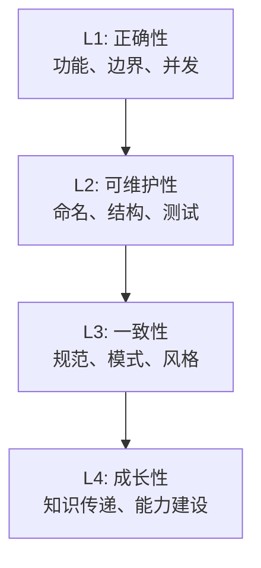
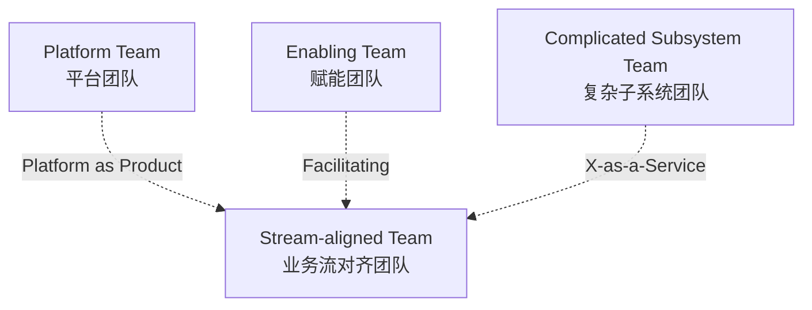
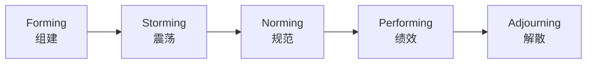

# 团队建设

> **版本**：v1.2
> **最后更新**：2026-04-28

## 📖 概述

"架构是长出来的，不是画出来的。" 一个好架构的背后一定是一支好团队。架构师不仅要设计系统，还要**设计让好架构能持续产出的组织机制**。本文讲解 4 类机制：**代码评审文化**（保证代码质量的日常肌肉）、**技术分享机制**（知识流动的管道）、**架构委员会**（重大决策的治理组织）、**工程师梯队建设**（人才的阶梯）。

## 🎯 学习目标

- 能够建立一套可持续的代码评审文化与规范
- 能够设计多种形式的技术分享机制
- 理解架构委员会的组成、职责、议事规则
- 掌握工程师梯队模型（P 序列、能力模型）及晋升支持

## 🎯 代码评审文化

代码评审（Code Review，CR）是**成本最低、收益最大**的工程实践之一。它不仅能发现 Bug，更是知识传承与团队对齐的载体。

### CR 的四层目标



### 高质量 CR 的规则

```js
const crRules = {
  authorRules: [
    '单次 PR 小于 400 行（研究表明超过此数缺陷检出率骤降）',
    '自我审查后再发起（先 diff 自己看一遍）',
    '描述 Why 而非 How（代码已写了 How）',
    '关联 Issue / 设计文档 / ADR',
    'CI 全绿再请人评审',
  ],
  reviewerRules: [
    '24 小时内给首次响应',
    '用"建议 / 必须 / 疑问"三种标签',
    '评论针对代码而非人',
    '不堵塞琐碎问题（通过 linter 解决）',
    '发现好代码也要点赞',
  ],
  bannedBehavior: [
    '「我觉得这样更好」式主观反驳',
    '等我回复再合并（拖延型阻塞）',
    '改到让我满意为止（无标准游移）',
    '「我以前就是这么写的」（经验权威压人）',
  ],
}

function validatePR(pr) {
  const issues = []
  if (pr.changedLines > 400) issues.push('PR 过大，建议拆分')
  if (!pr.description || pr.description.length < 20) issues.push('描述过短')
  if (!pr.ciPassed) issues.push('CI 未通过')
  if (!pr.selfReviewed) issues.push('未自审')
  return { canStartReview: issues.length === 0, issues }
}

console.log(validatePR({ changedLines: 320, description: '重构订单创建逻辑...', ciPassed: true, selfReviewed: true }))
```

### 评论分级标签

| 标签 | 含义 | 处理 |
| --- | --- | --- |
| `must` / 🔴 | 必须修改 | 不改不能合并 |
| `should` / 🟡 | 强烈建议 | 作者决定，需回复 |
| `nit` / 🟢 | 吹毛求疵 | 可忽略 |
| `question` / 🔵 | 疑问 | 作者答复 |
| `praise` / ⭐ | 点赞 | 鼓励好代码 |

### 度量指标

- **首次响应时间**：P50 < 4h，P90 < 24h
- **合并时长**：P50 < 1d，P90 < 3d
- **CR 参与率**：核心开发者人均每周 5+ 次
- **缺陷检出率**：单次 CR 发现问题数 / 代码变更规模

## 🎯 技术分享机制

技术分享是**让组织学习速度超过个人学习速度**的关键。一人习得的技能，通过分享可以被 10 人、100 人复用。

### 多层次分享体系

```js
const sharingChannels = [
  {
    level: '团队（每周）',
    form: '晨会 / 迭代评审',
    duration: '10-15 min',
    content: '本周学到的小技巧、坑、工具',
  },
  {
    level: '部门（双周）',
    form: '技术分享会',
    duration: '30-45 min',
    content: '项目深度复盘、新技术探索、PoC 结论',
  },
  {
    level: '公司（月度）',
    form: 'Tech Talk / Brown Bag',
    duration: '1h',
    content: '跨领域最佳实践、专家讲座',
  },
  {
    level: '行业（季度）',
    form: '对外技术博客 / 会议',
    duration: '不定',
    content: '经过打磨的方法论与案例',
  },
]

function recommendChannel(topicMaturity) {
  if (topicMaturity === 'tip') return sharingChannels[0]
  if (topicMaturity === 'pattern') return sharingChannels[1]
  if (topicMaturity === 'methodology') return sharingChannels[2]
  return sharingChannels[3]
}

console.log(recommendChannel('pattern').form) // 技术分享会
```

### 激励机制

- **可见性**：分享作为晋升材料的正式项
- **低门槛**：15 分钟的"小灶分享"也算
- **内容沉淀**：所有分享必须有 slide + 录播 + 文章
- **反馈闭环**：听众打分公开，驱动讲者持续优化

### 常见反模式

```js
const antiPatterns = {
  '水分享': '临时拼凑 PPT，无深度',
  '独角戏': '只有少数"明星"持续分享',
  '大水漫灌': '所有人必须参加，形成负担',
  '形式主义': '只算数量，不问质量',
  '无沉淀': '分享完就消失，无法复用',
}

function diagnose(team) {
  return Object.entries(antiPatterns).filter(([key]) =>
    team.symptoms.includes(key),
  )
}

console.log(
  diagnose({ symptoms: ['独角戏', '无沉淀'] }).map(([k]) => k),
)
// ['独角戏', '无沉淀']
```

## 🎯 架构委员会

架构委员会（Architecture Review Board，ARB）是**重大技术决策的治理组织**。它不是一个"官僚机构"，而是**让集体智慧参与到关键决策**的机制。

### 组成与职责

```js
const archCommittee = {
  chair: 'CTO 或 首席架构师',
  members: [
    { role: '各业务线架构师', count: 4 },
    { role: '基础平台代表', count: 2 },
    { role: '安全代表', count: 1 },
    { role: '轮值特邀专家', count: 1 },
  ],
  cadence: '每月 1 次例会，紧急可临时召集',
  responsibilities: [
    '审议跨域/高风险技术方案',
    '批准架构原则与技术标准',
    '维护技术雷达',
    '裁决跨团队技术争议',
    '评估重大技术投资（ROI > 100 人日）',
  ],
  nonResponsibilities: [
    '团队内部技术选择（应下放）',
    '具体代码实现问题',
    '人员绩效评估',
  ],
}

function requiresArbReview(proposal) {
  const triggers = [
    proposal.crossTeams >= 3,
    proposal.estimatedEffort >= 100, // 人日
    proposal.securityImpact === 'high',
    proposal.dataImpact === 'high',
    proposal.replacesExistingStandard,
  ]
  return triggers.filter(Boolean).length >= 1
}

console.log(
  requiresArbReview({
    crossTeams: 1,
    estimatedEffort: 150,
    securityImpact: 'low',
    dataImpact: 'low',
    replacesExistingStandard: false,
  }),
) // true（超过工时门槛）
```

### 议事规则

1. **预读**：议题提前 48 小时发材料
2. **时间盒**：每议题 30 分钟内结束
3. **决议方式**：充分讨论 + 主席拍板（非投票）
4. **Disagree and Commit**：决议后异议者仍需执行
5. **公开透明**：决议写入 ADR，公司内部全员可见

### 反模式防范

- ❌ **过度介入**：插手团队内部选型，打击自主性
- ❌ **效率黑洞**：每个小事都要上委员会
- ❌ **只批不建**：只说不行，不给替代方案
- ❌ **少数暴政**：强势专家主导，他人沉默

## 🎯 工程师梯队建设

梯队建设的目标是**让每个工程师都能看到成长路径，让组织始终有下一梯队的接班人**。

### 能力模型（以 P 序列为例）

```js
const engineerLadder = [
  { level: 'P4 初级', years: '0-2', focus: '完成分配任务', scope: '模块级' },
  { level: 'P5 中级', years: '2-4', focus: '独立负责子系统', scope: '子系统级' },
  { level: 'P6 高级', years: '4-7', focus: '主导关键系统', scope: '系统级' },
  { level: 'P7 技术专家', years: '7-10', focus: '领域技术领导', scope: '多系统/业务域' },
  { level: 'P8 资深专家/架构师', years: '10+', focus: '跨域架构与战略', scope: '组织级' },
  { level: 'P9 首席/Fellow', years: '—', focus: '行业影响力', scope: '行业/公司级' },
]

const dimensions = [
  '技术深度',
  '技术广度',
  '业务理解',
  '架构设计',
  '工程质量',
  '技术影响力',
  '组织协作',
  '培养他人',
]

// 能力画像评估
function profile(engineer) {
  return dimensions.map((d) => ({
    dimension: d,
    score: engineer.scores[d] ?? 0, // 1-5
    gap: Math.max(0, (engineer.targetLevel?.[d] ?? 0) - (engineer.scores[d] ?? 0)),
  }))
}

console.log(
  profile({
    scores: { 技术深度: 4, 技术广度: 3, 架构设计: 3, 工程质量: 4, 业务理解: 3, 技术影响力: 2, 组织协作: 3, 培养他人: 2 },
    targetLevel: { 技术深度: 4, 技术广度: 4, 架构设计: 4, 工程质量: 4, 业务理解: 4, 技术影响力: 3, 组织协作: 3, 培养他人: 3 },
  }),
)
```

### 成长支持体系

```js
const growthSupport = {
  mentor: '每个 P5 以下工程师指定导师（1:1 每双周）',
  rotation: '每 2 年可申请跨团队轮岗',
  project: '提供挑战性项目作为成长机会',
  coaching: '资深工程师晋升前 1 对 1 教练',
  externalExposure: '鼓励对外分享、开源贡献',
  learningBudget: '每人每年 ≥ 5000 元学习预算',
}

// 梯队健康度指标
function ladderHealth(team) {
  const ratio = (level) => team.filter((p) => p.level === level).length / team.length
  return {
    hasSeniors: ratio('P7') + ratio('P8') >= 0.2, // 资深占比 ≥ 20%
    hasJuniors: ratio('P4') + ratio('P5') <= 0.5, // 初中级占比 ≤ 50%
    hasSuccessors: team.some((p) => p.level === 'P7' && p.readyForP8), // 有接班人
  }
}

const team = [
  { level: 'P5' }, { level: 'P5' }, { level: 'P6' }, { level: 'P6' },
  { level: 'P7', readyForP8: true }, { level: 'P7' }, { level: 'P8' },
]
console.log(ladderHealth(team))
```

### 晋升支持

架构师应该做晋升的**推动者而非评委**：

- **目标澄清**：帮工程师看清下一级的标准和差距
- **机会匹配**：把能锻炼关键能力的项目分配给合适的人
- **材料打磨**：协助准备晋升材料（不代写）
- **预演反馈**：组织模拟答辩，提供改进建议
- **落选托底**：未通过时一起分析并制定下轮计划

## 🧠 理论基础

团队建设背后是一系列管理学、组织行为学、认知心理学的经典理论。

### 1. Team Topologies（Skelton & Pais, 2019）

Matthew Skelton 与 Manuel Pais 在 [*Team Topologies*](https://teamtopologies.com/) 中提出**四类团队 + 三种交互模式**，是现代工程组织设计的主流方法论：



| 团队类型 | 职责 | 典型例子 |
| --- | --- | --- |
| **Stream-aligned** | 端到端交付某一业务价值流 | 订单团队、商品团队 |
| **Enabling** | 短期派驻，提升他人能力 | DDD 教练团、SRE 教练 |
| **Complicated Subsystem** | 维护需要专门知识的子系统 | 搜索引擎、推荐算法 |
| **Platform** | 提供内部产品，降低认知负荷 | DevOps 平台、数据平台 |

**三种交互模式**：

- **Collaboration**：两个团队深度合作（短期使用，长期会互相拖累）
- **X-as-a-Service**：一方提供稳定服务接口
- **Facilitating**：一方帮助另一方学习或解决问题

```js
// 判断团队交互模式是否健康
function evaluateTeamInteraction(pair) {
  if (pair.mode === 'Collaboration' && pair.durationMonths > 6) {
    return { healthy: false, advice: '长期 Collaboration 应转为 X-as-a-Service 或 Facilitating' }
  }
  if (pair.mode === 'X-as-a-Service' && !pair.hasServiceContract) {
    return { healthy: false, advice: '必须有清晰的服务契约（SLA + API）' }
  }
  if (pair.mode === 'Facilitating' && pair.durationMonths > 3) {
    return { healthy: false, advice: 'Facilitating 应时间盒化，避免长期依赖' }
  }
  return { healthy: true }
}

console.log(
  evaluateTeamInteraction({
    mode: 'X-as-a-Service',
    durationMonths: 12,
    hasServiceContract: true,
  }),
)
```

### 2. 邓巴数（Robin Dunbar, 1992）

英国人类学家 Robin Dunbar 基于灵长类动物新皮质大小研究得出 [**Dunbar's Number = 150**](https://en.wikipedia.org/wiki/Dunbar%27s_number)：人类稳定维持社交关系的上限约为 150 人。后续研究细化出一系列**同心圆**：

| 圈层 | 人数 | 对团队建设的启示 |
| --- | --- | --- |
| **亲密圈** | 5 | 小组（Pair / Squad 核心） |
| **好友圈** | 15 | 两个披萨团队（Two-Pizza Team） |
| **熟人圈** | 50 | 部门或领域上限 |
| **认识圈** | 150 | 整个工程组织的沟通边界 |

```js
const dunbarLayers = [5, 15, 50, 150]

function recommendOrgStructure(engineerCount) {
  if (engineerCount <= 5) return { structure: '单一 Squad', rule: '5 人以内一个圈' }
  if (engineerCount <= 15) return { structure: '2-3 个 Squad', rule: 'Two-Pizza Team' }
  if (engineerCount <= 50) return { structure: '多个 Squad 组成 Tribe', rule: '50 人以内一层管理' }
  if (engineerCount <= 150) return { structure: '多个 Tribe', rule: '需要正式的 API 与仪式' }
  return { structure: '拆分为多个独立事业部', rule: '突破 Dunbar 上限，必须正式化' }
}

console.log(recommendOrgStructure(40))
```

### 3. 两个披萨原则（Jeff Bezos, 2002）

亚马逊 Jeff Bezos 提出 [**Two-Pizza Team Rule**](https://www.aboutamazon.com/news/workplace/two-pizza-teams-are-just-the-start-accountability-and-effective-decision-making-at-amazon)：**一个团队应该小到两个披萨能喂饱**（通常 6-10 人）。原理：

- **沟通复杂度**：N 人团队的双向通道数 = N × (N-1) / 2，10 人 = 45 条、20 人 = 190 条
- **心理安全**：小团队更容易建立信任
- **决策效率**：小团队无需大量协调

```js
function communicationPaths(n) {
  return (n * (n - 1)) / 2
}

function teamSizeHealth(size) {
  const paths = communicationPaths(size)
  if (size <= 3) return { size, paths, verdict: '过小，抗风险能力弱' }
  if (size <= 10) return { size, paths, verdict: '健康（Two-Pizza）' }
  if (size <= 15) return { size, paths, verdict: '临界，需考虑拆分' }
  return { size, paths, verdict: '过大，沟通成本指数上升' }
}

console.log([5, 10, 15, 20].map(teamSizeHealth))
```

### 4. Tuckman 团队发展阶段（Bruce Tuckman, 1965）

Bruce Tuckman 在论文 [*Developmental Sequence in Small Groups*](https://psycnet.apa.org/record/1965-12187-001) 中提出团队四阶段（1977 年补充第五阶段）：



| 阶段 | 特征 | 领导者作用 |
| --- | --- | --- |
| **Forming** | 礼貌、依赖领导 | 明确目标、角色 |
| **Storming** | 冲突、权力斗争 | 疏导冲突，建立规则 |
| **Norming** | 规则建立、凝聚力 | 放权、培养协作 |
| **Performing** | 高效自主 | 移除障碍，战略引领 |
| **Adjourning** | 项目结束、解散 | 复盘、情感告别 |

```js
function assessTeamStage(indicators) {
  if (indicators.conflictLevel > 0.7) return 'Storming'
  if (indicators.trustLevel < 0.4) return 'Forming'
  if (indicators.selfOrganization > 0.7 && indicators.output > 0.7) return 'Performing'
  if (indicators.normsEstablished) return 'Norming'
  return 'Forming'
}

function leadershipFocus(stage) {
  return {
    Forming: '明确目标、建立角色',
    Storming: '疏导冲突、建立评审/决策机制',
    Norming: '文档化流程、培养 Mentor',
    Performing: '移除障碍、战略引领',
    Adjourning: '复盘、知识沉淀',
  }[stage]
}

const stage = assessTeamStage({
  conflictLevel: 0.3,
  trustLevel: 0.8,
  selfOrganization: 0.7,
  output: 0.8,
  normsEstablished: true,
})
console.log({ stage, focus: leadershipFocus(stage) })
```

### 5. 心理安全（Amy Edmondson, 1999 / Google Project Aristotle, 2015）

Harvard 教授 Amy Edmondson 在 [*Psychological Safety and Learning Behavior in Work Teams*](https://journals.sagepub.com/doi/10.2307/2666999) 中提出**心理安全（Psychological Safety）**概念。2015 年 Google 的 [*Project Aristotle*](https://rework.withgoogle.com/print/guides/5721312655835136/) 用两年时间研究 180 多个团队后确认：**心理安全是高绩效团队的第一要素**。

五大要素（重要性排序）：

1. **Psychological Safety**：敢说敢问不被惩罚
2. **Dependability**：团队成员可靠
3. **Structure & Clarity**：目标清晰
4. **Meaning**：工作有意义
5. **Impact**：工作有影响

```js
// 简易心理安全度调研
const psychSafetyItems = [
  { q: '在团队里犯错不会被针对', weight: 0.25 },
  { q: '可以提出难题或难处', weight: 0.2 },
  { q: '团队接受差异与新想法', weight: 0.2 },
  { q: '能安全地冒险尝试', weight: 0.15 },
  { q: '容易请求他人帮助', weight: 0.1 },
  { q: '没人会故意破坏你的努力', weight: 0.05 },
  { q: '你的独特技能被重视', weight: 0.05 },
]

function psychSafetyScore(answers) {
  // answers: 各题 1-5 分
  const total = psychSafetyItems.reduce((sum, item, i) => sum + answers[i] * item.weight, 0)
  return {
    score: Number(total.toFixed(2)),
    level: total >= 4 ? '高' : total >= 3 ? '中' : '低',
  }
}

console.log(psychSafetyScore([5, 4, 4, 4, 5, 5, 4]))
```

### 6. 无咎复盘（Blameless Culture）/ John Allspaw

Etsy 前 CTO John Allspaw 在 2012 年博客 [*Blameless PostMortems and a Just Culture*](https://www.etsy.com/codeascraft/blameless-postmortems) 中系统化**无咎复盘**文化：

> Engineers whose actions have contributed to an accident can give detailed accounts of:
> - what actions they took
> - what effects they observed
> - expectations they had
> - assumptions they had made
> - their understanding of timeline of events as they occurred
>
> ...without fear of punishment or retribution.

无咎文化的公式：**行为 = 局部合理 × 系统约束**。要改变的是**系统**（流程、工具、培训），而非责怪个人。

```js
// 复盘提问引导（5 类问题）
const blamelessQuestions = {
  timeline: '事件的精确时间线是什么？',
  assumption: '当时你有什么假设？',
  information: '你当时能看到什么信息？缺少什么？',
  systemSignal: '系统是否发出过警告？',
  countermeasure: '什么系统性改进能避免重演？',
}

function reviewQuality(postmortem) {
  const covered = Object.keys(blamelessQuestions).filter((q) => postmortem[q])
  const hasBlameLanguage = /(笨|傻|马虎|不认真)/.test(JSON.stringify(postmortem))
  return {
    coverage: covered.length / Object.keys(blamelessQuestions).length,
    blameless: !hasBlameLanguage,
    verdict: !hasBlameLanguage && covered.length >= 4 ? 'healthy' : 'needs-improvement',
  }
}

console.log(
  reviewQuality({
    timeline: '...',
    assumption: '...',
    information: '...',
    systemSignal: '...',
    countermeasure: '改进 PR 模板...',
  }),
)
```

### 7. 成长型思维（Carol Dweck, 2006）

Stanford 心理学家 Carol Dweck 在 [*Mindset: The New Psychology of Success*](https://mindsetonline.com/) 中区分：

- **固定型思维（Fixed Mindset）**：能力是先天的，失败=我不行
- **成长型思维（Growth Mindset）**：能力可习得，失败=学习机会

在工程师梯队建设中：**鼓励过程、而非鼓励天赋**。

```js
const praiseExamples = {
  fixed: ['你真聪明', '你真有天赋', '你是天才'],
  growth: [
    '你在这个问题上花的心思让我印象深刻',
    '你尝试的这个角度很独特',
    '你从上一次失败中学到了什么？',
  ],
}

function mindsetStyle(feedback) {
  const growth = ['努力', '过程', '学', '尝试', '方法', '进步']
  const fixed = ['聪明', '天赋', '天生', '笨']
  const hits = { growth: 0, fixed: 0 }
  for (const w of growth) if (feedback.includes(w)) hits.growth++
  for (const w of fixed) if (feedback.includes(w)) hits.fixed++
  return hits.growth >= hits.fixed ? 'growth' : 'fixed'
}

console.log(mindsetStyle('你在这个问题上花的心思和尝试的方法让我印象深刻')) // growth
```

### 理论到实践的映射

| 实践 | 对应理论 | 解决的问题 |
| --- | --- | --- |
| 按业务流组建 Squad | Team Topologies | 端到端交付能力 |
| 团队规模 6-10 | Two-Pizza + 邓巴数 | 控制沟通复杂度 |
| 根据阶段调整领导风格 | Tuckman | 匹配团队成熟度 |
| 建立敢说敢错的文化 | 心理安全 | 信息流动、创新 |
| 事故不追责个人 | 无咎复盘 | 改系统而非责骂 |
| 鼓励过程与努力 | 成长型思维 | 工程师持续成长 |

## 📝 实际应用示例：一个 30 人团队的建设路线图

```js
const teamBuildingPlan = {
  quarter1: {
    focus: '打基础',
    actions: [
      '发布 CR 规范 v1.0',
      '引入 PR 模板 + 自动化 Lint/CI',
      '建立每周 30 分钟技术分享',
      '盘点团队能力画像',
    ],
    successMetrics: ['CR 参与率 > 80%', '分享会出勤率 > 70%'],
  },
  quarter2: {
    focus: '拉深度',
    actions: [
      '成立轻量架构委员会（5 人）',
      '启动第一批技术债务专项',
      '推出 Mentor 机制',
      '建立团队技术雷达',
    ],
    successMetrics: ['3 个 ADR 产出', '2 项技术债完成偿还'],
  },
  quarter3: {
    focus: '拉广度',
    actions: [
      '组织跨团队轮岗（2 人试点）',
      '启动对外技术博客',
      '举办第一届内部 Tech Talk',
    ],
    successMetrics: ['5 篇对外文章', '跨团队协作满意度提升'],
  },
  quarter4: {
    focus: '见成果',
    actions: [
      '盘点团队能力画像变化',
      '支持 2-3 人晋升',
      '产出年度技术总结',
    ],
    successMetrics: ['晋升通过率 > 80%', '招聘吸引力提升'],
  },
}

console.log(Object.keys(teamBuildingPlan).length) // 4
```

## 🔗 相关概念

- **技术选型**：架构委员会是选型的治理层
- **技术沟通**：CR、技术分享都是沟通的具体形式
- **项目治理**：团队建设与项目治理是两个互补视角

## 📝 学习检查点

- [ ] 能为团队起草一份可执行的 CR 规范
- [ ] 能设计一套可持续运转的技术分享体系
- [ ] 能定义架构委员会的组成、议事与反模式
- [ ] 能画出一个工程师的能力画像并提出成长计划
- [ ] 能支持一次工程师晋升的完整流程

## 🚀 下一步

→ [项目治理](./04-project-governance.mdx)

