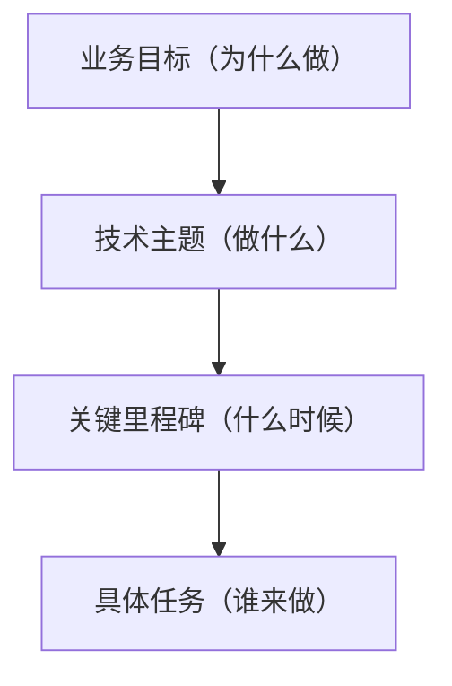
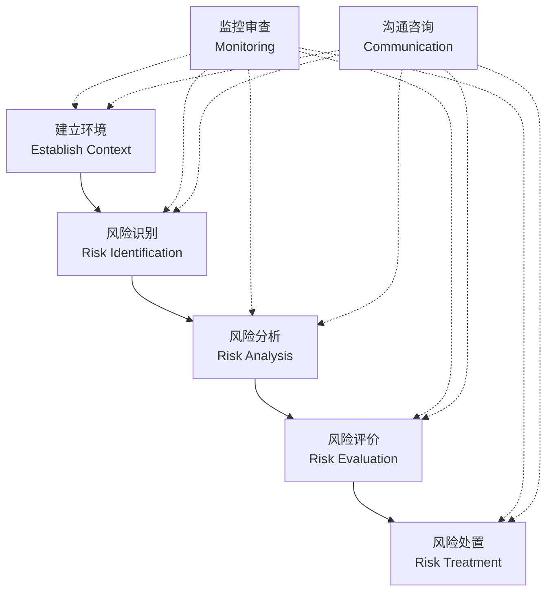
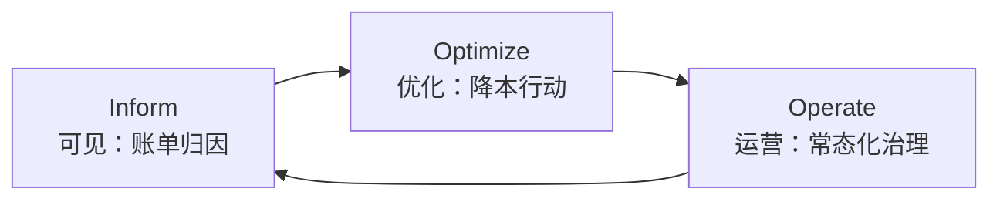

# 项目治理

> **版本**：v1.2
> **最后更新**：2026-04-28

## 📖 概述

项目治理（Project Governance）是架构师从"设计者"走向"负责人"的关键能力。它不是"多开会、多写 PPT"，而是**用系统化方法让不确定性变得可控，让资源投入产生最大回报**。本文讲解 4 类治理能力：**技术风险识别与管控**、**容量规划与成本优化**、**研发效能度量（DORA 指标等）**、**技术路线图规划**。

## 🎯 学习目标

- 掌握技术风险的识别、评估、应对与监控全流程
- 能够做容量规划并落地成本优化（FinOps 思维）
- 理解 DORA 四大指标与 SPACE 框架
- 能够制定 3-12 个月的技术路线图

## 🎯 技术风险识别与管控

### 风险矩阵

风险的核心维度是**可能性 × 影响面**，绘制成 5×5 矩阵即可直观判断优先级。

```js
const riskMatrix = {
  dimensions: { probability: [1, 2, 3, 4, 5], impact: [1, 2, 3, 4, 5] },
  classify(prob, impact) {
    const score = prob * impact
    if (score >= 16) return { level: 'critical', color: 'red', action: '立即应对' }
    if (score >= 9) return { level: 'high', color: 'orange', action: '优先应对' }
    if (score >= 4) return { level: 'medium', color: 'yellow', action: '计划应对' }
    return { level: 'low', color: 'green', action: '监控即可' }
  },
}

const risks = [
  { name: '主库单点', probability: 2, impact: 5 },
  { name: '第三方依赖稳定性', probability: 4, impact: 3 },
  { name: '团队核心成员流失', probability: 3, impact: 4 },
  { name: '监控告警缺失', probability: 4, impact: 4 },
]

console.table(
  risks.map((r) => ({
    name: r.name,
    score: r.probability * r.impact,
    ...riskMatrix.classify(r.probability, r.impact),
  })),
)
```

### 风险应对四策略

```js
const riskStrategies = {
  avoid: {
    desc: '规避：改变方案，让风险不发生',
    example: '不使用不成熟的开源组件',
  },
  mitigate: {
    desc: '降低：减少可能性或影响',
    example: '主库加上从库实现 HA',
  },
  transfer: {
    desc: '转移：让第三方承担风险',
    example: '购买云厂商的 SLA、买保险',
  },
  accept: {
    desc: '接受：明示接受并监控',
    example: '小概率区域性故障，准备应急预案',
  },
}

function pickStrategy(risk) {
  if (risk.level === 'critical' && risk.avoidable) return 'avoid'
  if (risk.level === 'critical' || risk.level === 'high') return 'mitigate'
  if (risk.level === 'medium' && risk.transferable) return 'transfer'
  return 'accept'
}

console.log(pickStrategy({ level: 'critical', avoidable: false })) // mitigate
```

### 风险登记册（Risk Register）

```js
const riskRegister = [
  {
    id: 'RISK-001',
    title: '订单主库单点',
    owner: '@dba-team',
    probability: 2,
    impact: 5,
    strategy: 'mitigate',
    mitigation: ['配置 HA 主从', '每周演练主从切换'],
    residualRisk: '跨机房网络分区',
    reviewCycle: '月度',
    status: 'in-progress',
    dueDate: '2026-06-30',
  },
  {
    id: 'RISK-002',
    title: '关键开源组件无内部维护者',
    owner: '@platform-team',
    probability: 4,
    impact: 3,
    strategy: 'mitigate',
    mitigation: ['指定 2 名内部 maintainer', '每半年代码走读'],
    reviewCycle: '季度',
    status: 'planned',
  },
]

function healthCheck(register) {
  const overdue = register.filter((r) => {
    if (!r.dueDate) return false
    return new Date(r.dueDate) < new Date() && r.status !== 'closed'
  })
  const highUnowned = register.filter((r) => r.probability * r.impact >= 9 && !r.owner)
  return { overdue, highUnowned }
}

console.log(healthCheck(riskRegister))
```

### 事故复盘（Blameless Postmortem）

风险从"潜在"变成"事故"后，复盘是下一次避免的起点。关键原则：**对事不对人**。

- **时间线**：精确到分钟的事件回放
- **影响**：用户数、订单数、金额等量化数据
- **根因**：使用 5 Whys 或 Fishbone 分析
- **Action**：每项必须有 owner + 截止时间
- **公开**：全员可读，形成组织记忆

## 🎯 容量规划与成本优化

容量规划回答两个问题：**够不够用？花得值不值？**

### 容量估算模型

```js
// 一个简化的容量估算框架
function estimateCapacity(input) {
  const {
    dau, // 日活用户
    actionsPerUser, // 人均关键操作次数
    peakFactor, // 峰谷比，典型 3-10
    bytesPerAction, // 每次操作数据量（字节）
    retentionDays, // 数据保留天数
  } = input

  const dailyActions = dau * actionsPerUser
  const peakQPS = Math.ceil((dailyActions * peakFactor) / 86400)
  const dailyStorageGB = (dailyActions * bytesPerAction) / 1024 ** 3
  const totalStorageGB = dailyStorageGB * retentionDays

  return {
    peakQPS,
    dailyStorageGB: Math.ceil(dailyStorageGB),
    totalStorageGB: Math.ceil(totalStorageGB),
  }
}

console.log(
  estimateCapacity({
    dau: 5_000_000,
    actionsPerUser: 10,
    peakFactor: 5,
    bytesPerAction: 2000,
    retentionDays: 180,
  }),
)
// { peakQPS: 2894, dailyStorageGB: 94, totalStorageGB: 16875 }
```

### 资源预算与安全水位

- **日常水位**：核心服务 CPU/内存 ≤ 40%，DB ≤ 60%
- **大促水位**：CPU/内存 ≤ 70%，DB ≤ 80%
- **预留 buffer**：突发场景预留 30% 余量
- **HPA 策略**：根据 QPS + 延迟双指标自动扩缩

```js
function recommendReplicas({ currentQPS, maxQPSPerPod, safetyBuffer = 0.3 }) {
  const base = Math.ceil(currentQPS / maxQPSPerPod)
  const withBuffer = Math.ceil(base * (1 + safetyBuffer))
  return { base, recommended: withBuffer }
}

console.log(recommendReplicas({ currentQPS: 8000, maxQPSPerPod: 1000 }))
// { base: 8, recommended: 11 }
```

### 成本优化（FinOps）

```js
const costOptimizations = [
  {
    category: '计算',
    actions: ['使用 Spot/抢占式实例', 'ARM 机型替代 x86（降本 20-40%）', '夜间自动缩容'],
    typicalSaving: '20-40%',
  },
  {
    category: '存储',
    actions: ['冷数据下沉到对象存储', '归档 + 压缩', '定期清理无效快照'],
    typicalSaving: '30-60%',
  },
  {
    category: '网络',
    actions: ['跨可用区流量优化', 'CDN 缓存命中率提升', '内网调用替代公网'],
    typicalSaving: '15-30%',
  },
  {
    category: '中间件',
    actions: ['按租户合并集群', '冷 Topic 下线', '连接池优化'],
    typicalSaving: '10-25%',
  },
]

function prioritize(savings, monthlyCost) {
  return savings
    .map((s) => ({
      ...s,
      estimatedMonthly: Math.round(monthlyCost * (parseInt(s.typicalSaving) / 100)),
    }))
    .sort((a, b) => b.estimatedMonthly - a.estimatedMonthly)
}

console.table(prioritize(costOptimizations, 500000))
```

### 成本归因（Cost Allocation）

成本可见才能优化。使用标签（Tag）对每个资源归属到**团队 + 服务 + 环境**。

```js
function requiredTags() {
  return ['team', 'service', 'env', 'cost-center', 'owner']
}

function validateResourceTags(resource) {
  const missing = requiredTags().filter((t) => !resource.tags?.[t])
  return { compliant: missing.length === 0, missing }
}

console.log(
  validateResourceTags({
    id: 'i-123',
    tags: { team: 'order', service: 'api', env: 'prod', 'cost-center': 'CC-01', owner: '@zhangsan' },
  }),
)
// { compliant: true, missing: [] }
```

## 🎯 研发效能度量

度量不是为了给工程师打分，而是**帮助团队识别瓶颈、持续改进**。

### DORA 四大指标（DevOps Research & Assessment）

[DORA](https://dora.dev/) 是业界最权威的研发效能度量框架，其四大指标：

```js
const doraMetrics = {
  deploymentFrequency: {
    name: '部署频率',
    tiers: {
      elite: '按需/每天多次',
      high: '每天 1 次 ~ 每周 1 次',
      medium: '每周 1 次 ~ 每月 1 次',
      low: '每月 1 次 ~ 每半年 1 次',
    },
  },
  leadTimeForChanges: {
    name: '变更前置时间（代码提交到生产）',
    tiers: { elite: '< 1 小时', high: '< 1 天', medium: '< 1 周', low: '1 周 ~ 半年' },
  },
  changeFailureRate: {
    name: '变更失败率',
    tiers: { elite: '0-15%', high: '16-30%', medium: '16-30%', low: '16-30%' },
  },
  timeToRestoreService: {
    name: '故障恢复时间',
    tiers: { elite: '< 1 小时', high: '< 1 天', medium: '< 1 天', low: '1 天 ~ 1 周' },
  },
}

function assessDoraTier(metric, value) {
  // value 以分钟/百分比为单位，简化判定
  const thresholds = {
    deploymentFrequency: { elite: 1, high: 7, medium: 30, low: 180 }, // 最小周期(天)
    leadTimeForChanges: { elite: 60, high: 1440, medium: 10080, low: 259200 }, // 分钟
    changeFailureRate: { elite: 15, high: 30, medium: 45, low: 100 }, // 百分比
    timeToRestoreService: { elite: 60, high: 1440, medium: 1440, low: 10080 }, // 分钟
  }
  const t = thresholds[metric]
  if (value <= t.elite) return 'elite'
  if (value <= t.high) return 'high'
  if (value <= t.medium) return 'medium'
  return 'low'
}

console.log(assessDoraTier('leadTimeForChanges', 720)) // high (12h)
```

### SPACE 框架（五维度度量）

2021 年微软 + GitHub 提出 [SPACE](https://queue.acm.org/detail.cfm?id=3454124)，解决"单一指标被 game"的问题：

| 维度 | 说明 | 示例指标 |
| --- | --- | --- |
| **S**atisfaction | 满意度 | 开发者 NPS、工具满意度 |
| **P**erformance | 产出质量 | 变更失败率、客户满意度 |
| **A**ctivity | 活动量 | PR 数、Commit 数 |
| **C**ommunication | 协作 | CR 响应时间、文档贡献 |
| **E**fficiency | 效率 | Lead Time、等待时长 |

**关键原则**：**同时看多个维度，避免单指标被优化而整体变差**。

### 度量陷阱

```js
const metricsAntiPatterns = {
  goodhartLaw: {
    desc: '当一个指标成为目标时，它就不再是好指标',
    example: '把代码行数作为考核 → 凑行数；把 bug 数作为考核 → 隐瞒',
  },
  individualMetrics: {
    desc: '用指标评估个人，破坏协作',
    example: 'PR 数排名 → 拆小 PR 骗数量',
  },
  vanityMetrics: {
    desc: '看起来很美但没有指导意义',
    example: '代码提交次数 → 与价值产出无关',
  },
  neglectQuality: {
    desc: '只看速度不看质量',
    example: '部署频率高但故障率爆炸',
  },
}

console.log(Object.keys(metricsAntiPatterns))
```

## 🎯 技术路线图规划

技术路线图（Tech Roadmap）是**未来 3-12 个月技术投入的指南针**。

### 路线图的四层



### Now / Next / Later 模型

```js
const techRoadmap = {
  now: {
    timeframe: '当前季度（Q2）',
    themes: [
      { name: '订单系统分库分表', status: 'in-progress', owner: '@zhangsan', eta: '2026-06-30' },
      { name: '全链路灰度发布', status: 'in-progress', owner: '@lisi', eta: '2026-06-15' },
    ],
  },
  next: {
    timeframe: '下一季度（Q3）',
    themes: [
      { name: 'Service Mesh 试点', status: 'planned', owner: '@wangwu' },
      { name: '可观测性 2.0', status: 'planned', owner: '@zhaoliu' },
    ],
  },
  later: {
    timeframe: '半年后（Q4+）',
    themes: [
      { name: '多活容灾架构', status: 'explore', owner: 'TBD' },
      { name: 'AI 辅助研发平台', status: 'explore', owner: 'TBD' },
    ],
  },
}

function summarize(roadmap) {
  return Object.entries(roadmap).map(([bucket, section]) => ({
    bucket,
    themes: section.themes.length,
    withOwner: section.themes.filter((t) => t.owner && t.owner !== 'TBD').length,
  }))
}

console.table(summarize(techRoadmap))
```

### 路线图的生命周期

```js
function reviewRoadmap(roadmap, today = new Date()) {
  const alerts = []
  for (const theme of roadmap.now.themes) {
    if (theme.eta && new Date(theme.eta) < today && theme.status !== 'done') {
      alerts.push({ theme: theme.name, alert: '已延期' })
    }
  }
  for (const theme of roadmap.next.themes) {
    if (!theme.owner || theme.owner === 'TBD') {
      alerts.push({ theme: theme.name, alert: '缺负责人' })
    }
  }
  return alerts
}

console.log(reviewRoadmap(techRoadmap, new Date('2026-07-01')))
```

### OKR 对齐

技术路线图必须与业务 OKR 对齐，否则会沦为"架构师的自嗨"：

```js
const okrAlignment = {
  businessO: '提升订单履约效率，大促期间稳定性 99.99%',
  businessKRs: ['下单成功率 ≥ 99.9%', '履约时长缩短 20%', '大促 0 P0 故障'],
  techContributions: [
    { theme: '订单分库分表', supportsKR: '下单成功率 ≥ 99.9%' },
    { theme: '履约引擎重构', supportsKR: '履约时长缩短 20%' },
    { theme: '全链路灰度', supportsKR: '大促 0 P0 故障' },
  ],
}

function validateAlignment(alignment) {
  const covered = new Set(alignment.techContributions.map((t) => t.supportsKR))
  const uncovered = alignment.businessKRs.filter((kr) => !covered.has(kr))
  return { fullyAligned: uncovered.length === 0, uncoveredKRs: uncovered }
}

console.log(validateAlignment(okrAlignment))
```

## 🧠 理论基础

项目治理的核心工具都有严谨的运筹学、统计学、系统工程学根源。

### 1. Little 定律（John Little, 1961）

MIT 教授 John Little 证明的 [**Little's Law**](https://en.wikipedia.org/wiki/Little%27s_law)：

> **L = λ × W**

- L：系统中平均任务数（WIP, Work in Progress）
- λ：平均吞吐率（到达率 / 完成率）
- W：平均停留时间（Lead Time）

这是**看板方法论**与 DevOps 效能度量的数学根基。任何想"加快交付"的团队都要在 L、λ、W 三者之间权衡。

```js
function littleLaw({ L, lambda, W }) {
  // 给出其中两个量，求第三个
  if (L == null) return { L: Number((lambda * W).toFixed(2)), lambda, W }
  if (lambda == null) return { L, lambda: Number((L / W).toFixed(2)), W }
  if (W == null) return { L, lambda, W: Number((L / lambda).toFixed(2)) }
  return { L, lambda, W, check: Math.abs(L - lambda * W) < 0.01 ? '一致' : '不自洽' }
}

// 已知 WIP=30，吞吐率 5 单/天 → Lead Time = 6 天
console.log(littleLaw({ L: 30, lambda: 5, W: null }))
// 要把 Lead Time 从 6 天降到 3 天：要么 WIP 减一半，要么吞吐率翻倍
console.log(littleLaw({ L: 30, lambda: null, W: 3 }))
// { L: 30, lambda: 10, W: 3 }
```

**治理启示**：

- **限制 WIP（看板）** 比"加人加班"更能缩短 Lead Time
- **DORA 的 Lead Time for Changes** 本质上就是 Little 定律的 W

### 2. ISO 31000 风险管理（ISO, 2009/2018）

[ISO 31000](https://www.iso.org/iso-31000-risk-management.html) 是国际标准化组织制定的风险管理权威标准，定义了完整的风险管理流程：



**风险 = 影响 × 可能性**（5×5 矩阵源于此）。ISO 31000 强调**风险是不确定性对目标的影响**，可以是正向（机会）也可以是负向（威胁）。

```js
// ISO 31000 风险评级
function iso31000RiskLevel(impact, likelihood) {
  const matrix = [
    ['Low', 'Low', 'Medium', 'Medium', 'High'],
    ['Low', 'Medium', 'Medium', 'High', 'High'],
    ['Medium', 'Medium', 'High', 'High', 'Critical'],
    ['Medium', 'High', 'High', 'Critical', 'Critical'],
    ['High', 'High', 'Critical', 'Critical', 'Critical'],
  ]
  return matrix[likelihood - 1][impact - 1]
}

console.log(iso31000RiskLevel(5, 2)) // High (影响 5, 可能性 2)
```

### 3. DORA / Accelerate（Forsgren, Humble, Kim, 2018）

Nicole Forsgren、Jez Humble、Gene Kim 在 [*Accelerate*](https://itrevolution.com/book/accelerate/) 一书中发布了**大规模实证研究（2014-2018 年、32,000+ 份问卷）**的结论，确立了四大关键指标。他们证明：**这四个指标能预测组织的软件交付与运营绩效**，并与业务结果显著相关。

| 指标 | 定义 | 精英水平 |
| --- | --- | --- |
| **Deployment Frequency** | 部署频率 | 按需部署（一天多次） |
| **Lead Time for Changes** | 代码提交到生产的时间 | < 1 小时 |
| **Change Failure Rate** | 变更失败率 | 0-15% |
| **Time to Restore Service** | 故障恢复时间 | < 1 小时 |

**四指标的设计哲学**：
- 两个**速度**指标（前两个）
- 两个**稳定性**指标（后两个）
- 避免"只提速不要质量"或"过度稳定而慢"

2021 年 Google DORA 团队在 [*State of DevOps Report*](https://cloud.google.com/devops/state-of-devops) 中加入第五个指标 —— **Reliability（可靠性/SLO 达成率）**，形成五大指标。

```js
// 四象限判定（速度 × 稳定性）
function doraQuadrant({ speed, stability }) {
  // speed/stability: 0-100
  if (speed >= 70 && stability >= 70) return 'Elite: 又快又稳'
  if (speed >= 70) return 'High-Speed-Low-Stability: 速度虚高'
  if (stability >= 70) return 'Safe-But-Slow: 稳定但慢'
  return 'Low: 需全面改进'
}

console.log(doraQuadrant({ speed: 80, stability: 40 }))
// High-Speed-Low-Stability: 速度虚高
```

### 4. SPACE 框架（GitHub × Microsoft, 2021）

Nicole Forsgren、Margaret-Anne Storey 等人在 ACM Queue 发表 [*The SPACE of Developer Productivity*](https://queue.acm.org/detail.cfm?id=3454124)，解决单一指标被 game 的问题。关键论点：

> **Developer productivity cannot be measured with one metric.**

SPACE 五维度：

| 维度 | 含义 | 示例指标 |
| --- | --- | --- |
| **S**atisfaction & Well-being | 满意度与健康 | 开发者 NPS、Burnout 指数 |
| **P**erformance | 产出质量 | 变更失败率、客户满意度 |
| **A**ctivity | 活动量 | PR 数、Commit 数 |
| **C**ommunication & Collaboration | 沟通协作 | CR 响应时间、文档贡献 |
| **E**fficiency & Flow | 流动效率 | Lead Time、等待时间 |

**三原则**：

1. 不能只看一个维度
2. 不能用作个人 KPI
3. 必须定性 + 定量结合

```js
function spaceBalance(metrics) {
  const dims = ['satisfaction', 'performance', 'activity', 'communication', 'efficiency']
  const covered = dims.filter((d) => metrics[d] != null)
  const missing = dims.filter((d) => metrics[d] == null)
  return {
    coverage: covered.length / dims.length,
    missing,
    warning: covered.length < 3 ? '维度不足，可能被 game' : null,
  }
}

console.log(
  spaceBalance({
    satisfaction: 0.8,
    performance: 0.7,
    activity: 0.6,
    communication: 0.7,
    efficiency: 0.65,
  }),
)
```

### 5. Goodhart 定律（Charles Goodhart, 1975）

英国经济学家 Charles Goodhart 在 1975 年提出：

> **When a measure becomes a target, it ceases to be a good measure.**
> 一旦一个指标成为目标，它就不再是一个好指标。

这是所有度量陷阱的理论根源：部署频率成 KPI → 拆小 PR 骗次数；测试覆盖率成 KPI → 写无效断言凑行数。

```js
function isGoodhartRisk(metric) {
  const risky = []
  if (metric.isIndividualKPI) risky.push('个人 KPI 易被操作')
  if (metric.singleIndicator) risky.push('单一指标无制衡')
  if (!metric.hasGuardrail) risky.push('缺少护栏指标')
  if (metric.easilyGameable) risky.push('易被低成本操作')
  return { atRisk: risky.length >= 2, issues: risky }
}

console.log(
  isGoodhartRisk({
    name: 'PR 数量',
    isIndividualKPI: true,
    singleIndicator: true,
    hasGuardrail: false,
    easilyGameable: true,
  }),
)
```

**对策**：用多维度指标（SPACE），不作为个人 KPI，搭配护栏指标。

### 6. 容量规划与排队论（M/M/c 模型）

容量规划背后是排队论。经典 **M/M/c 模型**（泊松到达、指数服务、c 个服务台）给出等待时间与利用率的非线性关系：

> **当利用率 ρ → 1 时，等待时间 → ∞**

这就是为什么**核心服务 CPU 水位不能超 70%**的数学依据：超过某个阈值后，延迟会指数级上升。

```js
// 单服务台 M/M/1 简化模型
function mm1WaitTime(arrivalRate, serviceRate) {
  const rho = arrivalRate / serviceRate
  if (rho >= 1) return { rho, waitTime: Infinity, verdict: '系统崩溃' }
  const waitTime = rho / (serviceRate - arrivalRate) // 平均等待时间
  return {
    utilization: Number(rho.toFixed(2)),
    waitTime: Number(waitTime.toFixed(3)),
    verdict: rho > 0.8 ? '危险水位' : rho > 0.6 ? '接近极限' : '健康',
  }
}

// 利用率从 60% 升到 80%，等待时间翻了 3 倍
console.log(mm1WaitTime(60, 100)) // rho 0.6
console.log(mm1WaitTime(80, 100)) // rho 0.8
console.log(mm1WaitTime(95, 100)) // rho 0.95, 开始爆炸
```

### 7. FinOps 框架（FinOps Foundation, 2019）

[FinOps Foundation](https://www.finops.org/framework/) 定义的**云财务运营**理论，三阶段循环：



核心原则（FinOps Principles）：

- **Teams need to collaborate**：跨职能协作
- **Everyone takes ownership of cloud usage**：全员担责
- **A centralized team drives FinOps**：中心团队驱动
- **Reports should be accessible and timely**：报表可见及时
- **Decisions are driven by business value**：业务价值驱动

```js
function finopsMaturity(org) {
  if (!org.costVisibility) return 'Crawl - 基础可见性不足'
  if (!org.costAllocation) return 'Crawl - 未按团队归因'
  if (!org.optimizationActions) return 'Walk - 有可见但无行动'
  if (!org.automation) return 'Walk - 人工优化难以规模化'
  if (!org.continuousGovernance) return 'Run - 治理尚未常态化'
  return 'Run+ - 成熟的 FinOps 运营'
}

console.log(
  finopsMaturity({
    costVisibility: true,
    costAllocation: true,
    optimizationActions: true,
    automation: true,
    continuousGovernance: false,
  }),
)
```

### 理论到实践的映射

| 实践 | 对应理论 | 解决的问题 |
| --- | --- | --- |
| 限制 WIP | Little 定律 | 缩短交付周期 |
| 风险矩阵 5×5 | ISO 31000 | 系统化风险管理 |
| DORA 四指标 | Accelerate 实证研究 | 度量效能 |
| SPACE 多维度 | Goodhart 定律规避 | 防指标被 game |
| 核心服务水位 ≤ 70% | 排队论 M/M/c | 避免延迟爆炸 |
| 按阶段推进降本 | FinOps 三阶段 | 成本可见到可控 |

## 📝 实际应用示例：季度治理节奏

```js
const quarterlyGovernance = {
  monthly: [
    '风险登记册评审',
    '成本报告回顾',
    'DORA 指标公布',
  ],
  quarterly: [
    '技术路线图评审（Now/Next/Later 滚动）',
    '技术债务专项盘点',
    'SPACE 多维度体检',
    '架构委员会议题回顾',
  ],
  annually: [
    '技术战略发布',
    '能力画像 + 梯队盘点',
    '事故年度复盘（组织级）',
  ],
}

function governanceReadiness(team) {
  const readiness = {
    hasRiskRegister: Boolean(team.artifacts?.riskRegister),
    hasCostDashboard: Boolean(team.artifacts?.costDashboard),
    hasDoraDashboard: Boolean(team.artifacts?.doraDashboard),
    hasRoadmap: Boolean(team.artifacts?.roadmap),
  }
  return Object.entries(readiness).filter(([, v]) => !v).map(([k]) => k)
}

console.log(
  governanceReadiness({
    artifacts: { riskRegister: true, costDashboard: true, doraDashboard: false, roadmap: true },
  }),
)
// ['hasDoraDashboard']
```

## 🔗 相关概念

- **技术选型**：路线图上的每一项可能都对应一次选型
- **团队建设**：治理的执行依赖健康的团队
- **业务理解**：路线图必须对齐业务 OKR

## 📝 学习检查点

- [ ] 能建立并维护团队的风险登记册
- [ ] 能为一个核心服务做容量估算与成本优化
- [ ] 能解读团队的 DORA 四大指标并定位瓶颈
- [ ] 能用 Now/Next/Later 输出一份 3-12 个月的路线图
- [ ] 能建立季度 / 月度的治理节奏

## 🚀 下一步

→ [8.3 业务理解](../03-business-understanding/01-business-understanding-overview.mdx)

