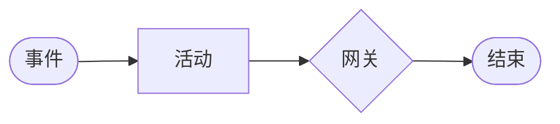
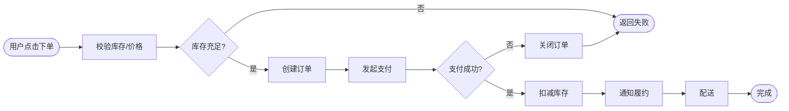
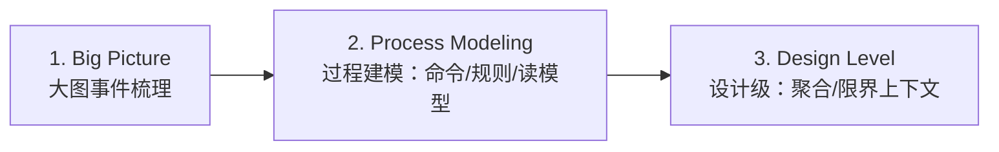
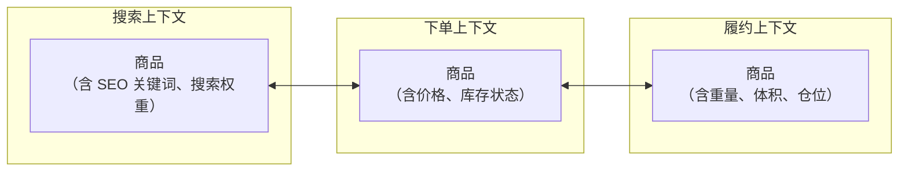
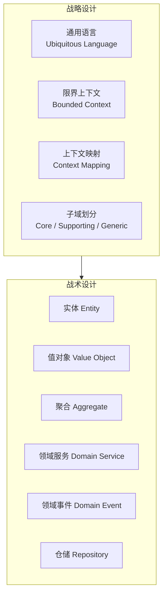
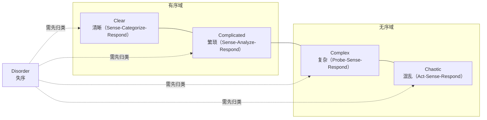
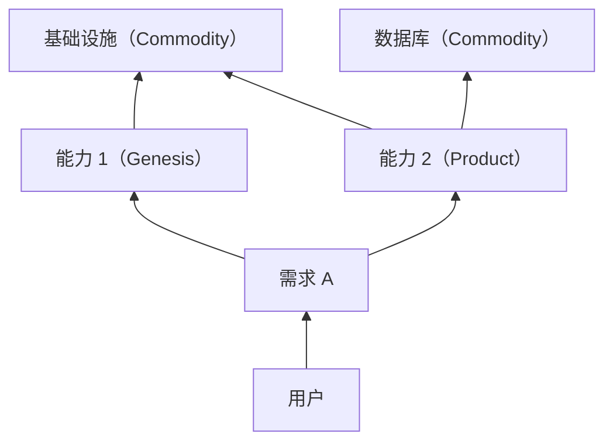

# 业务建模

> **版本**：v1.2
> **最后更新**：2026-04-28

## 📖 概述

架构的本质是**对业务的抽象**。不理解业务就做架构，只能画出漂亮但无法落地的技术图纸。本文讲解架构师把业务"翻译"成技术架构的三类方法：**业务流程分析**（把事件和参与者画清楚）、**业务领域理解**（从 DDD 视角识别核心）、**商业模式与技术映射**（从商业模式画布到架构决策）。

## 🎯 学习目标

- 掌握业务流程建模（BPMN、事件风暴）的核心技巧
- 能够用 DDD 视角拆解业务领域并识别核心子域
- 理解商业模式画布（BMC）与技术架构的映射关系
- 能够从业务 KPI 反推技术关键指标

## 🎯 业务流程分析

业务流程是**事件 + 参与者 + 规则**的组合。架构师要先看懂"钱和物怎么流"，再决定系统怎么拆。

### BPMN 基础

BPMN（Business Process Model and Notation）是业务流程标准语言，核心四要素：



以"电商下单履约"为例：



### 事件风暴（Event Storming）

事件风暴由 Alberto Brandolini 提出，是**用便签快速梳理业务**的工作坊方法。核心元素：

```js
const eventStormingElements = {
  domainEvent: { color: 'orange', form: '过去式动词', example: '订单已创建' },
  command: { color: 'blue', form: '命令', example: '创建订单' },
  actor: { color: 'yellow', form: '角色', example: '顾客' },
  aggregate: { color: 'lightyellow', form: '聚合根', example: '订单' },
  policy: { color: 'purple', form: '业务规则', example: '支付超时自动取消' },
  readModel: { color: 'green', form: '视图/报表', example: '订单列表' },
  externalSystem: { color: 'pink', form: '外部系统', example: '支付网关' },
}

console.log(Object.keys(eventStormingElements))
```

### 事件风暴三阶段



- **阶段 1（1-3 小时）**：只贴橙色便签（领域事件），按时间顺序排列
- **阶段 2（3-6 小时）**：在事件之间补齐命令、角色、规则、外部系统
- **阶段 3（0.5-2 天）**：识别聚合与限界上下文，为落地打基础

### 事件流示例（订单域）

```js
const orderEventStream = [
  { event: '订单已创建', actor: '顾客', command: '创建订单', aggregate: '订单' },
  { event: '支付已发起', actor: '顾客', command: '发起支付', aggregate: '订单' },
  { event: '支付已成功', actor: '支付网关', command: null, aggregate: '订单' },
  { event: '库存已扣减', actor: '系统', command: '扣减库存', aggregate: '库存' },
  { event: '履约已触发', actor: '系统', command: '触发履约', aggregate: '履约单', policy: '支付成功后自动触发' },
  { event: '订单已发货', actor: '仓库', command: '发货', aggregate: '履约单' },
  { event: '订单已签收', actor: '顾客', command: '确认收货', aggregate: '订单' },
]

// 从事件流导出聚合
function extractAggregates(stream) {
  const aggregates = new Map()
  for (const item of stream) {
    if (!item.aggregate) continue
    if (!aggregates.has(item.aggregate)) aggregates.set(item.aggregate, new Set())
    aggregates.get(item.aggregate).add(item.event)
  }
  return Array.from(aggregates, ([name, events]) => ({ name, events: Array.from(events) }))
}

console.log(extractAggregates(orderEventStream))
```

## 🎯 业务领域理解

业务领域理解的核心是**识别核心子域（Core Domain）**，把有限的精力投到最能产生竞争力的地方。

### 子域分类（DDD）

```js
const subdomainTypes = {
  core: {
    desc: '核心子域：公司的核心竞争力',
    investmentStrategy: '重点投入，自研',
    example: '电商的推荐算法、支付的风控',
  },
  supporting: {
    desc: '支撑子域：支持核心但不差异化',
    investmentStrategy: '自研或定制，不必投入过重',
    example: '电商的订单、库存管理',
  },
  generic: {
    desc: '通用子域：通用能力',
    investmentStrategy: '买现成方案或开源',
    example: '登录、短信、日志',
  },
}

function classifySubdomain(feature) {
  // 简化规则：独特性 × 业务价值
  const score = feature.uniqueness * feature.businessValue
  if (score >= 16) return 'core'
  if (score >= 9) return 'supporting'
  return 'generic'
}

const features = [
  { name: '个性化推荐', uniqueness: 5, businessValue: 5 },
  { name: '订单管理', uniqueness: 2, businessValue: 5 },
  { name: '短信通知', uniqueness: 1, businessValue: 3 },
]

console.table(
  features.map((f) => ({
    name: f.name,
    type: classifySubdomain(f),
    strategy: subdomainTypes[classifySubdomain(f)].investmentStrategy,
  })),
)
```

### 限界上下文与上下文映射

限界上下文（Bounded Context）是**同一模型在不同场景下的边界**。一个"商品"在搜索、下单、履约三个上下文里，属性可能完全不同。



### 上下文关系模式

```js
const contextRelations = {
  sharedKernel: '共享内核：两上下文共享一小部分模型',
  customerSupplier: '客户-供应商：下游能影响上游优先级',
  conformist: '追随者：下游必须跟随上游变更',
  antiCorruptionLayer: '防腐层：下游通过适配层隔离上游',
  openHostService: '开放主机服务：上游提供标准接口',
  publishedLanguage: '发布语言：共享文档化的模型',
  separateWays: '各行其道：两上下文不打交道',
}

function recommendRelation(ctx) {
  if (ctx.legacySystem) return 'antiCorruptionLayer'
  if (ctx.manyConsumers) return 'openHostService'
  if (ctx.strongInfluence) return 'customerSupplier'
  if (ctx.noOverlap) return 'separateWays'
  return 'sharedKernel'
}

console.log(recommendRelation({ legacySystem: true })) // antiCorruptionLayer
```

## 🎯 商业模式与技术映射

技术架构服务于商业模式。同样是"电商"，自营、平台、社交、直播的架构差异巨大。

### 商业模式画布（BMC）

```js
const businessModelCanvas = {
  customerSegments: '客户细分：你服务谁？',
  valueProposition: '价值主张：为什么选你？',
  channels: '渠道：怎么触达？',
  customerRelationships: '客户关系：如何维系？',
  revenueStreams: '收入来源：谁付钱、怎么付？',
  keyResources: '核心资源：离不开什么？',
  keyActivities: '关键业务：每天在做什么？',
  keyPartners: '重要合作：依赖谁？',
  costStructure: '成本结构：钱花在哪？',
}

console.log(Object.keys(businessModelCanvas).length) // 9
```

### 商业模式 → 架构决策映射

```js
const modelToArchitecture = [
  {
    bmcField: 'customerSegments',
    question: 'C 端 / B 端 / 多租户？',
    architectureImpact: ['多租户隔离策略', 'ID 体系', '权限模型'],
  },
  {
    bmcField: 'valueProposition',
    question: '低价、快、个性化？',
    architectureImpact: ['核心子域投入', '关键性能指标'],
  },
  {
    bmcField: 'channels',
    question: 'Web / App / 小程序 / API？',
    architectureImpact: ['网关层设计', 'SDK / BFF 策略'],
  },
  {
    bmcField: 'revenueStreams',
    question: '交易抽佣 / 广告 / 订阅？',
    architectureImpact: ['账务系统', '计费引擎', '数据报表'],
  },
  {
    bmcField: 'keyActivities',
    question: '主流程有多热？',
    architectureImpact: ['容量规划', '核心链路可用性'],
  },
  {
    bmcField: 'keyPartners',
    question: '依赖多少第三方？',
    architectureImpact: ['集成层设计', '熔断降级策略'],
  },
  {
    bmcField: 'costStructure',
    question: '成本是否敏感？',
    architectureImpact: ['FinOps 策略', 'Serverless / 按量付费评估'],
  },
]

function deriveArchitectureConcerns(bmc) {
  return modelToArchitecture.filter((m) => bmc[m.bmcField])
}

console.log(
  deriveArchitectureConcerns({
    customerSegments: 'B 端多租户',
    revenueStreams: '订阅',
  }).map((x) => x.architectureImpact),
)
```

### 业务 KPI → 技术 SLI

业务关心 KPI（转化率、GMV、NPS），技术要把它们翻译成 SLI（Service Level Indicator）才能指导架构决策。

```js
function deriveSLI(kpi) {
  const mapping = {
    'GMV（成交额）': ['下单成功率 ≥ 99.9%', '支付成功率 ≥ 99.8%'],
    '首屏转化率': ['首屏加载 P75 < 1.5s', 'API P95 < 200ms'],
    '用户留存率': ['崩溃率 < 0.1%', '启动成功率 > 99.9%'],
    '客服工单量': ['故障恢复 MTTR < 30min', '告警准确率 > 90%'],
    'NPS': ['P99 延迟 < 500ms', '全链路可观测覆盖率 100%'],
  }
  return mapping[kpi] ?? []
}

function buildSloTree(businessKPIs) {
  return businessKPIs.map((kpi) => ({ kpi, slis: deriveSLI(kpi) }))
}

console.table(buildSloTree(['GMV（成交额）', '首屏转化率', '用户留存率']))
```

## 🧠 理论基础

业务建模的三大理论支柱：**DDD**（领域驱动设计）、**Cynefin**（复杂性框架）、**Wardley Mapping**（战略演化图）。

### 1. DDD 理论谱系（Eric Evans, 2003）

Eric Evans 在 [*Domain-Driven Design: Tackling Complexity in the Heart of Software*](https://www.domainlanguage.com/ddd/) 提出完整的战略+战术设计语言，核心论点：

> **业务复杂性必须在"领域模型"这一层被驯服，而不是推给技术层。**

DDD 的理论谱系如下：



2013 年 Vaughn Vernon 在 [*Implementing Domain-Driven Design*](https://kalele.io/books/) 进一步把 DDD 与事件驱动、CQRS、微服务对齐，形成现代 DDD 实践框架。

```js
// DDD 战术元素识别
function classifyDddElement(obj) {
  if (obj.hasUniqueId && obj.hasLifecycle) return 'Entity'
  if (!obj.hasUniqueId && obj.immutable) return 'Value Object'
  if (obj.containsEntities && obj.hasRootEntity) return 'Aggregate'
  if (obj.isPastTense && obj.describesFact) return 'Domain Event'
  if (obj.operatesAcrossEntities && !obj.hasState) return 'Domain Service'
  return 'unknown'
}

console.log(
  classifyDddElement({
    name: 'Money',
    hasUniqueId: false,
    immutable: true,
  }),
) // Value Object

console.log(
  classifyDddElement({
    name: 'OrderPlaced',
    isPastTense: true,
    describesFact: true,
  }),
) // Domain Event
```

### 2. 事件风暴（Alberto Brandolini, 2013）

意大利咨询师 Alberto Brandolini 在 [*Introducing EventStorming*](https://www.eventstorming.com/book/) 中系统化了事件风暴方法。它建立在三个认知科学基础上：

1. **空间外部化（Spatial Externalization）**：把思考过程贴到墙上，让大脑腾出工作记忆
2. **领域专家主导**：颜色编码让非技术人也能参与
3. **时间线叙事**：按时间顺序推进，避免陷入细节

三阶段对应认知层次：

| 阶段 | 认知层次 | 产出 |
| --- | --- | --- |
| **Big Picture** | 现象归纳 | 领域事件时间线 |
| **Process Modeling** | 因果分析 | 命令、规则、外部系统 |
| **Design Level** | 结构抽象 | 聚合、限界上下文 |

```js
// 事件风暴成熟度评估
function eventStormingMaturity(session) {
  const checks = {
    hasDomainExperts: session.domainExperts >= 1,
    hasUnbrokenTimeline: session.timelineGaps === 0,
    hasPoliciesIdentified: session.policiesCount >= 3,
    hasBoundedContextCandidates: session.contextCandidates >= 2,
    hasHotspotsMarked: session.hotspotsCount >= 1,
  }
  const passed = Object.values(checks).filter(Boolean).length
  return {
    level: passed === 5 ? 'Design-Ready' : passed >= 3 ? 'Process-Ready' : 'Big-Picture-Only',
    checks,
  }
}

console.log(
  eventStormingMaturity({
    domainExperts: 2,
    timelineGaps: 0,
    policiesCount: 5,
    contextCandidates: 3,
    hotspotsCount: 2,
  }),
)
```

### 3. Cynefin 框架（Dave Snowden, 1999）

Dave Snowden 在 IBM Global Services 期间提出 [**Cynefin Framework**](https://hbr.org/2007/11/a-leaders-framework-for-decision-making)（2007 年在 HBR 发表知名论文），把决策场景分为五域：



| 域 | 因果关系 | 典型场景 | 架构含义 |
| --- | --- | --- | --- |
| **Clear** | 显然 | CRUD、基础工作流 | 最佳实践、自动化 |
| **Complicated** | 可分析 | 支付结算、报表 | 专家设计、良好实践 |
| **Complex** | 事后才知 | 推荐系统、用户行为 | 实验+反馈（A/B、灰度） |
| **Chaotic** | 无 | 大故障、黑天鹅 | 先行动止血再说 |
| **Disorder** | 未知 | 不知在哪个域 | 先归类 |

```js
function cynefinDomain(problem) {
  if (problem.causalityKnown === 'obvious') return 'Clear'
  if (problem.causalityKnown === 'analyzable') return 'Complicated'
  if (problem.causalityKnown === 'hindsight-only') return 'Complex'
  if (problem.causalityKnown === 'none' && problem.urgency === 'high') return 'Chaotic'
  return 'Disorder'
}

function strategyFor(domain) {
  return {
    Clear: '标准化 + 自动化',
    Complicated: '专家评估 + 最佳实践',
    Complex: '小范围探测 + 放大有效做法',
    Chaotic: '果断行动 + 事后复盘',
    Disorder: '先分解问题归入合适的域',
  }[domain]
}

const d = cynefinDomain({ causalityKnown: 'hindsight-only', urgency: 'low' })
console.log({ domain: d, strategy: strategyFor(d) })
// { domain: 'Complex', strategy: '小范围探测 + 放大有效做法' }
```

**架构师启示**：不要用 Clear 域的套路（标准化 SOP）解决 Complex 问题（用户增长）。

### 4. Wardley Mapping（Simon Wardley, 2005 起）

Simon Wardley 基于自身 CEO 经历创造了 [**Wardley Maps**](https://learnwardleymapping.com/)，是目前唯一能清晰展示**业务链条 + 演化阶段**的战略工具。两个维度：

- **Y 轴（Value Chain）**：从客户需求向下分解的价值链
- **X 轴（Evolution）**：Genesis → Custom-Built → Product → Commodity



演化阶段对应投资策略：

| 阶段 | 特征 | 策略 |
| --- | --- | --- |
| **Genesis** | 新生、不稳定 | 探索、小投入 |
| **Custom-Built** | 定制化 | 学习模式 |
| **Product** | 差异化竞争 | 差异化投入 |
| **Commodity** | 同质化 | 外购、不自研 |

```js
// 组件演化阶段识别
function evolutionStage(component) {
  const { marketMaturity, differentiation, commoditization } = component
  if (marketMaturity === 'none') return 'Genesis'
  if (differentiation === 'high' && commoditization === 'low') return 'Custom-Built'
  if (differentiation === 'medium') return 'Product'
  return 'Commodity'
}

// 根据阶段推断策略
function wardleyStrategy(stage) {
  return {
    Genesis: '自研探索，允许失败',
    'Custom-Built': '定制自研，形成竞争壁垒',
    Product: '差异化投入 + 买现成组合',
    Commodity: '直接买云服务或开源',
  }[stage]
}

console.log(wardleyStrategy(evolutionStage({ marketMaturity: 'high', differentiation: 'low', commoditization: 'high' })))
// 直接买云服务或开源
```

Wardley Maps 的核心价值：**让"为什么这里自研、那里外购"的决策可被讨论、可被挑战**。

### 5. 通用语言与 Sapir-Whorf 假说

DDD 的"通用语言（Ubiquitous Language）"理论根植于语言学的 [**Sapir-Whorf Hypothesis**](https://en.wikipedia.org/wiki/Linguistic_relativity)：**语言塑造思维**。业务、产品、工程师使用不同术语会导致：

- 需求传递失真
- 同一词不同意
- 模型与代码偏离

Evans 的对策：**在限界上下文内强制使用同一套术语，写进代码**。

```js
// 通用语言契约检查（代码是否与领域词汇对齐）
function ubiquitousLanguageCompliance(codeSymbols, glossary) {
  const definedInGlossary = codeSymbols.filter((s) => glossary.includes(s))
  const coverage = definedInGlossary.length / codeSymbols.length
  const unknownTerms = codeSymbols.filter((s) => !glossary.includes(s))
  return {
    coverage: Number(coverage.toFixed(2)),
    unknownTerms,
    verdict: coverage >= 0.9 ? 'Aligned' : coverage >= 0.7 ? 'Partially Aligned' : 'Misaligned',
  }
}

console.log(
  ubiquitousLanguageCompliance(
    ['Order', 'LineItem', 'PlaceOrder', 'OrderPlaced', 'OrderMan'],
    ['Order', 'LineItem', 'PlaceOrder', 'OrderPlaced', 'Customer'],
  ),
)
// { coverage: 0.8, unknownTerms: ['OrderMan'], verdict: 'Partially Aligned' }
```

### 6. BPMN 与业务过程管理

[BPMN](https://www.bpmn.org/)（Business Process Model and Notation）由 BPMI（后并入 OMG）2004 年发布，2011 年 2.0 成为 ISO 标准（ISO/IEC 19510）。它是**唯一被国际标准化的业务流程建模语言**。

理论根基：**业务过程管理（BPM）** —— Michael Hammer 在 1990 年 HBR 论文 [*Reengineering Work: Don't Automate, Obliterate*](https://hbr.org/1990/07/reengineering-work-dont-automate-obliterate) 中倡导的"流程重构"思想，驳斥了单纯把纸质流程自动化的做法。

### 理论到实践的映射

| 实践 | 对应理论 | 解决的问题 |
| --- | --- | --- |
| 限界上下文 | DDD 战略设计 | 模型边界清晰 |
| 事件风暴工作坊 | Brandolini + 认知科学 | 快速达成共识 |
| 区分复杂与繁琐 | Cynefin 框架 | 用对方法 |
| 自研 vs 外购决策 | Wardley Mapping | 战略级可视化 |
| 通用语言 | Sapir-Whorf | 消除语义偏差 |
| BPMN 建模 | BPM 理论 | 流程可标准化 |

## 📝 实际应用示例：外卖平台架构推导

```js
// Step 1: 商业模式画布
const bmc = {
  customerSegments: '消费者 + 商家 + 骑手',
  valueProposition: '30 分钟送达，海量选择',
  channels: 'App（主） + 小程序',
  revenueStreams: '商家佣金 + 配送费 + 广告',
  keyActivities: '下单、调度、履约、结算',
  keyPartners: '支付、地图、物流',
  costStructure: '履约补贴 + 基础设施 + 人力',
}

// Step 2: 核心子域识别
const subdomains = [
  { name: '订单履约调度', classification: 'core', reason: '决定用户体验，差异化' },
  { name: '骑手调度算法', classification: 'core', reason: '成本核心' },
  { name: '商家供应链', classification: 'supporting', reason: '必要但非差异化' },
  { name: '支付', classification: 'generic', reason: '接第三方即可' },
  { name: '短信', classification: 'generic', reason: '接第三方即可' },
]

// Step 3: 技术关键要求
const techRequirements = {
  core: ['低延迟调度（<100ms）', '强一致（订单状态）', '大规模实时计算'],
  supporting: ['稳定可靠', '能力逐步迭代'],
  generic: ['最低成本接入', '标准化'],
}

// Step 4: 架构决策
const architectureDecisions = [
  { decision: '调度引擎独立部署', basis: '核心子域需极致性能' },
  { decision: '订单域采用事件溯源', basis: '强一致 + 完整轨迹' },
  { decision: '支付/短信走外部服务', basis: '通用子域不自研' },
  { decision: '多活 + 按城市分片', basis: '履约业务天然地域性' },
]

function summarize() {
  return { bmc, subdomains, techRequirements, architectureDecisions }
}

console.log(summarize().architectureDecisions)
```

## 🔗 相关概念

- **DDD 战略设计**：业务建模的核心方法
- **C4 模型**：限界上下文对应到 C4 的 Container/Component
- **产品思维**：业务建模后要用产品思维评估交付顺序

## 📝 学习检查点

- [ ] 能用 BPMN 画出一个业务的主流程与异常分支
- [ ] 能组织一场事件风暴工作坊，产出聚合与限界上下文
- [ ] 能识别一个业务的核心/支撑/通用子域
- [ ] 能根据商业模式画布推导出关键架构决策
- [ ] 能把业务 KPI 翻译成可度量的技术 SLI

## 🚀 下一步

→ [产品思维](./03-product-thinking.mdx)

