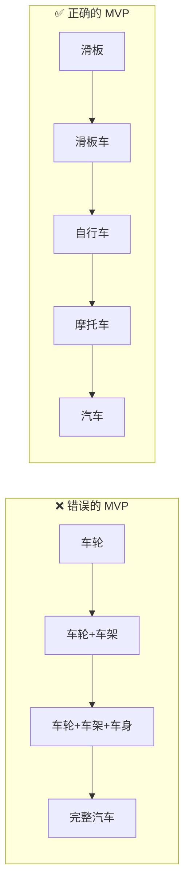
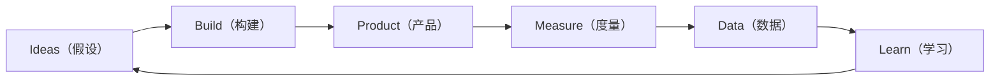
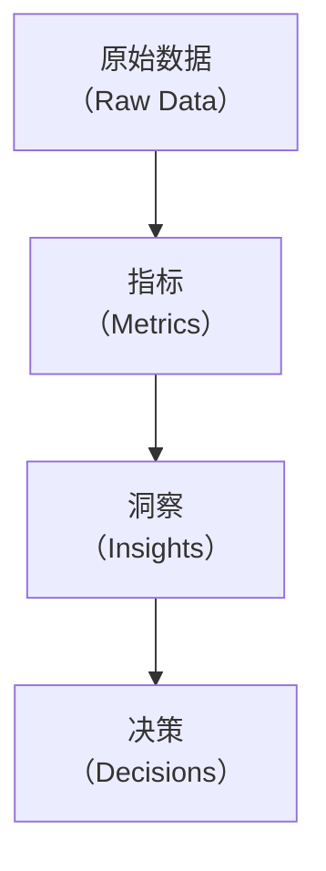
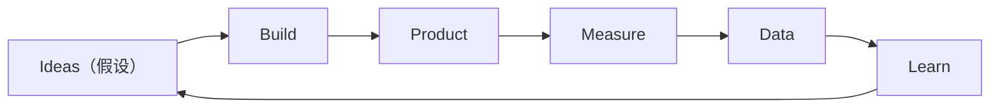
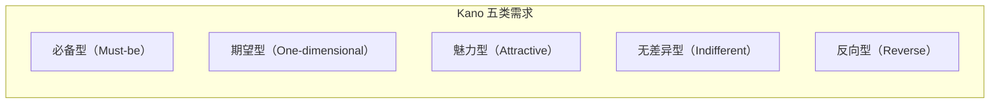

# 产品思维

> **版本**：v1.2
> **最后更新**：2026-04-28

## 📖 概述

架构师如果只有工程思维，容易陷入"完美过度设计"：用最先进的技术、最漂亮的架构，却解决了一个不重要的问题。产品思维让架构师**从"用户价值"出发反向思考技术投入**。本文讲解三类核心产品思维：**用户体验与技术取舍**（把用户放在指标前面）、**MVP 思维**（用最小代价验证价值）、**数据驱动决策**（用数据代替直觉）。

## 🎯 学习目标

- 能够在用户体验与技术优雅之间做出正确取舍
- 掌握 MVP 思维在架构设计与技术选型中的应用
- 理解数据驱动决策的方法论与实施路径
- 建立"用户价值优先"的技术判断直觉

## 🎯 用户体验与技术取舍

### 性能是一种用户体验

性能不是 "P99 < 200ms 这个数字"，而是 "用户感知到的快与慢"。架构决策要**服务于用户感知**。

```js
// Google RAIL 模型：人类对延迟的感知分级
const railPerceptionModel = {
  response: { maxMs: 100, desc: '交互响应（点击、输入）感觉"瞬时"' },
  animation: { maxMs: 16, desc: '动画每帧需 < 16ms（60fps）' },
  idle: { maxMs: 50, desc: '主线程空闲任务块应 ≤ 50ms' },
  load: { maxMs: 1000, desc: '首屏应在 1s 内出现可交互内容' },
}

function classifyPerformance(scenario, actualMs) {
  const spec = railPerceptionModel[scenario]
  if (!spec) return 'unknown'
  if (actualMs <= spec.maxMs) return 'acceptable'
  if (actualMs <= spec.maxMs * 2) return 'noticeable'
  return 'broken'
}

console.log(classifyPerformance('response', 180)) // noticeable
console.log(classifyPerformance('load', 2500)) // broken
```

### 权衡矩阵

在用户体验与技术投入之间做决策时，用"价值 × 成本"矩阵：

```js
function prioritizeTradeoff(items) {
  return items
    .map((item) => ({
      ...item,
      score: item.userValue * 2 - item.techCost, // 用户价值权重更高
      quadrant: quadrantOf(item.userValue, item.techCost),
    }))
    .sort((a, b) => b.score - a.score)
}

function quadrantOf(value, cost) {
  if (value >= 4 && cost <= 2) return '立即做（高价值低成本）'
  if (value >= 4 && cost >= 3) return '规划做（高价值高成本）'
  if (value <= 2 && cost <= 2) return '有空做（低价值低成本）'
  return '不要做（低价值高成本）'
}

const candidates = [
  { name: '首屏骨架屏', userValue: 5, techCost: 2 },
  { name: '离线可用 PWA', userValue: 3, techCost: 4 },
  { name: '极致代码分包', userValue: 2, techCost: 3 },
  { name: '全链路动画', userValue: 2, techCost: 5 },
]

console.table(prioritizeTradeoff(candidates))
```

### 体验优先的反直觉决策

以下是架构师常犯的"技术正确但用户错"的例子：

```js
const counterintuitiveDecisions = [
  {
    bad: '追求接口 P99 < 50ms 但让首屏白屏 3 秒',
    good: '接口允许 300ms 但首屏骨架屏立即出现',
    principle: '用户感知的是整体，不是接口',
  },
  {
    bad: '完美的 RESTful 规范，前端要调用 8 个接口',
    good: 'BFF 聚合为 1 个接口，前端一次拿到首屏数据',
    principle: '规范服务于价值，不是目的',
  },
  {
    bad: '强一致分布式事务保证 100% 一致',
    good: '最终一致 + 用户感知层补偿（toast 提示）',
    principle: '技术一致性 ≠ 用户感知一致性',
  },
  {
    bad: '新架构很优雅但迁移期影响老用户',
    good: '增量迁移 + 双写，老用户零感知',
    principle: '平滑过渡是用户价值',
  },
]

console.log(counterintuitiveDecisions.length) // 4
```

## 🎯 MVP 思维

MVP（Minimum Viable Product，最小可行产品）由 Eric Ries 在《精益创业》中提出，核心是**用最小代价验证关键假设**。

### 真正的 MVP vs 假 MVP



**核心差异**：每一步都是**完整可用**的产品，而不是未完成的零件。

### MVP 的三层架构应用

```js
const mvpArchPatterns = {
  infrastructure: {
    mvp: '托管的云服务（RDS + OSS + ECS）',
    scale: '自建 Kubernetes + 多活',
    principle: '先用买的，跑起来再说',
  },
  architecture: {
    mvp: '单体应用，模块化设计',
    scale: '按业务域逐步拆分',
    principle: '不要过早微服务化',
  },
  dataLayer: {
    mvp: '单个关系型数据库',
    scale: '分库分表 + 读写分离 + 缓存',
    principle: '99% 的场景 MySQL 够用',
  },
  observability: {
    mvp: '结构化日志 + 简单监控',
    scale: '全链路追踪 + SLI/SLO 体系',
    principle: '先有再好',
  },
}

function suggestMvpPath(feature) {
  // 根据阶段建议架构
  if (feature.stage === 'validate') return 'infrastructure + architecture = MVP 层'
  if (feature.stage === 'grow') return '混合：核心子域自研，其他保持 MVP'
  return '全面升级至 scale'
}

console.log(suggestMvpPath({ stage: 'validate' }))
```

### Build-Measure-Learn 循环



### 架构师的 MVP 检查清单

```js
function mvpArchReadiness(proposal) {
  const checks = [
    { item: '是否明确了要验证的假设？', check: Boolean(proposal.hypothesis) },
    { item: '是否设置了验证期（如 2 周）？', check: proposal.timebox <= 30 },
    { item: '是否砍掉了所有"nice-to-have"？', check: proposal.optionalFeatures === 0 },
    { item: '是否用了最简单可行的技术？', check: proposal.techComplexity <= 2 },
    { item: '是否可以 24 小时内下线/回滚？', check: proposal.rollbackMinutes <= 1440 },
    { item: '是否有明确的成功/失败标准？', check: Boolean(proposal.successCriteria) },
  ]
  const failed = checks.filter((c) => !c.check)
  return { isMvp: failed.length === 0, failedChecks: failed.map((f) => f.item) }
}

console.log(
  mvpArchReadiness({
    hypothesis: '个性化推荐可提升转化率 5%',
    timebox: 14,
    optionalFeatures: 0,
    techComplexity: 2,
    rollbackMinutes: 5,
    successCriteria: '转化率 ≥ 基线 + 3%',
  }),
)
```

## 🎯 数据驱动决策

"没有数据的决策都是猜测。" 数据驱动不是"画仪表板"，而是**把数据嵌入到每个决策节点**。

### 数据决策四层漏斗



### 好指标的特征（AARRR + HEART）

```js
const aarrrFunnel = {
  acquisition: '获取：用户从哪来？',
  activation: '激活：首次成功体验？',
  retention: '留存：持续回来？',
  revenue: '收入：愿意付费？',
  referral: '推荐：愿意推荐他人？',
}

const heartFramework = {
  happiness: '满意度',
  engagement: '参与度',
  adoption: '采纳率',
  retention: '留存率',
  taskSuccess: '任务成功率',
}

function isGoodMetric(metric) {
  const criteria = {
    actionable: metric.actionable, // 能指导行动
    accessible: metric.accessible, // 可获取
    auditable: metric.auditable, // 可复核
    comparable: metric.comparable, // 可对比
  }
  const failed = Object.entries(criteria).filter(([, v]) => !v).map(([k]) => k)
  return { good: failed.length === 0, failed }
}

console.log(
  isGoodMetric({
    name: '注册转化率',
    actionable: true,
    accessible: true,
    auditable: true,
    comparable: true,
  }),
)
```

### A/B 测试的架构支撑

A/B 测试是数据驱动决策的核心工具。架构师要保证平台能支持**快速实验**：

```js
function abTestInfrastructure(team) {
  return {
    featureFlag: team.hasFeatureFlag ?? false, // 支持动态开关
    trafficSplitting: team.hasTrafficRouter ?? false, // 流量分桶
    eventTracking: team.hasEventPipeline ?? false, // 事件采集
    analyticsPlatform: team.hasAnalytics ?? false, // 分析平台
    guardrails: team.hasGuardrailMetrics ?? false, // 护栏指标（防止劣化核心指标）
  }
}

function maturityLevel(infra) {
  const count = Object.values(infra).filter(Boolean).length
  if (count === 5) return 'L5 实验驱动型组织'
  if (count >= 4) return 'L4 常态化实验'
  if (count >= 3) return 'L3 可做规范实验'
  if (count >= 2) return 'L2 基础具备'
  return 'L1 初始阶段'
}

const infra = abTestInfrastructure({
  hasFeatureFlag: true,
  hasTrafficRouter: true,
  hasEventPipeline: true,
  hasAnalytics: true,
  hasGuardrailMetrics: false,
})
console.log(maturityLevel(infra)) // L4 常态化实验
```

### 护栏指标（Guardrail Metrics）

实验常追求某个关键指标的提升，却忽略了"副作用"。护栏指标确保**核心体验不被破坏**。

```js
const guardrailMetrics = [
  { metric: 'P99 延迟', threshold: '不能劣化 > 10%' },
  { metric: '崩溃率', threshold: '不能升高 > 0.1 个百分点' },
  { metric: '核心功能成功率', threshold: '不能下降 > 0.5 个百分点' },
  { metric: '客诉率', threshold: '不能上升 > 20%' },
]

function checkGuardrails(experiment) {
  const violations = experiment.observedChanges.filter((c) => c.violated)
  return {
    safe: violations.length === 0,
    violations: violations.map((v) => v.metric),
    action: violations.length ? '立即回滚' : '可继续推广',
  }
}

console.log(
  checkGuardrails({
    observedChanges: [
      { metric: 'P99 延迟', violated: false },
      { metric: '崩溃率', violated: true, delta: 0.3 },
    ],
  }),
)
// { safe: false, violations: ['崩溃率'], action: '立即回滚' }
```

### 从数据到决策

```js
const decisionFramework = {
  step1_question: '我们要回答什么问题？',
  step2_hypothesis: '假设是什么？',
  step3_metric: '用什么指标衡量？',
  step4_baseline: '基线是多少？',
  step5_threshold: '达到多少算成功？',
  step6_experiment: '如何设计实验？',
  step7_analyze: '结果如何解读（考虑显著性）？',
  step8_decide: '决策：推广 / 调整 / 放弃',
  step9_followup: '后续监控与复盘',
}

// 简单的统计显著性判断（用于 A/B 测试）
function isStatisticallySignificant({ pValue, minSampleSize, currentSample }) {
  if (currentSample < minSampleSize) return { significant: false, reason: '样本不足' }
  if (pValue >= 0.05) return { significant: false, reason: 'p 值 > 0.05' }
  return { significant: true, reason: '达到统计显著' }
}

console.log(
  isStatisticallySignificant({ pValue: 0.03, minSampleSize: 10000, currentSample: 25000 }),
)
// { significant: true, reason: '达到统计显著' }
```

## 🧠 理论基础

产品思维看似玄学，其实背后是心理学、创业方法论、度量理论的系统整合。

### 1. 精益创业与构建-度量-学习（Eric Ries, 2011）

Eric Ries 在 [*The Lean Startup*](http://theleanstartup.com/) 一书中把丰田精益生产与 Steve Blank 客户发展理论融合，提出：

> **A startup is a human institution designed to create a new product or service under conditions of extreme uncertainty.**

核心循环是 **Build-Measure-Learn**：



关键概念：

- **MVP（最小可行产品）**：验证假设的最小投入
- **Pivot（枢轴转向）**：根据数据修正方向
- **Validated Learning**：可验证的学习，区别于纯数据增长
- **Innovation Accounting**：用漏斗指标评估进展

```js
function leanCycleQuality(cycle) {
  return {
    hasHypothesis: Boolean(cycle.hypothesis),
    hasMinimalBuild: cycle.buildCostWeeks <= 4,
    hasMeasurement: Boolean(cycle.measurementPlan),
    hasLearningTarget: Boolean(cycle.decisionCriteria),
    cycleTimeWeeks: cycle.totalWeeks,
    verdict: cycle.totalWeeks <= 6 ? 'Lean' : '过重，应拆成更小循环',
  }
}

console.log(
  leanCycleQuality({
    hypothesis: '用户愿意为定制推荐付费',
    buildCostWeeks: 2,
    measurementPlan: { metric: '付费转化率', target: '>= 5%' },
    decisionCriteria: '低于 2% 放弃，2-5% 调整，>5% 全量',
    totalWeeks: 4,
  }),
)
```

### 2. Kano 模型（狩野纪昭, 1984）

日本教授狩野纪昭（Noriaki Kano）在 1984 年提出 [**Kano Model**](https://en.wikipedia.org/wiki/Kano_model)，把用户需求分为五类，解释"为什么加了功能用户也不满意"：



| 类别 | 特征 | 架构启示 |
| --- | --- | --- |
| **必备型** | 有不觉得好，无必抱怨 | 基础可用性、性能、安全 |
| **期望型** | 线性满足 | 首屏速度、搜索准确率 |
| **魅力型** | 意外惊喜 | 个性化推荐、语音交互 |
| **无差异型** | 有无无感 | 避免投入 |
| **反向型** | 有了反而不满 | 骚扰通知、冗余流程 |

```js
function kanoCategory({ presenceSatisfaction, absenceSatisfaction }) {
  // 评分 -2 ~ 2
  if (presenceSatisfaction === 0 && absenceSatisfaction <= -1) return 'Must-be'
  if (presenceSatisfaction >= 1 && absenceSatisfaction <= -1) return 'One-dimensional'
  if (presenceSatisfaction >= 1 && absenceSatisfaction === 0) return 'Attractive'
  if (presenceSatisfaction <= -1) return 'Reverse'
  return 'Indifferent'
}

// 首屏速度：有快很满意，没有很不满意 → One-dimensional（期望型，必须做好）
console.log(kanoCategory({ presenceSatisfaction: 2, absenceSatisfaction: -2 })) // One-dimensional
// 语音交互：有很惊喜，没有无所谓 → Attractive（魅力型，加分项）
console.log(kanoCategory({ presenceSatisfaction: 2, absenceSatisfaction: 0 })) // Attractive
```

**架构师启示**：资源优先保 Must-be + One-dimensional，Attractive 作为差异化，砍掉 Indifferent 与 Reverse。

### 3. Jobs-to-be-Done（Clayton Christensen, 2003）

Clayton Christensen 与 Bob Moesta 提出 [**Jobs-to-be-Done（JTBD）**](https://hbr.org/2016/09/know-your-customers-jobs-to-be-done) 框架：**用户不是"买产品"，而是"雇佣产品完成某项工作"**。

经典案例：麦当劳奶昔。研究发现早上购买奶昔的顾客并不是"想喝奶昔"，而是"雇佣奶昔来解决：单手可操作 + 不易撒 + 能撑一小时的通勤饥饿"。

JTBD 三要素：

- **Functional Job**：要完成的功能性任务
- **Emotional Job**：希望获得的情感
- **Social Job**：想展现的社会形象

```js
function jtbdStatement({ when, want, soThat }) {
  // 标准 JTBD 叙述：When [situation], I want to [motivation], so I can [outcome]
  return `When ${when}, I want to ${want}, so I can ${soThat}.`
}

console.log(
  jtbdStatement({
    when: '我在通勤路上',
    want: '快速消费一杯耐饿的饮品',
    soThat: '不会在开会前饿得没精神',
  }),
)
// When 我在通勤路上, I want to 快速消费一杯耐饿的饮品, so I can 不会在开会前饿得没精神.
```

**架构师启示**：在设计新功能前先问"用户雇佣它完成什么？"，避免"功能堆砌但无人使用"。

### 4. HEART 框架（Google UX Research, 2010）

Kerry Rodden、Hilary Hutchinson、Xin Fu 在 2010 CHI 论文 [*Measuring the User Experience on a Large Scale*](https://research.google/pubs/measuring-the-user-experience-on-a-large-scale-user-centered-metrics-for-web-applications/) 中提出 [**HEART 框架**](https://www.dtelepathy.com/blog/business/how-to-use-googles-heart-framework-to-measure-success)：

| 维度 | 含义 | 示例 |
| --- | --- | --- |
| **H**appiness | 满意度 | NPS、CSAT |
| **E**ngagement | 参与度 | DAU、停留时长 |
| **A**doption | 采纳率 | 新功能使用率 |
| **R**etention | 留存率 | 次日/7 日留存 |
| **T**ask Success | 任务成功率 | 搜索成功率、完单率 |

与 G-S-M 结合（Goal-Signal-Metric）形成完整度量闭环：

```js
function goalSignalMetric(goal, signal, metric) {
  return {
    goal, // 要达成什么（如"让用户快速找到商品"）
    signal, // 什么行为能体现（如"在 3 次点击内下单"）
    metric, // 怎么测量（如"3 次点击内的下单比例"）
  }
}

const gsm = [
  goalSignalMetric('用户满意', '主动推荐给朋友', 'NPS'),
  goalSignalMetric('任务成功', '搜索后下单', '搜索-下单转化率'),
  goalSignalMetric('长期留存', '次月回访', '30 日留存率'),
]

console.table(gsm)
```

### 5. 北极星指标（North Star Metric, Sean Ellis）

增长黑客之父 Sean Ellis（也是"增长黑客"一词的发明者）在 [*Hacking Growth*](https://growthhackers.com/books/hacking-growth) 中提出 [**北极星指标**](https://amplitude.com/blog/north-star-metric)：

- **唯一性**：全公司对齐的单一指标
- **价值反映**：用户得到核心价值的量化
- **领先性**：能预测长期收入

经典例子：

| 公司 | 北极星指标 |
| --- | --- |
| Airbnb | 预订夜数 |
| Facebook | DAU（早期） |
| Spotify | 播放时长 |
| Slack | 发送 2000 条消息的团队数 |

```js
function isNorthStarCandidate(metric) {
  const criteria = {
    reflectsUserValue: metric.reflectsUserValue,
    predictsRevenue: metric.predictsRevenue,
    universallyUnderstood: metric.universallyUnderstood,
    movable: metric.movable, // 团队能影响
    actionable: metric.actionable,
  }
  const passed = Object.values(criteria).filter(Boolean).length
  return {
    score: passed,
    qualified: passed === 5,
    missing: Object.entries(criteria).filter(([, v]) => !v).map(([k]) => k),
  }
}

console.log(
  isNorthStarCandidate({
    name: '日付费用户数',
    reflectsUserValue: true,
    predictsRevenue: true,
    universallyUnderstood: true,
    movable: true,
    actionable: true,
  }),
)
// { score: 5, qualified: true, missing: [] }
```

### 6. A/B 测试的统计根基（Ronald Fisher, 1925）

现代 A/B 测试的统计学基础来自 Ronald Fisher 1925 年的 [*Statistical Methods for Research Workers*](https://psychclassics.yorku.ca/Fisher/Methods/) —— 假设检验与 p 值。核心逻辑：

> 在**原假设（两组无差异）**为真的前提下，观察到当前数据的概率（p 值）非常小（通常 < 0.05），则拒绝原假设。

关键概念：

- **显著性水平 α**：通常 0.05
- **统计功效 1-β**：通常 ≥ 0.80
- **最小可检测效应 MDE**：业务上有意义的差异阈值
- **样本量**：与 α、功效、MDE、基线方差有关

```js
// 简化的样本量估算（比例指标，双尾）
// 公式: n ≈ 16 * p*(1-p) / delta^2（α=0.05, power=0.80 时的近似）
function estimateSampleSize({ baselineRate, mde }) {
  const p = baselineRate
  const delta = mde
  const n = Math.ceil((16 * p * (1 - p)) / (delta * delta))
  return { sampleSizePerGroup: n, baselineRate: p, mde: delta }
}

// 基线转化率 5%，想检测 0.5pp 提升
console.log(estimateSampleSize({ baselineRate: 0.05, mde: 0.005 }))
// { sampleSizePerGroup: ~30400, ... }
```

### 7. 用户感知延迟（Jakob Nielsen, 1993）

Jakob Nielsen 在 [*Usability Engineering*](https://www.nngroup.com/articles/response-times-3-important-limits/) 中基于人因工程研究，给出**三大响应时间限制**：

| 时间 | 人类感知 | 架构含义 |
| --- | --- | --- |
| **0.1s** | "瞬时" | 直接操作（拖动、按钮反馈） |
| **1.0s** | "可感但思维不断" | 页面跳转、API 响应 |
| **10s** | "保持注意力上限" | 长任务必须有进度指示 |

Google 的 [**RAIL 模型**](https://web.dev/articles/rail) 是此理论在 Web 性能领域的延伸。

```js
const nielsenThresholds = [0.1, 1, 10] // 秒

function perceptionLevel(seconds) {
  if (seconds <= nielsenThresholds[0]) return '瞬时'
  if (seconds <= nielsenThresholds[1]) return '可感但流畅'
  if (seconds <= nielsenThresholds[2]) return '仍可保持注意力'
  return '已失去注意力，必须有进度或取消'
}

console.log([0.05, 0.5, 3, 15].map(perceptionLevel))
```

### 理论到实践的映射

| 实践 | 对应理论 | 解决的问题 |
| --- | --- | --- |
| MVP 快速迭代 | 精益创业 + Build-Measure-Learn | 用最小代价验证假设 |
| 功能优先级 | Kano 模型 | 资源投对地方 |
| 用户诉求分析 | Jobs-to-be-Done | 理解"用户为什么买" |
| 度量指标设计 | HEART + G-S-M | 全面看用户体验 |
| 唯一北极星 | Sean Ellis 理论 | 全公司对齐 |
| A/B 测试 | Fisher 假设检验 | 用统计代替直觉 |
| 性能目标 | Nielsen 响应限制 | 基于人因工程 |

## 📝 实际应用示例：架构师的产品思维日常

场景：用户投诉"搜索慢"。只有工程思维的架构师：加缓存、加机器、换引擎。具备产品思维的架构师：

```js
const productThinkingWorkflow = {
  step1_clarify: {
    action: '找产品、客服、数据了解"慢"是什么',
    finding: '其实只有 5% 重度用户觉得慢，但他们贡献 40% GMV',
    insight: '不是全体问题，是核心用户问题',
  },
  step2_measure: {
    action: '对重度用户单独看指标',
    finding: '他们搜索 P99 为 3s，一般用户 800ms',
    insight: '长尾查询（多关键词）是主要瓶颈',
  },
  step3_mvp: {
    action: '先缓存 Top 10k 长尾查询',
    finding: '1 周上线，重度用户 P99 降到 1.2s',
    insight: '投入 2 人周，覆盖 70% 长尾',
  },
  step4_scale: {
    action: '剩余 30% 再引入更强的检索引擎',
    finding: '投入产出比远高于"一上来就重构"',
    insight: '先止血，再治本',
  },
  step5_measure: {
    action: '持续监控 + A/B 对比',
    finding: '重度用户留存 +3%，GMV +1.5%',
    insight: '用户价值可量化',
  },
}

function evaluateApproach(workflow) {
  return Object.entries(workflow).map(([step, info]) => ({
    step,
    action: info.action,
    insight: info.insight,
  }))
}

console.table(evaluateApproach(productThinkingWorkflow))
```

## 🔗 相关概念

- **业务建模**：产品思维的基础是理解业务
- **技术选型**：MVP 思维指导"不要过度设计"
- **项目治理**：数据驱动是项目治理的底层方法

## 📝 学习检查点

- [ ] 能在用户体验与技术投入间做出合理取舍
- [ ] 能区分真假 MVP 并用 MVP 思维设计架构
- [ ] 能设计 A/B 测试并定义护栏指标
- [ ] 能用数据驱动而非直觉做技术决策
- [ ] 能从用户价值反推技术优先级

## 🚀 下一步

→ [行业认知](./04-industry-awareness.mdx)

