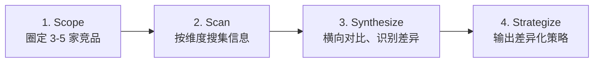
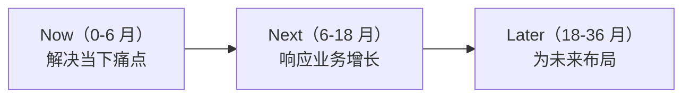
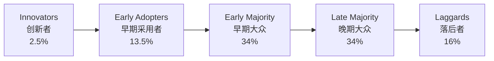
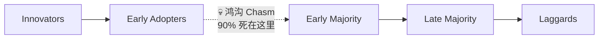
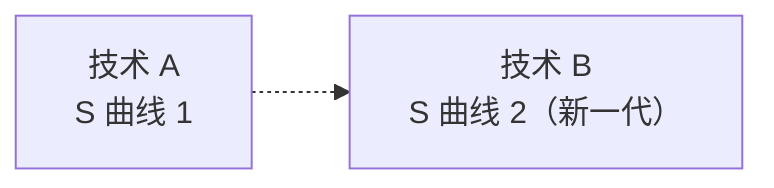

# 行业认知

> **版本**：v1.2
> **最后更新**：2026-04-28

## 📖 概述

架构师的"天花板"很大程度上由**行业认知**决定。只看自己项目，做出来的是"今天能用的架构"；看得见行业趋势，做出来的才是"三年还能用的架构"。本文讲解三类行业认知能力：**行业技术趋势跟踪**（站在巨人肩膀上）、**竞品技术分析**（知己知彼）、**技术前瞻与布局**（为未来下注）。

## 🎯 学习目标

- 建立一套可持续的行业技术趋势跟踪体系
- 能够系统化地进行竞品技术分析并产出可决策的洞察
- 理解 Hype Cycle 并能为组织做技术前瞻布局
- 具备从"信息搜集"到"决策影响"的闭环能力

## 🎯 行业技术趋势跟踪

### 信息源分层（信噪比排序）

```js
const infoSources = [
  {
    tier: 1,
    type: '一手实践',
    examples: ['大厂工程博客（Netflix Tech Blog、阿里中间件团队）', '开源项目 Design Docs', '核心贡献者 Twitter'],
    signalToNoise: '极高',
    frequency: '周度',
  },
  {
    tier: 2,
    type: '权威分析',
    examples: ['ThoughtWorks 技术雷达', 'Gartner Magic Quadrant', 'CNCF Landscape', 'InfoQ Trends Report'],
    signalToNoise: '高',
    frequency: '季度 / 年度',
  },
  {
    tier: 3,
    type: '技术大会',
    examples: ['KubeCon', 'QCon', 'ArchSummit', 'Google I/O / AWS re:Invent'],
    signalToNoise: '中',
    frequency: '年度',
  },
  {
    tier: 4,
    type: '学术与标准',
    examples: ['SIGMOD / USENIX 论文', 'IETF RFC', 'W3C 标准'],
    signalToNoise: '高（但理解门槛高）',
    frequency: '按需',
  },
  {
    tier: 5,
    type: '社区噪音',
    examples: ['Twitter / Hacker News / 知乎'],
    signalToNoise: '低（需主动过滤）',
    frequency: '日度',
  },
]

function pickSources(timeBudgetHoursPerWeek) {
  if (timeBudgetHoursPerWeek < 2) return infoSources.filter((s) => s.tier <= 2)
  if (timeBudgetHoursPerWeek < 5) return infoSources.filter((s) => s.tier <= 3)
  return infoSources
}

console.log(pickSources(3).map((s) => s.type))
```

### 个人情报系统

```js
const personalKnowledgeSystem = {
  inbox: {
    tools: ['RSS 订阅（Feedly）', '邮件订阅（Morning Brew / 阿里技术）', '稍后读（Readwise Reader）'],
    dailyTime: '15 分钟',
    rule: '只速读标题 + 摘要，感兴趣的加入 Read Later',
  },
  digest: {
    tools: ['笔记（Obsidian / Notion）', 'AI 摘要'],
    weeklyTime: '1-2 小时',
    rule: '每周精读 3-5 篇，写 50-200 字个人笔记',
  },
  output: {
    tools: ['技术博客', '团队分享', '公开分享'],
    monthlyTime: '4-8 小时',
    rule: '每月产出 1 篇深度文章或分享',
  },
}

function informationHealthCheck(user) {
  const issues = []
  if (user.dailyReadMinutes < 10) issues.push('日度摄入不足')
  if (user.weeklyDeepReads < 2) issues.push('缺少深度阅读')
  if (user.monthlyOutputs < 1) issues.push('缺少输出，仅输入易流失')
  return { healthy: issues.length === 0, issues }
}

console.log(informationHealthCheck({ dailyReadMinutes: 15, weeklyDeepReads: 3, monthlyOutputs: 1 }))
```

### 趋势识别框架

```js
// 区分"热点"与"趋势"
function classifySignal(signal) {
  const persistence = signal.monthsObserved // 观察到的月数
  const breadth = signal.independentSources // 独立来源数
  const depth = signal.productionCaseCount // 生产案例数

  if (persistence >= 18 && breadth >= 5 && depth >= 10) return '确立的趋势'
  if (persistence >= 6 && breadth >= 3) return '上升趋势'
  if (persistence < 3 || breadth < 2) return '短期热点'
  return '待观察'
}

console.log(
  classifySignal({
    name: 'Service Mesh',
    monthsObserved: 48,
    independentSources: 10,
    productionCaseCount: 50,
  }),
) // 确立的趋势
```

## 🎯 竞品技术分析

竞品技术分析不是"抄作业"，而是**从同行的技术选择中学习约束与取舍**。

### 竞品分析维度

```js
const competitorAnalysisDimensions = {
  scale: {
    metric: '规模指标',
    items: ['DAU / MAU', '订单量 / GMV', '内容条数', '集群规模'],
    source: '公开财报、招聘 JD、技术文章',
  },
  techStack: {
    metric: '技术栈',
    items: ['语言/框架', '数据库', '中间件', '云厂商', '自研 vs 开源'],
    source: '工程博客、开源项目、GitHub Org',
  },
  architecture: {
    metric: '架构特征',
    items: ['微服务/单体', 'DC 分布', '多活/灾备', '数据架构'],
    source: '大会分享、论文、故障复盘',
  },
  performance: {
    metric: '性能',
    items: ['P99 延迟', '可用性', 'QPS', '扩容速度'],
    source: '故障公告、对比评测',
  },
  organization: {
    metric: '组织与流程',
    items: ['团队规模', '发布频率', 'DORA 指标（估算）'],
    source: '招聘 JD、员工分享、离职访谈',
  },
  hiring: {
    metric: '招聘信号',
    items: ['岗位描述里的新技术', '团队扩张/收缩', '薪资水平'],
    source: '脉脉、BOSS、LinkedIn',
  },
}

console.log(Object.keys(competitorAnalysisDimensions))
```

### 竞品分析方法论（四步法）



### 横向对比表

```js
const competitors = [
  {
    name: 'Competitor A',
    scale: { dau: 100_000_000, qps: 500_000 },
    techStack: { lang: 'Java', db: 'TiDB', msg: 'Kafka', orchestration: 'K8s' },
    architecture: { pattern: '微服务 + 多活', dc: 3 },
    publicKnowledge: ['采用自研 Service Mesh', '每周发布 500+ 次'],
  },
  {
    name: 'Competitor B',
    scale: { dau: 50_000_000, qps: 200_000 },
    techStack: { lang: 'Go', db: 'MySQL 分库', msg: 'RocketMQ', orchestration: 'K8s' },
    architecture: { pattern: '微服务 + 同城双活', dc: 2 },
    publicKnowledge: ['主力 Go 语言', '重视 FinOps'],
  },
  {
    name: '我们',
    scale: { dau: 30_000_000, qps: 100_000 },
    techStack: { lang: 'Java', db: 'MySQL', msg: 'RabbitMQ', orchestration: 'K8s' },
    architecture: { pattern: '微服务 + 主从', dc: 1 },
    publicKnowledge: ['技术栈较为传统'],
  },
]

function findGaps(competitors) {
  const self = competitors.find((c) => c.name === '我们')
  const others = competitors.filter((c) => c.name !== '我们')
  const gaps = []
  const hasMulti = others.some((o) => o.architecture.pattern.includes('多活'))
  if (hasMulti && !self.architecture.pattern.includes('多活')) {
    gaps.push('容灾架构差距：多数竞品已多活，我们仅主从')
  }
  const usesKafka = others.some((o) => o.techStack.msg === 'Kafka')
  if (usesKafka && self.techStack.msg === 'RabbitMQ') {
    gaps.push('消息中间件差距：头部竞品使用 Kafka，吞吐更大')
  }
  return gaps
}

console.log(findGaps(competitors))
```

### 分析产出：决策建议

```js
function produceRecommendations(gaps, businessPriority) {
  return gaps.map((gap) => ({
    gap,
    priority: classifyPriority(gap, businessPriority),
    action: suggestAction(gap),
  }))
}

function classifyPriority(gap, businessPriority) {
  if (gap.includes('容灾') && businessPriority.includes('稳定性')) return 'P0'
  if (gap.includes('消息中间件') && businessPriority.includes('增长')) return 'P1'
  return 'P2'
}

function suggestAction(gap) {
  if (gap.includes('容灾')) return '启动多活架构专项，Q3 同城双活，Q4 异地灾备'
  if (gap.includes('消息中间件')) return '评估 Kafka 替代 RabbitMQ，Q2 完成 PoC'
  return '持续监控'
}

console.log(
  produceRecommendations(
    ['容灾架构差距：多数竞品已多活，我们仅主从'],
    ['稳定性', '增长'],
  ),
)
```

### 竞品分析的伦理边界

- ✅ **可以**：使用公开信息（博客、大会、招聘、论文）
- ✅ **可以**：通过产品体验推断技术选择
- ❌ **禁止**：雇佣离职员工获取机密
- ❌ **禁止**：逆向工程违反服务条款
- ❌ **禁止**：商业间谍行为

## 🎯 技术前瞻与布局

### Gartner Hype Cycle

[Gartner Hype Cycle](https://www.gartner.com/en/research/methodologies/gartner-hype-cycle) 描绘新技术从诞生到成熟的五个阶段。架构师要在**合适的阶段做合适的动作**。

```js
const hypeCycleStages = {
  trigger: {
    name: '技术萌发期（Innovation Trigger）',
    signal: '概念刚提出，早期 demo',
    action: '保持关注，不做投入',
  },
  peak: {
    name: '期望膨胀期（Peak of Inflated Expectations）',
    signal: '各大媒体吹捧，无数 PoC',
    action: '小心，避免 FOMO',
  },
  trough: {
    name: '泡沫破裂低谷期（Trough of Disillusionment）',
    signal: '媒体变冷，早期项目失败',
    action: '开始深入研究，真价值浮现',
  },
  slope: {
    name: '稳步爬升复苏期（Slope of Enlightenment）',
    signal: '第二代产品出现，最佳实践成型',
    action: '加大投入，小范围试点',
  },
  plateau: {
    name: '生产力成熟期（Plateau of Productivity）',
    signal: '标准化，大量生产案例',
    action: '全面采纳',
  },
}

function strategyFor(stage) {
  return hypeCycleStages[stage]?.action ?? '未知阶段'
}

console.log(strategyFor('trough'))
```

### 技术前瞻的"双轨投资"

```js
const dualTrackInvestment = {
  exploit: {
    desc: '利用（Exploit）：深耕成熟技术，产生当下价值',
    budgetShare: '80%',
    timeHorizon: '0-1 年',
    example: '持续优化当前 Kubernetes 平台',
  },
  explore: {
    desc: '探索（Explore）：尝试新技术，为未来下注',
    budgetShare: '20%',
    timeHorizon: '1-3 年',
    example: '试点 WebAssembly 在边缘的应用',
  },
}

function evaluatePortfolio(projects) {
  const total = projects.reduce((s, p) => s + p.budget, 0)
  const exploreBudget = projects.filter((p) => p.type === 'explore').reduce((s, p) => s + p.budget, 0)
  const ratio = exploreBudget / total
  return {
    ratio,
    verdict:
      ratio < 0.1 ? '过于保守，创新不足'
      : ratio > 0.3 ? '过于激进，稳定性堪忧'
      : '平衡',
  }
}

console.log(
  evaluatePortfolio([
    { name: '平台稳定性', type: 'exploit', budget: 200 },
    { name: '性能优化', type: 'exploit', budget: 100 },
    { name: 'AI 网关试点', type: 'explore', budget: 80 },
  ]),
)
```

### 技术布局的三层时间窗



```js
function layoutTechnologies(portfolio) {
  const layers = { Now: [], Next: [], Later: [] }
  for (const tech of portfolio) {
    if (tech.maturity === 'plateau' && tech.urgency === 'high') layers.Now.push(tech.name)
    else if (tech.maturity === 'slope') layers.Next.push(tech.name)
    else if (tech.maturity === 'trough' || tech.maturity === 'trigger') layers.Later.push(tech.name)
  }
  return layers
}

console.log(
  layoutTechnologies([
    { name: 'Kubernetes', maturity: 'plateau', urgency: 'high' },
    { name: 'eBPF 可观测', maturity: 'slope', urgency: 'medium' },
    { name: 'WASM 边缘函数', maturity: 'trough', urgency: 'low' },
    { name: '量子安全加密', maturity: 'trigger', urgency: 'low' },
  ]),
)
```

### 避免"技术追星"陷阱

```js
const hypePitfalls = [
  {
    pitfall: 'FOMO 驱动选型',
    example: '区块链火了，所有业务都想"上链"',
    remedy: '明确回答"解决什么实际问题"',
  },
  {
    pitfall: '简历驱动开发（Resume-Driven Development）',
    example: '用新技术只为个人增值，不顾项目需求',
    remedy: '所有选型必须经过架构委员会评审',
  },
  {
    pitfall: '过早优化',
    example: '日活 1 万的应用就要搞多活',
    remedy: '规模决定架构，不是相反',
  },
  {
    pitfall: '标准缺失',
    example: '每个团队用不同技术栈，运维崩溃',
    remedy: '技术雷达与组织标准约束'
  },
]

console.log(hypePitfalls.map((p) => p.pitfall))
```

## 🧠 理论基础

技术趋势判断看似依赖直觉，实则背后有 60 年的扩散理论、曲线模型、战略思想支撑。

### 1. 创新扩散理论（Everett Rogers, 1962）

社会学家 Everett Rogers 在 [*Diffusion of Innovations*](https://www.simonandschuster.com/books/Diffusion-of-Innovations-5th-Edition/Everett-M-Rogers/9780743222099)（1962 年初版，2003 年第五版）中系统研究了新技术/新思想的扩散规律，提出**采用者五类**：



Rogers 还提出**感知创新属性**决定扩散速度的 5 个维度：

1. **相对优势（Relative Advantage）**：比现有方案好多少
2. **兼容性（Compatibility）**：与现有价值观、经验、需求兼容
3. **复杂性（Complexity）**：理解和使用难度（反向）
4. **可试性（Trialability）**：是否可小范围试用
5. **可观察性（Observability）**：结果是否可见

```js
// 技术扩散潜力评估
function diffusionPotential(tech) {
  const dims = {
    relativeAdvantage: tech.advantageVsExisting ?? 0, // 0-5
    compatibility: tech.compatibility ?? 0,
    simplicity: 5 - (tech.complexity ?? 5), // 反向
    trialability: tech.trialability ?? 0,
    observability: tech.observability ?? 0,
  }
  const total = Object.values(dims).reduce((s, v) => s + v, 0) / 25
  return {
    dims,
    potential: Number(total.toFixed(2)),
    verdict: total >= 0.7 ? '高扩散潜力' : total >= 0.4 ? '中等潜力' : '低潜力',
  }
}

console.log(
  diffusionPotential({
    advantageVsExisting: 5,
    compatibility: 3,
    complexity: 2, // 低复杂度
    trialability: 5,
    observability: 4,
  }),
)
```

### 2. 跨越鸿沟（Geoffrey Moore, 1991）

Geoffrey Moore 在 [*Crossing the Chasm*](https://www.crossingthechasm.com/) 中发现：**早期采用者与早期大众之间存在"鸿沟"**，这是 90% 新技术夭折的原因。



跨越鸿沟的策略是**保龄球战术**（Bowling Alley）：**集中火力攻一个早期大众的细分市场**，以此为支点扩散。

```js
function chasmStage(adoption) {
  // adoption: 0-1
  if (adoption < 0.025) return { stage: 'Innovators', strategy: '小批量试用' }
  if (adoption < 0.16) return { stage: 'Early Adopters', strategy: '样板客户' }
  if (adoption < 0.5) return { stage: 'Chasm-Crossing', strategy: '集中攻一个细分' }
  if (adoption < 0.84) return { stage: 'Majority', strategy: '规模化标准化' }
  return { stage: 'Late Majority/Laggards', strategy: '合规驱动' }
}

console.log(chasmStage(0.12)) // Early Adopters 阶段
```

**架构师启示**：评估一项新技术时，不只看"是否新"，还要问"是否已有早期大众案例（≥ 10 家生产部署）？"

### 3. S 曲线（Richard Foster, 1986）

Richard Foster 在 [*Innovation: The Attacker's Advantage*](https://www.amazon.com/Innovation-Attackers-Advantage-Richard-Foster/dp/0671622501) 中提出**技术 S 曲线**：任何技术的性能随投入的增长都呈 S 形 —— 早期缓慢、中期快速、末期趋饱和。



Foster 的关键洞察：**当现有技术接近 S 曲线顶端时，新技术正在其 S 曲线底部积蓄能量**。位于顶端的公司反而最容易被颠覆（Clayton Christensen 后来在 [*The Innovator's Dilemma*](http://claytonchristensen.com/books/the-innovators-dilemma/) 中深入剖析）。

```js
// 估算技术所处 S 曲线位置
function sCurvePosition({ yearlyImprovement, pastFiveYearAvg, theoreticalLimit, currentLevel }) {
  const ratio = currentLevel / theoreticalLimit
  const slowing = yearlyImprovement < pastFiveYearAvg * 0.5
  if (ratio < 0.3) return { position: 'Early', verdict: '爬坡期，投入可见回报' }
  if (ratio < 0.7 && !slowing) return { position: 'Steep', verdict: '高速成长，全力投入' }
  if (ratio >= 0.7 || slowing) return { position: 'Plateau', verdict: '接近饱和，关注替代技术' }
  return { position: 'Unclear', verdict: '持续观察' }
}

console.log(
  sCurvePosition({
    yearlyImprovement: 5,
    pastFiveYearAvg: 20,
    theoreticalLimit: 100,
    currentLevel: 80,
  }),
)
// { position: 'Plateau', verdict: '接近饱和，关注替代技术' }
```

### 4. Gartner Hype Cycle（Jackie Fenn, 1995）

Jackie Fenn 1995 年为 Gartner 创造 [**Hype Cycle**](https://www.gartner.com/en/research/methodologies/gartner-hype-cycle)，综合了**心理预期**与**生产力现实**的差距。它不是纯粹的客观模型，而是基于 30 年新技术观察的经验规律。

与 Moore 鸿沟的对应关系：

| Hype Cycle 阶段 | 对应 Moore 阶段 | 架构行动 |
| --- | --- | --- |
| Innovation Trigger | Innovators | 关注 |
| Peak of Expectations | 早期热捧 | 警惕泡沫 |
| Trough of Disillusionment | Chasm | 真假分化 |
| Slope of Enlightenment | 跨越鸿沟 | 小规模引入 |
| Plateau of Productivity | Majority | 大规模采用 |

**批判性使用**：Hype Cycle 受到学术界质疑（Jeffrey Funk 2018 年 [论文](https://www.sciencedirect.com/science/article/abs/pii/S0040162517316876) 显示只有约 20% 技术真正经历完整五阶段）。因此 Hype Cycle **仅作参考信号**，不要作为唯一判断依据。

### 5. 探索与利用平衡（March, 1991）

James March 在 1991 年论文 [*Exploration and Exploitation in Organizational Learning*](https://www.jstor.org/stable/2634940) 中提出**Exploration vs Exploitation**悖论：

- **Exploitation（利用）**：深耕已知技术，产出当下价值
- **Exploration（探索）**：尝试未知技术，为未来下注

过度利用 → 失去未来机会；过度探索 → 损害当下。这是"双轨投资"策略的理论源头。

```js
// 平衡度评估（基于 March 理论）
function exploreExploitBalance(portfolio) {
  const total = portfolio.reduce((s, p) => s + p.investment, 0)
  const exploration = portfolio.filter((p) => p.type === 'explore').reduce((s, p) => s + p.investment, 0)
  const ratio = exploration / total
  // March 研究建议 15-25% 用于探索
  if (ratio < 0.1) return { ratio, verdict: '过度利用，未来被动' }
  if (ratio > 0.4) return { ratio, verdict: '过度探索，当下不稳' }
  return { ratio, verdict: '健康平衡' }
}

console.log(
  exploreExploitBalance([
    { name: '核心平台优化', type: 'exploit', investment: 60 },
    { name: 'AI 网关试点', type: 'explore', investment: 20 },
    { name: '成本优化', type: 'exploit', investment: 15 },
    { name: 'WASM 探索', type: 'explore', investment: 5 },
  ]),
)
// ratio: 0.25, verdict: '健康平衡'
```

### 6. 技术演化的 Wardley 映射（Simon Wardley）

本系列 8.3.2 已介绍 Wardley Mapping。在行业认知视角下，其**演化坐标**（Genesis → Custom → Product → Commodity）与 Rogers 采用者曲线、Moore 鸿沟高度一致：

```js
function wardleyToRogersStage(wardleyStage) {
  return {
    Genesis: 'Innovators',
    'Custom-Built': 'Early Adopters',
    Product: 'Early Majority (Post-Chasm)',
    Commodity: 'Late Majority / Laggards',
  }[wardleyStage]
}

console.log(wardleyToRogersStage('Product')) // Early Majority
```

这让架构师可以从**技术视角**（Wardley）与**扩散视角**（Rogers）交叉验证判断。

### 7. 弱信号扫描（Ansoff, 1975）

Igor Ansoff 在 1975 年提出 [**Weak Signals**](https://www.sciencedirect.com/science/article/abs/pii/0305048375900217) 概念：重大变化发生前会有微弱信号，建立组织能力**在信号被噪音淹没之前捕获**。

弱信号特征：

- **来源分散**：单一来源看不出，多源叠加才显现
- **意义模糊**：初期难以明确影响
- **时间滞后**：从出现到成为主流往往 3-10 年

```js
// 弱信号强度评估
function weakSignalStrength(signal) {
  const dimensions = {
    sourceCount: Math.min(signal.independentSources / 5, 1), // 5+ 独立来源算 1
    persistence: Math.min(signal.monthsObserved / 24, 1), // 24 个月算 1
    expertMentions: Math.min(signal.expertMentions / 10, 1),
    prototypeCount: Math.min(signal.prototypeCount / 5, 1),
  }
  const strength = Object.values(dimensions).reduce((s, v) => s + v, 0) / 4
  return {
    strength: Number(strength.toFixed(2)),
    verdict:
      strength >= 0.7 ? '强信号，启动 PoC'
      : strength >= 0.4 ? '中等信号，持续跟踪'
      : '弱信号，广泛关注',
  }
}

console.log(
  weakSignalStrength({
    name: 'WebAssembly on Edge',
    independentSources: 4,
    monthsObserved: 18,
    expertMentions: 6,
    prototypeCount: 3,
  }),
)
```

### 理论到实践的映射

| 实践 | 对应理论 | 解决的问题 |
| --- | --- | --- |
| 技术雷达分环 | Rogers 创新扩散 | 识别采用阶段 |
| 谨慎引入未成熟技术 | Moore 跨越鸿沟 | 规避 90% 失败率 |
| 关注替代技术 | Foster S 曲线 | 避免被颠覆 |
| Hype Cycle 判断 | Gartner 经验模型 | 区分热点与趋势 |
| 双轨投资（80/20） | March 探索-利用 | 当下与未来平衡 |
| 弱信号扫描 | Ansoff | 在信号变强前布局 |

## 📝 实际应用示例：年度技术前瞻输出

```js
const annualForesight2026 = {
  title: '2026 年技术前瞻',
  researchPeriod: '2025-10 ~ 2026-01',
  sources: ['ThoughtWorks 技术雷达 Vol.32', 'Gartner 2026 报告', 'CNCF End User Survey', 'QCon 2025 大会', '50+ 大厂博客'],

  trendsConfirmed: [
    { name: 'AI 原生应用', stage: 'slope', action: 'Q2 试点 RAG' },
    { name: 'Platform Engineering', stage: 'slope', action: '成立平台工程团队' },
    { name: 'FinOps', stage: 'plateau', action: '正式纳入治理体系' },
  ],

  trendsWatching: [
    { name: 'WASM 微服务', stage: 'trough', action: '团队学习，暂不投入' },
    { name: '零信任架构', stage: 'slope', action: 'Q4 做 PoC' },
  ],

  trendsHold: [
    { name: 'Web3 应用层', stage: 'trough', action: '继续观望，暂不投入' },
    { name: '去中心化身份（DID）', stage: 'peak', action: '警惕过热' },
  ],

  investments: {
    exploit: ['云原生平台演进', 'AI 辅助研发工具'],
    explore: ['AI Gateway 试点', '零信任架构 PoC'],
  },

  budgetAllocation: { exploit: 0.8, explore: 0.2 },
}

function summarize(foresight) {
  return {
    confirmed: foresight.trendsConfirmed.length,
    watching: foresight.trendsWatching.length,
    hold: foresight.trendsHold.length,
    exploreRatio: foresight.budgetAllocation.explore,
  }
}

console.log(summarize(annualForesight2026))
```

## 🔗 相关概念

- **技术选型**：行业认知是选型的前置输入
- **技术路线图**：前瞻结论落到路线图里
- **产品思维**：业务价值决定技术投入优先级

## 📝 学习检查点

- [ ] 能搭建一套属于自己的行业信息系统
- [ ] 能完成一份主要竞品的技术画像与横向对比
- [ ] 能判断一项技术处于 Hype Cycle 的哪个阶段
- [ ] 能用"双轨投资"的方式规划技术预算
- [ ] 能避免典型的"技术追星"陷阱

## 🚀 下一步

→ [第九阶段：前沿技术视野](/architect/09-emerging-technologies/01-ai-architecture/01-ai-architecture-overview)

